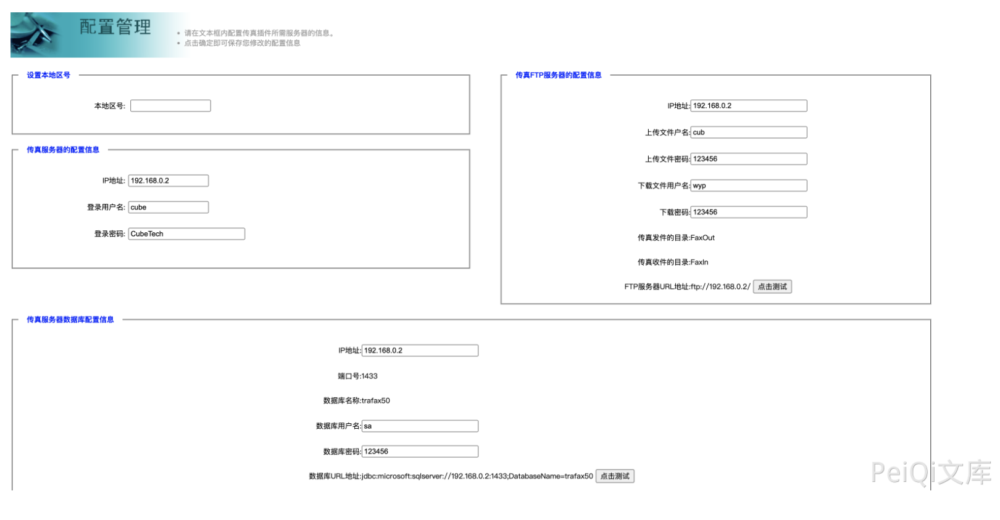

# 致远OA A6 config.jsp 敏感信息泄漏漏洞

## 漏洞描述

致远OA A6 config.jsp页面可未授权访问，导致敏感信息泄漏漏洞，攻击者通过漏洞可以获取服务器中的敏感信息

## 漏洞影响

```
致远OA A6
```

## 网络测绘

```
body="yyoa" && app="致远互联-OA"
```

## 漏洞复现

登录页面


验证POC

```
	/yyoa/ext/trafaxserver/SystemManage/config.jsp
```

