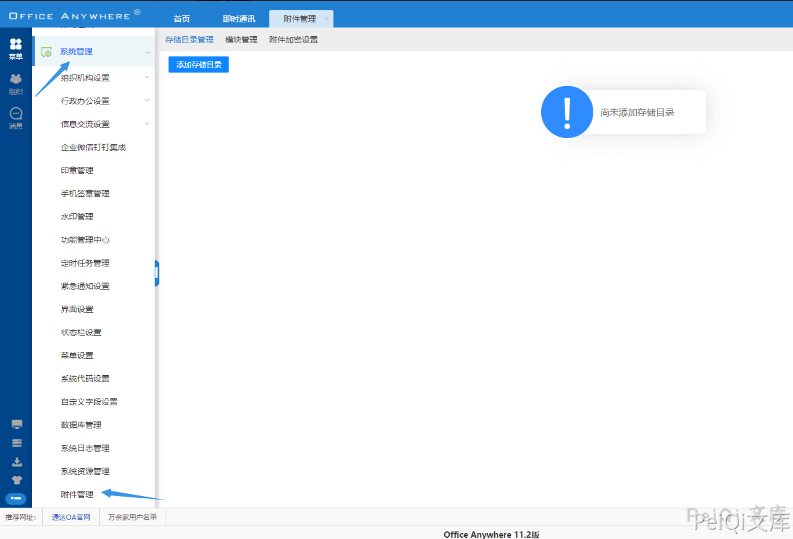
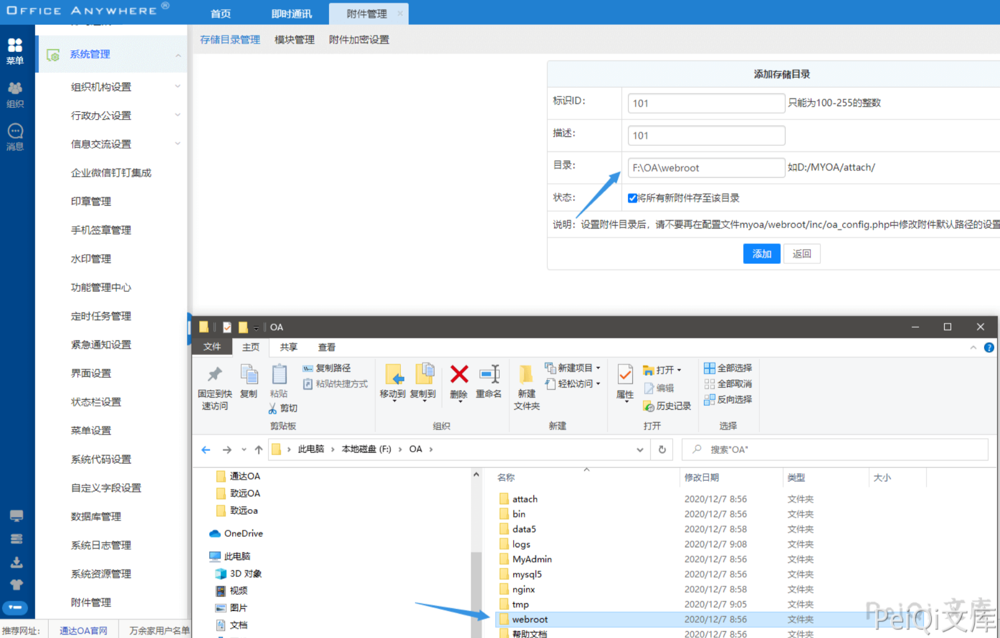
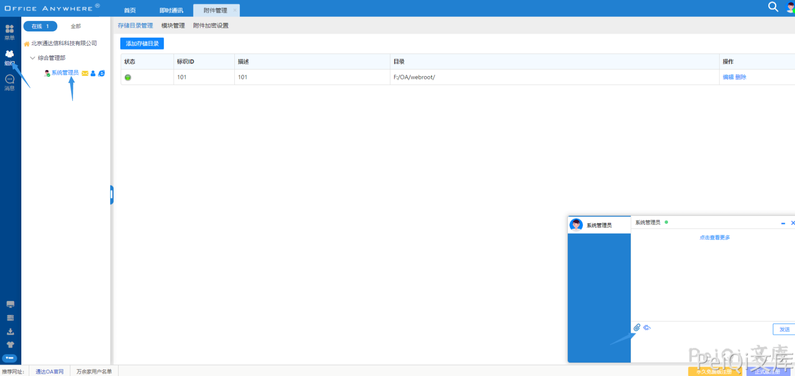
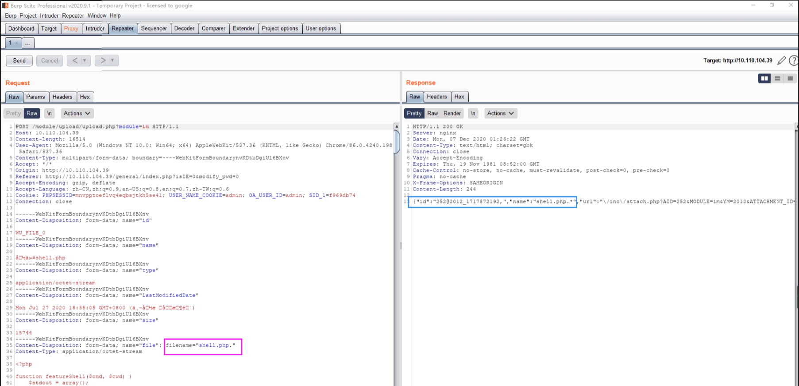
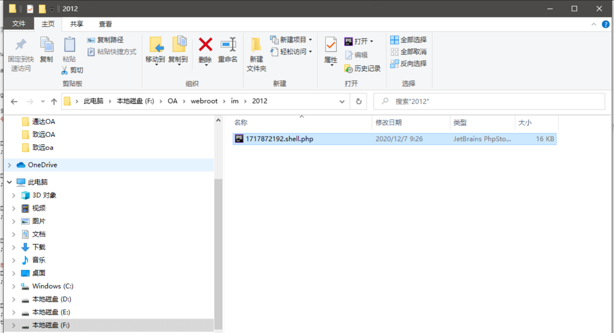
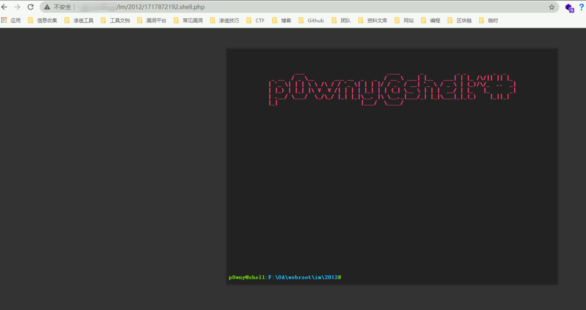

# 通达OA v11.2 upload.php 后台任意文件上传漏洞

## 漏洞描述

通达OA v11.2后台存在文件上传漏洞，允许通过绕过黑名单的方法来上传恶意文件，导致服务器被攻击

## 漏洞影响

```
通达OA v11.2
```

## 环境搭建

[通达OA v11.2下载链接](https://cdndown.tongda2000.com/oa/2019/TDOA11.2.exe)

下载后按步骤安装即可

## 漏洞复现

该漏洞存在于后台，需要通过登录后才能进行使用

登录后点击 **菜单 -> 系统管理 -> 附件管理**



点击添加附录存储管理添加如下(存储目录为 webroot 目录，默认为 **D:/MYOA/webroot/**)



点击 **组织 -> 系统管理员 -> 上传附件**



抓包使用 windows 的绕过方法 **shell.php -> shell.php.**



2012 为目录

1717872192 为拼接的文件名

最后的shell名字为 1717872192.shell.php



访问木马文件

