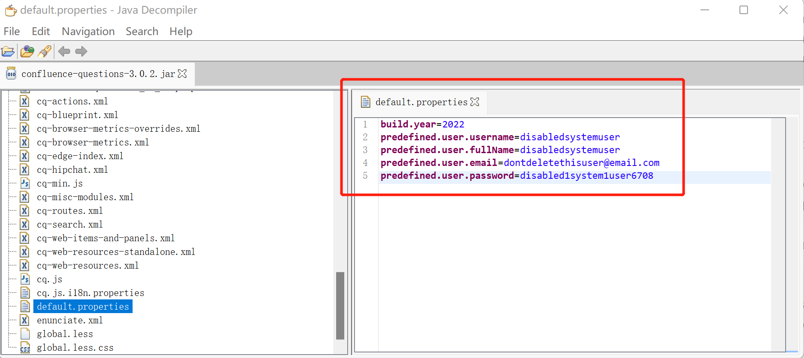

# Atlassian Questions For Confluence 身份认证绕过漏洞CVE-2022-26138

## 漏洞描述

Atlassian官方发布了2022年7月的安全更新，其中涉及到Confluence Server的多个漏洞，其中CVE-2022-26138为一个硬编码漏洞。

当Confluence Server或Data Center上的Questions for Confluence app启用时，它会创建一个名为`disabledsystemuser`的Confluence用户帐户。此帐户旨在帮助将数据从应用程序迁移到 Confluence Cloud的管理员账号中。该帐户通过使用**硬编码密码**创建并添加到confluence-users组中，在默认情况下允许查看和编辑 Confluence 中的所有非受限页面。

未经身份验证攻击者可以利用所知的硬编码密码登录Confluence并访问该组有权限访问的所有页面。

## 漏洞影响

```
Questions for Confluence app == 2.7.34
Questions for Confluence app == 2.7.35
Questions for Confluence app == 3.0.2
```

## 漏洞分析

下载应用程序 **confluence-questions-3.0.2.jar** 或者另外两个版本。

```
https://packages.atlassian.com/maven-atlassian-external/com/atlassian/confluence/plugins/confluence-questions/3.0.2/confluence-questions-3.0.2.jar
```

分析源码，在配置文件default.properties中可以找到所创建用户的相关信息，其中的username和password都是固定的。

使用Java Decompiler打开jar文件，在配置文件default.properties中可以找到所创建用户的相关信息。




上传Questions for Confluence应用程序，使用硬编码用户密码成功登录。

```
predefined.user.username=disabledsystemuser
predefined.user.password=disabled1system1user6708
```

## 修复建议

目前厂商已发布升级更新Questions for Confluence扩展至以下安全版本:

- 2.7.x >= 2.7.38 (Confluence 6.13.18 到 7.16.2)

- Versions >= 3.0.5 (Confluence 7.16.3 之后的版本)

```
https://jira.atlassian.com/browse/CONFSERVER-79483
```